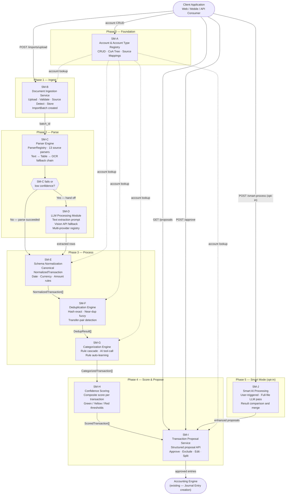
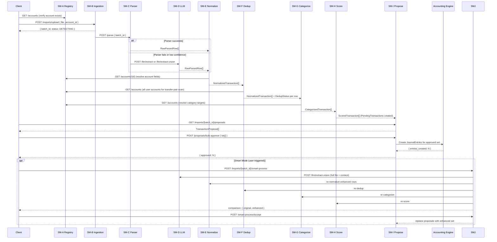

# Transaction Manager — Sub-module Specification Index
## Ledger 3.0 | Version 0.1 | March 15, 2026

---

> **Before reading any sub-module spec:** All REST APIs across every module conform to a shared standard for pagination, sorting, filtering, search, error format, auth, versioning, rate limiting, async operations, and bulk endpoints. Read [API-STANDARDS.md](API-STANDARDS.md) first. Sub-module specs document only what is specific to that module.

---

## Overview

The Transaction Manager is decomposed into **10 independently specifiable and testable sub-modules**, each with its own REST API surface, data contracts, and responsibilities. All modules communicate exclusively through their REST APIs — this makes each module independently testable, replaceable, and deployable.

The pipeline runs in five phases:

| Phase | Modules | Responsibility |
|---|---|---|
| 0 — Foundation | SM-A | Account and account type registry — the master reference all other modules depend on |
| 1 — Ingest | SM-B | File upload, validation, source detection, ImportBatch lifecycle |
| 2 — Parse | SM-C, SM-D | Source-specific parsers with structured fallback chain; LLM as optional enhancement |
| 3 — Process | SM-E, SM-F, SM-G | Normalize, deduplicate, and categorize parsed transactions |
| 4 — Score & Propose | SM-H, SM-I | Compute confidence scores; surface structured proposals for user review |
| 5 — Smart Mode | SM-J | Optional user-triggered AI-enhanced extraction and reconciliation |

> **LLM is optional.** The pipeline produces fully valid results without any LLM configured. LLM is an additive enhancement at the parse stage (low-confidence pages) and categorize stage (unmatched narrations). Set `use_llm: true` in any pipeline call to activate where applicable.

---

## Module Index

| ID | Name | Spec Document | Depends On |
|---|---|---|---|
| — | **API Standards & Conventions** | [API-STANDARDS.md](API-STANDARDS.md) | *(applies to all modules)* |
| SM-A | Account & Account Type Registry | [SM-A-account-registry.md](SM-A-account-registry.md) | — |
| SM-B | Document Ingestion Service | [SM-B-document-ingestion.md](SM-B-document-ingestion.md) | SM-A |
| SM-C | Parser Engine | [SM-C-parser-engine.md](SM-C-parser-engine.md) | SM-B |
| SM-D | LLM Processing Module *(optional)* | [SM-D-llm-processing.md](SM-D-llm-processing.md) | SM-B |
| SM-E | Schema Normalization Service | [SM-E-schema-normalization.md](SM-E-schema-normalization.md) | SM-A, SM-C, SM-D |
| SM-F | Deduplication Engine | [SM-F-deduplication-engine.md](SM-F-deduplication-engine.md) | SM-A, SM-E |
| SM-G | Categorization Engine | [SM-G-categorization-engine.md](SM-G-categorization-engine.md) | SM-A, SM-E |
| SM-H | Confidence Scoring Service | [SM-H-confidence-scoring.md](SM-H-confidence-scoring.md) | SM-C, SM-E, SM-F, SM-G |
| SM-I | Transaction Proposal Service | [SM-I-transaction-proposal.md](SM-I-transaction-proposal.md) | SM-A, SM-H |
| SM-J | Smart AI Processing Mode *(optional, user-triggered)* | [SM-J-smart-ai-processing.md](SM-J-smart-ai-processing.md) | SM-B, SM-D, SM-E, SM-F, SM-G, SM-H, SM-I |
| SM-K | Pipeline Orchestration API | [SM-K-pipeline-orchestration-api.md](SM-K-pipeline-orchestration-api.md) | SM-B through SM-I |

---

## End-to-End Pipeline

---

## Inter-Module Data Flow

---

## Canonical Data Contracts (Cross-Module)

The following schemas are referenced by multiple modules. Each module spec defines its own extensions.

### ImportBatch

| Field | Type | Description |
|---|---|---|
| `batch_id` | UUID | Primary key |
| `user_id` | UUID | Owning user |
| `account_id` | UUID | Account this import targets (FK → SM-A) |
| `filename` | string | Original uploaded filename |
| `file_hash` | string | SHA-256 of original file bytes |
| `source_type` | SourceType enum | Detected source (see SM-B for full enum) |
| `format` | string | PDF / CSV / XLS / XLSX |
| `statement_from` | date | Statement period start |
| `statement_to` | date | Statement period end |
| `txn_found` | integer | Total rows parsed |
| `txn_new` | integer | New (not duplicates) |
| `txn_duplicate` | integer | Skipped as duplicates |
| `txn_transfer_pairs` | integer | Transfer pairs detected |
| `parse_confidence` | float 0–1 | Overall parse quality signal |
| `status` | BatchStatus enum | See SM-B for full state machine |
| `smart_processed` | boolean | Whether SM-J has been run |
| `created_at` | timestamp | — |
| `updated_at` | timestamp | — |

### NormalizedTransaction (canonical, after SM-E)

| Field | Type | Required | Description |
|---|---|---|---|
| `norm_id` | UUID | yes | Row identifier during processing |
| `batch_id` | UUID | yes | Source ImportBatch |
| `account_id` | UUID | yes | Target account (FK → SM-A) |
| `txn_date` | date | yes | Transaction date |
| `value_date` | date | no | Settlement date |
| `narration` | string | yes | Cleaned description |
| `narration_raw` | string | yes | Verbatim from document |
| `debit_amount` | decimal | cond. | Money leaving account (null if credit) |
| `credit_amount` | decimal | cond. | Money entering account (null if debit) |
| `amount_signed` | decimal | yes | Negative = debit, positive = credit |
| `running_balance` | decimal | no | Account balance after row |
| `reference_number` | string | no | UPI ref, NEFT ref, cheque no. |
| `quantity` | decimal | no | Units/shares (investment accounts) |
| `unit_price` | decimal | no | NAV or price per unit |
| `txn_type_hint` | TxnTypeHint enum | no | Parser hint: PURCHASE, REDEMPTION, etc. |
| `source_type` | SourceType enum | yes | Which parser produced this row |
| `parser_version` | string | yes | Parser version that produced this row |

### ScoredTransaction (after SM-H — input to SM-I)

| Field | Type | Description |
|---|---|---|
| `norm_id` | UUID | Links back to NormalizedTransaction |
| `dedup_status` | DedupStatus enum | NEW / DUPLICATE / NEAR_DUPLICATE / TRANSFER_PAIR |
| `dedup_confidence` | float 0–1 | Confidence that dedup_status is correct |
| `matched_entry_id` | UUID | Journal entry this duplicates (if DUPLICATE) |
| `transfer_pair_norm_id` | UUID | Matched counterpart (if TRANSFER_PAIR) |
| `suggested_account_id` | UUID | Category account (FK → SM-A) |
| `cat_confidence` | float 0–1 | Confidence in category assignment |
| `cat_source` | CatSource enum | RULE_USER / RULE_SYSTEM / AI / DEFAULT |
| `parse_confidence` | float 0–1 | From SM-C or SM-D |
| `field_completeness` | float 0–1 | Proportion of required fields populated |
| `overall_confidence` | float 0–1 | Composite weighted score (SM-H formula) |
| `confidence_band` | enum | GREEN / YELLOW / RED |
| `flags` | Flag[] | DUPLICATE, LOW_CONF, TRANSFER_PAIR, MISSING_DATE, etc. |

---

## Shared Enumerations

### SourceType
`HDFC_PDF` · `HDFC_CSV` · `SBI_PDF` · `SBI_CSV` · `ICICI_PDF` · `AXIS_PDF` · `KOTAK_PDF` · `INDUSIND_PDF` · `IDFC_PDF` · `CAS_CAMS` · `CAS_KFINTECH` · `CAS_MFCENTRAL` · `ZERODHA_HOLDINGS` · `ZERODHA_TRADEBOOK` · `ZERODHA_TAX_PL` · `ZERODHA_CAPITAL_GAINS` · `GENERIC_CSV` · `GENERIC_XLS`

### BatchStatus
`UPLOADING` · `DETECTING` · `DETECTION_FAILED` · `QUEUED` · `PARSING` · `PARSE_FAILED` · `NORMALIZING` · `DEDUPLICATING` · `CATEGORIZING` · `SCORING` · `IN_REVIEW` · `COMPLETED` · `ROLLED_BACK`

### DedupStatus
`NEW` · `DUPLICATE` · `NEAR_DUPLICATE` · `TRANSFER_PAIR` · `TRANSFER_PAIR_CANDIDATE`

### TxnTypeHint
`PURCHASE` · `REDEMPTION` · `DIVIDEND_PAYOUT` · `DIVIDEND_REINVEST` · `SIP` · `SWITCH_IN` · `SWITCH_OUT` · `BONUS` · `CORPORATE_ACTION` · `ATM_WITHDRAWAL` · `UPI_TRANSFER` · `NEFT_RTGS` · `EMI_PAYMENT` · `SALARY_CREDIT` · `INTEREST_CREDIT` · `GENERIC_DEBIT` · `GENERIC_CREDIT`

### ConfidenceBand
`GREEN` (≥ 0.85) · `YELLOW` (0.60 – 0.84) · `RED` (< 0.60)

---

## API Base URL Convention

All modules are versioned under `/api/v1/`. Example:

- `POST /api/v1/imports/upload` → SM-B
- `GET /api/v1/accounts` → SM-A
- `POST /api/v1/dedup/check` → SM-F

All endpoints require a bearer token (`Authorization: Bearer <jwt>`). The `user_id` is derived from the JWT — never accepted as a request parameter.

---

## Document Reference

| Document | Purpose |
|---|---|
| `docs/prd-v1.md` | Source requirements R2.1–R2.9, R3.1–R3.8 |
| `docs/pdf-parser.md` | Parser implementation patterns and source-specific detail |
| `docs/transaction-manager-spec.md` | Product/UX design for all 9 sub-modules |
| `docs/transaction-manager-design.md` | ERD, architecture diagrams, state machines |
| `docs/specs/` | This directory — engineering specs per sub-module |
