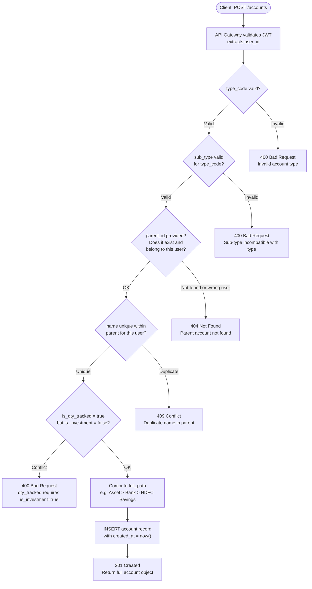
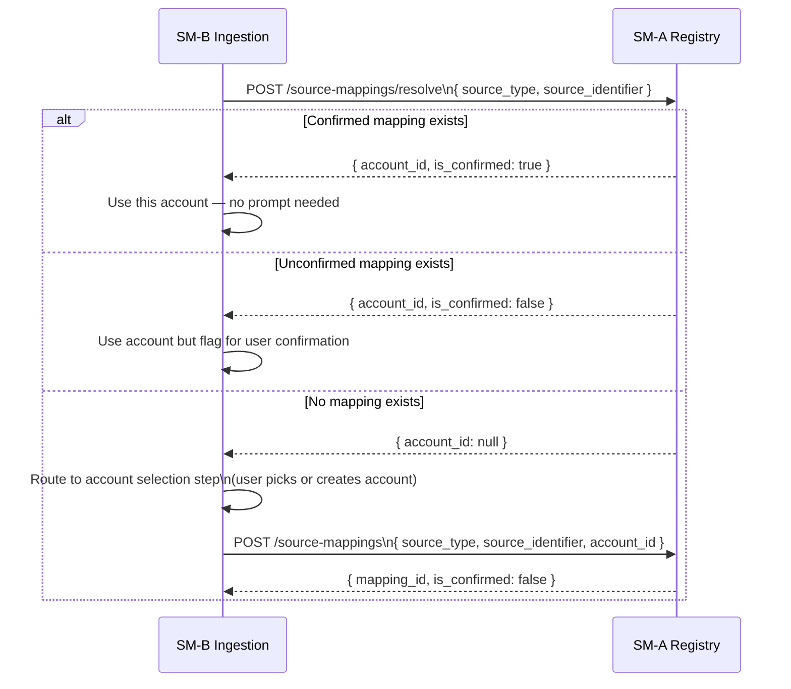
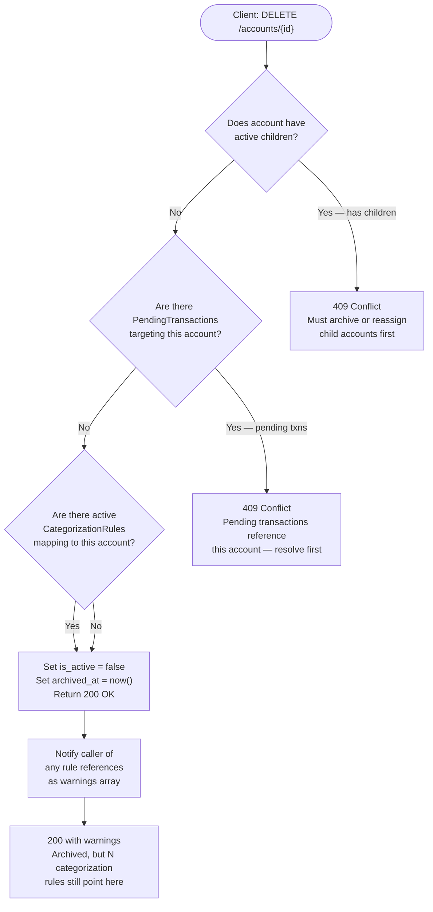
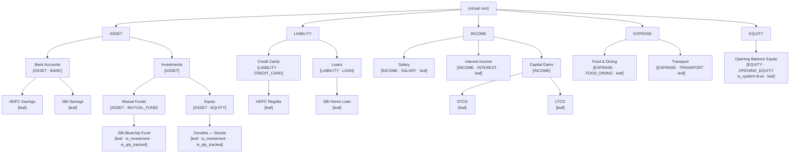

# SM-A — Account & Account Type Registry
## Ledger 3.0 | Sub-module Spec | Version 0.1 | March 15, 2026

---

## 1. Purpose & Scope

The Account & Account Type Registry is the **foundational master data service** for the entire Transaction Manager. It owns the Chart of Accounts (CoA) tree, the account type taxonomy, and the source-to-account mapping table that tells all other modules which account a given document import belongs to.

Every other sub-module reads from SM-A. No other sub-module writes to SM-A. This is the single authoritative reference for account identity.

### 1.1 Objectives

- Provide a hierarchical Chart of Accounts (CoA) tree supporting at least 4 levels of nesting
- Enforce account type rules (normal balance, debit/credit behaviour, investment flag)
- Own the source-to-account mapping — the association between a SourceType (e.g. `HDFC_PDF`) and a specific user account
- Expose all data via REST API for use by SM-B through SM-J
- Support soft-delete (archive) for accounts that should no longer accept new transactions but whose history must be preserved

### 1.2 Out of Scope

- Journal entry creation or balance calculation — owned by the Accounting Engine
- User authentication — handled by the API Gateway
- Onboarding wizard — handled by Module 1 (separateconcern)

---

## 2. Data Models

### 2.1 AccountType

AccountType defines the accounting classification of an account. It is a system-level enumeration (not user-editable) but is exposed via API for reference.

| Field | Type | Constraints | Description |
|---|---|---|---|
| `type_code` | string PK | ASSET, LIABILITY, EQUITY, INCOME, EXPENSE | Top-level accounting classification |
| `label` | string | | Display name |
| `normal_balance` | enum | DEBIT, CREDIT | Which side increases this account type |
| `debit_increases` | boolean | | True for ASSET and EXPENSE |
| `credit_increases` | boolean | | True for LIABILITY, EQUITY, INCOME |
| `allowed_sub_types` | string[] | | See §2.2 |

### 2.2 AccountSubType

Sub-types refine the top-level type for reporting and UI grouping. System-defined.

| Sub-type code | Parent type | Description |
|---|---|---|
| `BANK` | ASSET | Savings, current, salary accounts |
| `CASH` | ASSET | Physical cash |
| `FIXED_DEPOSIT` | ASSET | FDs, RDs |
| `MUTUAL_FUND` | ASSET | Equity and debt MF folios |
| `EQUITY` | ASSET | Stocks, ETFs, demat holdings |
| `GOLD` | ASSET | Physical gold, digital gold, SGBs |
| `PROVIDENT_FUND` | ASSET | PPF, EPF, NPS |
| `REAL_ESTATE` | ASSET | Property (non-primary for investment tracking) |
| `RECEIVABLE` | ASSET | Money owed to the user |
| `CREDIT_CARD` | LIABILITY | Credit card outstanding balance |
| `LOAN` | LIABILITY | Home loan, vehicle loan, personal loan |
| `PAYABLE` | LIABILITY | Money owed by the user |
| `OPENING_EQUITY` | EQUITY | Opening Balance Equity (system account) |
| `RETAINED_EARNINGS` | EQUITY | Accumulated surplus |
| `SALARY` | INCOME | Employment income |
| `INTEREST` | INCOME | Interest from FDs, savings |
| `DIVIDEND` | INCOME | Dividend income |
| `CAPITAL_GAINS_STCG` | INCOME | Short-term capital gains |
| `CAPITAL_GAINS_LTCG` | INCOME | Long-term capital gains |
| `RENTAL` | INCOME | Rental income |
| `OTHER_INCOME` | INCOME | Gifts, refunds, miscellaneous income |
| `FOOD_DINING` | EXPENSE | Dining out, food delivery |
| `GROCERIES` | EXPENSE | Supermarket, kirana |
| `TRANSPORT` | EXPENSE | Fuel, auto, cab, metro |
| `UTILITIES` | EXPENSE | Electricity, water, gas, internet |
| `RENT_HOUSING` | EXPENSE | Rent payments |
| `EMI_PRINCIPAL` | EXPENSE | Loan principal repayment leg |
| `EMI_INTEREST` | EXPENSE | Loan interest payment leg |
| `INSURANCE` | EXPENSE | Premiums for all policy types |
| `MEDICAL` | EXPENSE | Healthcare, pharmacy |
| `EDUCATION` | EXPENSE | Tuition, course fees |
| `SHOPPING` | EXPENSE | General retail shopping |
| `ENTERTAINMENT` | EXPENSE | OTT, movies, events |
| `TRAVEL` | EXPENSE | Flights, hotels, holidays |
| `TAX` | EXPENSE | TDS, advance tax, GST paid |
| `INVESTMENT_EXPENSE` | EXPENSE | Brokerage, STT, stamp duty |
| `MISCELLANEOUS` | EXPENSE | Default fallback bucket |

### 2.3 Account

The core entity. Each account is a node in the CoA tree.

| Field | Type | Constraints | Description |
|---|---|---|---|
| `account_id` | UUID | PK | Unique identifier |
| `user_id` | UUID | FK, indexed | Owning user — all queries must filter by this |
| `parent_id` | UUID | FK self-ref, nullable | Parent account; null = root level |
| `name` | string | max 120 chars, unique per parent per user | Display name |
| `full_path` | string | computed, e.g. `Asset > Bank > HDFC Savings` | Dot-path for display and search |
| `type_code` | AccountType | FK | Top-level classification |
| `sub_type` | AccountSubType | FK | Refined classification |
| `is_investment` | boolean | default false | Enables Holdings tab and FIFO lot tracking |
| `is_qty_tracked` | boolean | default false | Tracks units/shares as well as value |
| `currency` | string | ISO 4217, default INR | Account currency |
| `opening_date` | date | nullable | No transactions before this date |
| `institution_name` | string | nullable | E.g. "HDFC Bank", "Zerodha" |
| `account_number_masked` | string | nullable | Last 4 digits or folio number fragment |
| `is_system` | boolean | default false | System-generated accounts (Opening Equity, etc.) |
| `is_active` | boolean | default true | Archived accounts cannot receive new transactions |
| `notes` | text | nullable | Free-text notes |
| `created_at` | timestamp | system-set | — |
| `updated_at` | timestamp | system-set | — |
| `archived_at` | timestamp | nullable | Set when is_active becomes false |

### 2.4 SourceAccountMapping

Associates a detected `SourceType` with a specific user account. Created automatically on first import confirmation; editable by user.

| Field | Type | Constraints | Description |
|---|---|---|---|
| `mapping_id` | UUID | PK | — |
| `user_id` | UUID | FK, indexed | Owning user |
| `source_type` | SourceType enum | | E.g. `HDFC_PDF` |
| `source_identifier` | string | nullable | Additional discriminator — e.g. last 4 digits of account, folio prefix |
| `account_id` | UUID | FK → Account | The account this source maps to |
| `is_confirmed` | boolean | default false | User has explicitly confirmed this mapping |
| `created_at` | timestamp | | — |
| `updated_at` | timestamp | | — |

**Uniqueness constraint:** `(user_id, source_type, source_identifier)` must be unique.

---

## 3. API Specification

### 3.1 Base Path

`/api/v1/accounts`

### 3.2 Account Type Endpoints (read-only)

| Method | Path | Description |
|---|---|---|
| `GET` | `/account-types` | List all account type codes with labels and normal balance |
| `GET` | `/account-types/{type_code}/sub-types` | List all sub-types for a given top-level type |

### 3.3 Account CRUD Endpoints

| Method | Path | Description |
|---|---|---|
| `GET` | `/accounts` | List all accounts for the authenticated user (flat list) |
| `GET` | `/accounts/tree` | Return full CoA tree as nested JSON |
| `GET` | `/accounts/{account_id}` | Get single account detail |
| `POST` | `/accounts` | Create a new account |
| `PUT` | `/accounts/{account_id}` | Update account fields (name, notes, opening_date, institution) |
| `DELETE` | `/accounts/{account_id}` | Soft-delete (archive) — sets is_active=false |
| `POST` | `/accounts/{account_id}/restore` | Unarchive a previously archived account |
| `GET` | `/accounts/{account_id}/children` | List direct children of an account |
| `GET` | `/accounts/{account_id}/ancestors` | List all ancestors up to root |

### 3.4 Source Mapping Endpoints

| Method | Path | Description |
|---|---|---|
| `GET` | `/source-mappings` | List all source-to-account mappings for the user |
| `POST` | `/source-mappings` | Create a mapping manually |
| `PUT` | `/source-mappings/{mapping_id}` | Update (e.g. re-point to a different account) |
| `DELETE` | `/source-mappings/{mapping_id}` | Remove a mapping |
| `POST` | `/source-mappings/resolve` | Given a source_type + source_identifier, return the mapped account (or null if unmapped) |

### 3.5 Request / Response Shapes

**POST /accounts — Request Body**

| Field | Required | Notes |
|---|---|---|
| `parent_id` | no | If null, creates a root-level account |
| `name` | yes | Unique within parent and user |
| `type_code` | yes | Must match a valid AccountType |
| `sub_type` | yes | Must be valid for the given type_code |
| `is_investment` | no | Default false |
| `is_qty_tracked` | no | Default false; only valid if is_investment = true |
| `currency` | no | Default INR |
| `opening_date` | no | Must be before any transactions are imported |
| `institution_name` | no | — |
| `account_number_masked` | no | — |
| `notes` | no | — |

**GET /accounts/tree — Response Shape**

```
{
  "tree": [
    {
      "account_id": "...",
      "name": "Asset",
      "type_code": "ASSET",
      "sub_type": null,
      "children": [
        {
          "account_id": "...",
          "name": "Bank",
          "sub_type": "BANK",
          "children": [
            { "account_id": "...", "name": "HDFC Savings", "children": [] }
          ]
        }
      ]
    }
  ]
}
```

---

## 4. Workflows

### 4.1 Account Creation Flow



### 4.2 Source Mapping Resolution (used by SM-B on every upload)



### 4.3 Account Archive (Soft Delete) Flow



### 4.4 CoA Tree Structure



---

## 5. Business Rules & Constraints

| Rule | Description |
|---|---|
| BR-A-01 | `type_code` cannot be changed after creation — the accounting nature of an account is fixed |
| BR-A-02 | `parent_id` cannot be changed after creation — tree structure is immutable once set |
| BR-A-03 | An account's parent must share the same top-level `type_code` (Asset sub-account cannot live under Expense) |
| BR-A-04 | `full_path` is computed and stored on insert/update of name; it is not a user-supplied field |
| BR-A-05 | `is_qty_tracked` requires `is_investment = true` |
| BR-A-06 | `opening_date` cannot be later than the date of any transaction already linked to this account |
| BR-A-07 | Archived accounts (`is_active = false`) cannot be assigned as the `suggested_account_id` in new categorization rules |
| BR-A-08 | System accounts (`is_system = true`) cannot be archived or renamed by users |
| BR-A-09 | The `Opening Balance Equity` account is always provisioned as a system account on user initialization |
| BR-A-10 | A `SourceAccountMapping` must point to a leaf account (one with no active children) |
| BR-A-11 | Account name must be unique within the same parent per user — siblings cannot share a name |

---

## 6. Error Catalog

| HTTP Status | Error Code | Scenario |
|---|---|---|
| 400 | `INVALID_ACCOUNT_TYPE` | type_code not in AccountType enum |
| 400 | `INVALID_SUB_TYPE` | sub_type not valid for the given type_code |
| 400 | `QTY_TRACKED_WITHOUT_INVESTMENT` | is_qty_tracked=true but is_investment=false |
| 400 | `OPENING_DATE_AFTER_TRANSACTIONS` | opening_date would precede existing transactions |
| 400 | `MAPPING_NOT_LEAF` | Source mapping target is not a leaf account |
| 404 | `ACCOUNT_NOT_FOUND` | account_id does not exist or does not belong to user |
| 409 | `DUPLICATE_ACCOUNT_NAME` | Name already exists under same parent |
| 409 | `CANNOT_ARCHIVE_HAS_CHILDREN` | Active children prevent archival |
| 409 | `CANNOT_ARCHIVE_HAS_PENDING` | Pending transactions block archival |
| 409 | `DUPLICATE_SOURCE_MAPPING` | (user_id, source_type, source_identifier) already mapped |
| 422 | `PARENT_TYPE_MISMATCH` | Parent account is a different top-level type |
| 423 | `SYSTEM_ACCOUNT_IMMUTABLE` | Attempt to rename or archive a system account |

---

## 7. Integration Points

| Caller Module | How SM-A is Used |
|---|---|
| SM-B Ingestion | `POST /source-mappings/resolve` — determine which account an uploaded file belongs to |
| SM-C Parser | `GET /accounts/{id}` — verify account exists before dispatching parse |
| SM-E Normalization | `GET /accounts/{id}` — fetch type_code, is_investment, is_qty_tracked to set normalization rules |
| SM-F Deduplication | `GET /accounts` — list all active bank/wallet accounts for transfer-pair scan |
| SM-G Categorization | `GET /accounts` — resolve category target IDs for rule evaluation |
| SM-H Scoring | No direct calls — uses data already fetched by upstream modules |
| SM-I Proposal | `GET /accounts/{id}` — populate full account name in proposal response |
| SM-J Smart Mode | `GET /source-mappings` — include account context in LLM prompt |

---

## 8. Open Questions

| # | Question | Default if unresolved |
|---|---|---|
| OQ-A-01 | Should users be able to define custom sub-types (beyond the system list)? | No — system list only at v1 |
| OQ-A-02 | Should `full_path` be stored as a materialized column or computed on read? | Stored (materialized) — avoids repeated recursive queries |
| OQ-A-03 | Maximum CoA tree depth? | 6 levels — sufficient for all known India personal finance structures |
| OQ-A-04 | Can two users share a source mapping (e.g., a joint account)? | Not in v1 — each user has independent accounts |
