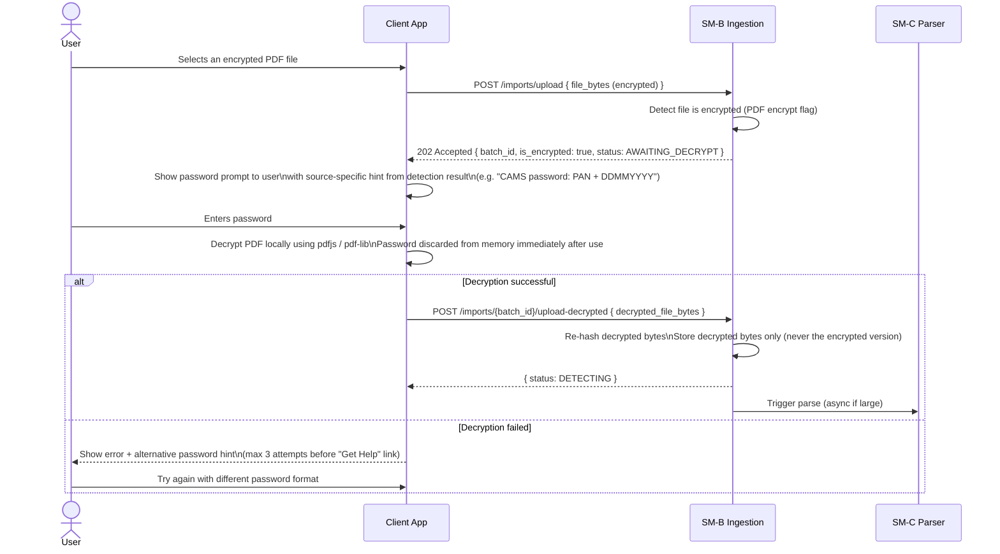
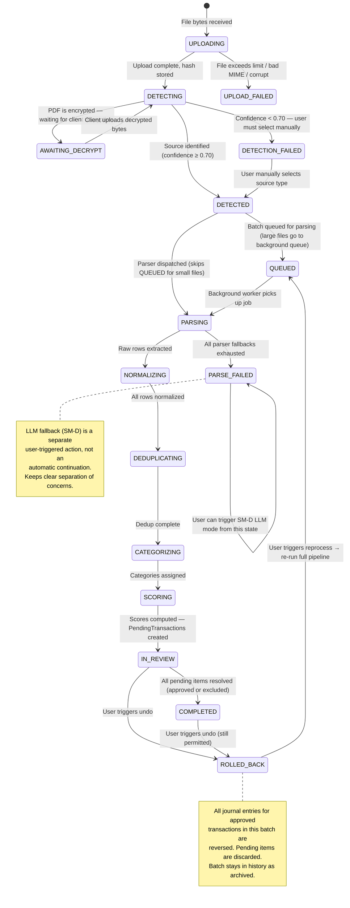
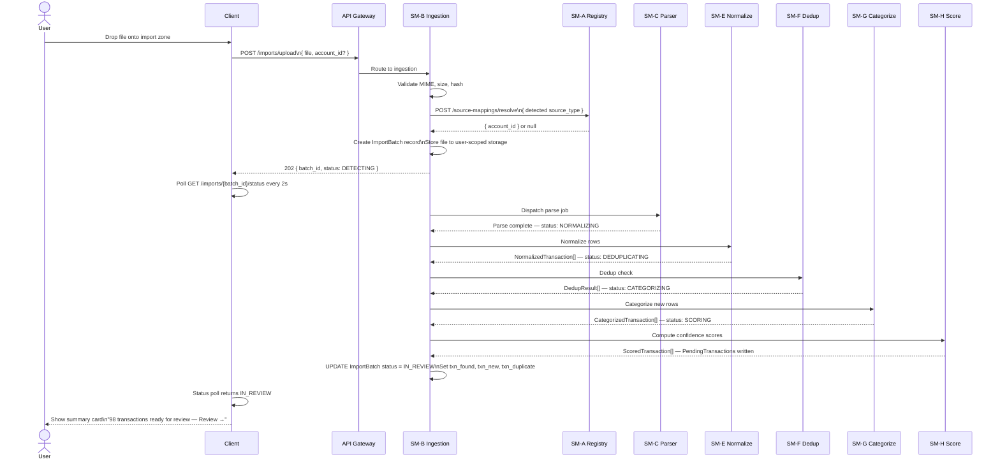
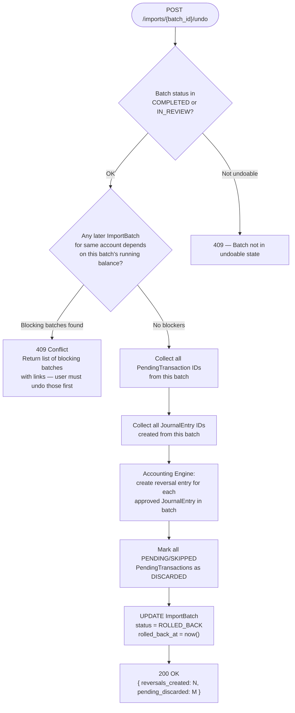

# SM-B — Document Ingestion Service
## Ledger 3.0 | Sub-module Spec | Version 0.1 | March 15, 2026

---

## 1. Purpose & Scope

The Document Ingestion Service is the **entry point for all external financial data**. It accepts file uploads, validates them, performs source detection, stores the original bytes, and creates an `ImportBatch` record that all downstream modules operate on. SM-B does not produce transactions — it produces a batch identity and a source type classification that triggers the parse pipeline.

### 1.1 Objectives

- Accept PDF, CSV, XLS, and XLSX uploads via REST API
- Validate file format, size, and content type
- Detect the document source (bank, broker, CAS) from the file contents
- Handle encrypted PDFs — coordinates client-side decryption (never receives or stores the password)
- Create and manage the `ImportBatch` record lifecycle
- Store original file bytes in user-scoped file storage
- Provide import history (list of all batches, with rollback and re-process capabilities)

### 1.2 Out of Scope

- Actual text extraction or parsing — owned by SM-C (Parser Engine)
- LLM-based extraction — owned by SM-D (LLM Processing Module)
- Account management — owned by SM-A (Account Registry)
- Journal entry creation — owned by the Accounting Engine

---

## 2. Data Models

### 2.1 ImportBatch

Full definition (extends the cross-module canonical in README.md):

| Field | Type | Constraints | Description |
|---|---|---|---|
| `batch_id` | UUID | PK | Unique batch identifier |
| `user_id` | UUID | FK, indexed | Owning user |
| `account_id` | UUID | FK → Account | Destination account (set at upload or mapping resolution) |
| `filename` | string | max 255 | Original filename |
| `file_size_bytes` | integer | | Size of uploaded file |
| `file_hash` | string | SHA-256 | Content hash — used to detect re-upload of same file |
| `storage_path` | string | | User-scoped storage path — never exposed in API |
| `mime_type` | string | | detected MIME: application/pdf, text/csv, etc. |
| `source_type` | SourceType enum | nullable | Set after detection; null if detection failed |
| `detection_confidence` | float 0–1 | | Confidence of source detection |
| `format` | string | PDF / CSV / XLS / XLSX | |
| `is_encrypted` | boolean | | True if file was password-protected |
| `statement_from` | date | nullable | Populated by parser (Stage 5+) |
| `statement_to` | date | nullable | Populated by parser |
| `txn_found` | integer | default 0 | Updated by parser |
| `txn_new` | integer | default 0 | Updated by dedup engine |
| `txn_duplicate` | integer | default 0 | Updated by dedup engine |
| `txn_transfer_pairs` | integer | default 0 | Updated by dedup engine |
| `parse_confidence` | float 0–1 | nullable | Populated by SM-C or SM-D after parse |
| `status` | BatchStatus enum | | Full state machine in §4.1 |
| `smart_processed` | boolean | default false | Set by SM-J if smart mode was run |
| `smart_processed_at` | timestamp | nullable | — |
| `rolled_back_at` | timestamp | nullable | Set on undo |
| `error_message` | string | nullable | Human-readable parse or detection error |
| `created_at` | timestamp | system | — |
| `updated_at` | timestamp | system | — |

### 2.2 UploadQueueItem

Tracks multi-file upload sessions (multiple files selected at once).

| Field | Type | Description |
|---|---|---|
| `queue_id` | UUID | PK |
| `user_id` | UUID | FK |
| `session_id` | UUID | Groups files from one upload session |
| `batch_id` | UUID | FK → ImportBatch (assigned after upload) |
| `filename` | string | |
| `status` | enum | QUEUED / UPLOADING / UPLOADED / FAILED |
| `queue_position` | integer | Order of processing within session |
| `created_at` | timestamp | |

### 2.3 ParseLog

A structured log entry per pipeline stage per batch — used for debugging and re-processing decisions.

| Field | Type | Description |
|---|---|---|
| `log_id` | UUID | PK |
| `batch_id` | UUID | FK |
| `stage` | string | UPLOAD / DETECTION / PARSE / NORMALIZE / DEDUP / CATEGORIZE / SCORE |
| `status` | enum | STARTED / COMPLETED / FAILED / SKIPPED |
| `message` | string | Human-readable status or error |
| `metadata` | JSON | Stage-specific data (detection scores, row counts, etc.) |
| `duration_ms` | integer | Wall-clock time for this stage |
| `created_at` | timestamp | |

---

## 3. Source Detection Fingerprints

Source detection inspects the first 2 pages (PDF) or header row (CSV/XLS). The detector emits a `DetectedSource` with a confidence score 0–1.

### 3.1 PDF Fingerprint Table

| SourceType | Page-1 Text Signals | Confidence Rule |
|---|---|---|
| `CAS_CAMS` | Contains "Computer Age Management Services" OR "CAMS" near "Consolidated Account Statement" | ≥ 0.95 |
| `CAS_KFINTECH` | Contains "KFintech" OR "KFin Technologies" OR "Karvy" | ≥ 0.95 |
| `CAS_MFCENTRAL` | Contains "MF Central" | ≥ 0.95 |
| `HDFC_PDF` | Contains "HDFC Bank" AND "Statement of Account" | ≥ 0.90 |
| `SBI_PDF` | Contains "State Bank of India" OR ("SBI" AND "Account Statement") | ≥ 0.90 |
| `ICICI_PDF` | Contains "ICICI Bank" AND ("Account Statement" OR "Passbook") | ≥ 0.90 |
| `AXIS_PDF` | Contains "Axis Bank" AND "Account Statement" | ≥ 0.90 |
| `KOTAK_PDF` | Contains "Kotak Mahindra Bank" | ≥ 0.90 |
| `INDUSIND_PDF` | Contains "IndusInd Bank" | ≥ 0.90 |
| `IDFC_PDF` | Contains "IDFC FIRST Bank" OR "IDFC First Bank" | ≥ 0.90 |

### 3.2 CSV / XLS Header Fingerprint Table

| SourceType | Header Column Signals | Confidence Rule |
|---|---|---|
| `ZERODHA_HOLDINGS` | Contains columns: `ISIN`, `Quantity`, `Average price` | ≥ 0.95 |
| `ZERODHA_TRADEBOOK` | Contains columns: `symbol`, `isin`, `trade_date`, `trade_type`, `quantity` | ≥ 0.95 |
| `ZERODHA_TAX_PL` | Contains "Tax P&L" as sheet name OR column "Capital Gains" | ≥ 0.90 |
| `ZERODHA_CAPITAL_GAINS` | Contains columns "buy_date", "sell_date", "realized_gain" | ≥ 0.90 |
| `HDFC_CSV` | Contains columns: `Date`, `Narration`, `Chq./Ref.No.`, `Value Dat`, `Withdrawal Amt` | ≥ 0.90 |
| `SBI_CSV` | Contains columns: `Txn Date`, `Description`, `Ref No./Cheque No.`, `Debit`, `Credit`, `Balance` | ≥ 0.90 |
| `GENERIC_CSV` | No confident match — any CSV with date-like and amount-like columns | 0.50 (triggers column mapper) |

### 3.3 Detection Priority

When multiple fingerprints match, the one with the highest confidence score wins. If the highest score is below **0.70**, the source is marked `DETECTION_FAILED` and the user is directed to:
1. Manual source selection (dropdown of all SourceTypes)
2. For CSV/XLS: the Column Mapper UI in SM-C (§4 of SM-C spec)

---

## 4. API Specification

### 4.1 Base Path

`/api/v1/imports`

### 4.2 Endpoints

| Method | Path | Description |
|---|---|---|
| `POST` | `/imports/upload` | Upload one file; returns batch_id immediately |
| `POST` | `/imports/upload-session` | Begin a multi-file session; returns session_id |
| `POST` | `/imports/upload-session/{session_id}/file` | Add a file to an existing upload session |
| `GET` | `/imports` | List all ImportBatches for the user (paginated) |
| `GET` | `/imports/{batch_id}` | Get single batch detail including parse log |
| `GET` | `/imports/{batch_id}/status` | Lightweight status poll (for polling during async parse) |
| `GET` | `/imports/{batch_id}/logs` | Return ParseLog entries for a batch |
| `POST` | `/imports/{batch_id}/cancel` | Cancel a batch in DETECTING or QUEUED state |
| `POST` | `/imports/{batch_id}/undo` | Rollback all journal entries from this batch |
| `POST` | `/imports/{batch_id}/reprocess` | Undo + re-run parse with latest parser version |

### 4.3 Upload Endpoint — Request

`POST /api/v1/imports/upload`

| Parameter | Location | Required | Description |
|---|---|---|---|
| `file` | multipart body | yes | The document file |
| `account_id` | body or query | no | Pre-assign to a specific account; if omitted, mapping resolution is attempted |
| `source_type_override` | body | no | Let user force a specific SourceType (skips detection) |
| `notify_on_complete` | body | no | boolean — whether to send in-app notification when async parse completes |

**Validation rules applied before acceptance:**
- Maximum file size: 50 MB
- Accepted MIME types: `application/pdf`, `text/csv`, `application/vnd.ms-excel`, `application/vnd.openxmlformats-officedocument.spreadsheetml.sheet`
- File name must contain only safe characters (no path traversal sequences)
- SHA-256 hash computed; if a prior batch exists for this user with the same hash, a warning is returned (not a hard block)

### 4.4 Upload Endpoint — Response

**202 Accepted** — batch accepted, detection and parsing proceed asynchronously for large files; synchronously for files under 10 MB / 200 pages.

```
{
  "batch_id": "uuid",
  "status": "DETECTING",
  "filename": "HDFC_Statement_Apr2025.pdf",
  "file_size_bytes": 184320,
  "is_encrypted": true,
  "detected_source": null,
  "account_id": null,
  "duplicate_file_warning": false
}
```

If `is_encrypted = true` in the response, the client must decrypt the file locally and re-upload the decrypted bytes. See §5.1 for the password handling protocol.

### 4.5 List Batches — Response

`GET /api/v1/imports?page=1&limit=20&status=IN_REVIEW`

| Query Param | Description |
|---|---|
| `status` | Filter by BatchStatus (comma-separated) |
| `account_id` | Filter to batches for a specific account |
| `source_type` | Filter by source type |
| `from_date` / `to_date` | Filter by created_at |
| `page` / `limit` | Pagination |

---

## 5. Workflows

### 5.1 Encrypted PDF Handling Protocol

The password is **never sent to the server**. The client is responsible for decryption.



### 5.2 ImportBatch State Machine



### 5.3 Full Upload-to-Review-Queue Sequence



### 5.4 Undo (Rollback) Flow



---

## 6. Business Rules & Constraints

| Rule | Description |
|---|---|
| BR-B-01 | Maximum file size is 50 MB. Larger files are rejected at upload with a clear error. |
| BR-B-02 | The PDF password is never sent to or stored on any server. Client performs decryption. |
| BR-B-03 | Only decrypted bytes are stored. Encrypted versions are never persisted server-side. |
| BR-B-04 | Storage path is user-scoped: `/{user_id}/imports/{batch_id}/{sanitized_filename}`. Path sanitization strips all path traversal characters. |
| BR-B-05 | File access uses time-limited signed URLs (TTL: 15 minutes). Direct storage paths are never returned in API responses. |
| BR-B-06 | A batch with `status = ROLLED_BACK` can be reprocessed; this creates a new batch with a new `batch_id` from the same stored file bytes. |
| BR-B-07 | Undo is blocked if any subsequent batch for the same account establishes an opening balance computed from this batch's ending balance. The blocker must be undone first. |
| BR-B-08 | Re-uploading the exact same file (same SHA-256 hash) triggers a warning, not a hard block. The user may still proceed — they may intend a forced re-import. |
| BR-B-09 | `statement_from` and `statement_to` are populated by SM-C after parse; SM-B does not infer these. |
| BR-B-10 | ParseLog entries are immutable — appended only, never updated. They form the audit trail for every pipeline stage. |

---

## 7. Error Catalog

| HTTP Status | Error Code | Scenario |
|---|---|---|
| 400 | `FILE_TOO_LARGE` | File exceeds 50 MB |
| 400 | `UNSUPPORTED_MIME_TYPE` | MIME not in allowed set |
| 400 | `CORRUPT_FILE` | File bytes cannot be read (truncated, wrong extension) |
| 400 | `PATH_TRAVERSAL_DETECTED` | Filename contains `..` or `/` sequences |
| 404 | `BATCH_NOT_FOUND` | batch_id not found or belongs to different user |
| 409 | `BATCH_NOT_UNDOABLE` | Batch status is not COMPLETED or IN_REVIEW |
| 409 | `UNDO_BLOCKED_BY_DEPENDENCY` | Later batches depend on this batch's balances |
| 409 | `DUPLICATE_FILE_WARNING` | Same SHA-256 already in history (warning only, not a block) |
| 422 | `DECRYPTION_REQUIRED` | Encrypted PDF was uploaded without providing decrypted copy |
| 503 | `STORAGE_UNAVAILABLE` | File storage service temporarily unreachable |

---

## 8. Integration Points

| Target | How SM-B calls it |
|---|---|
| SM-A | `POST /source-mappings/resolve` — determine account on upload |
| SM-C | Internal trigger — starts parse pipeline after successful upload |
| SM-D | Indirectly triggered when SM-C marks batch as PARSE_FAILED (user-triggered) |
| SM-E | Internal pipeline step after SM-C/SM-D completes |
| SM-F | Internal pipeline step after SM-E |
| SM-G | Internal pipeline step after SM-F |
| SM-H | Internal pipeline step after SM-G |
| SM-I | SM-I reads proposals created during the pipeline |
| Accounting Engine | Called during rollback to create reversal journal entries |
| File Storage | S3-compatible storage for original file bytes |
| Task Queue | Large files (> 10 MB / 200 pages) dispatched as background jobs |
