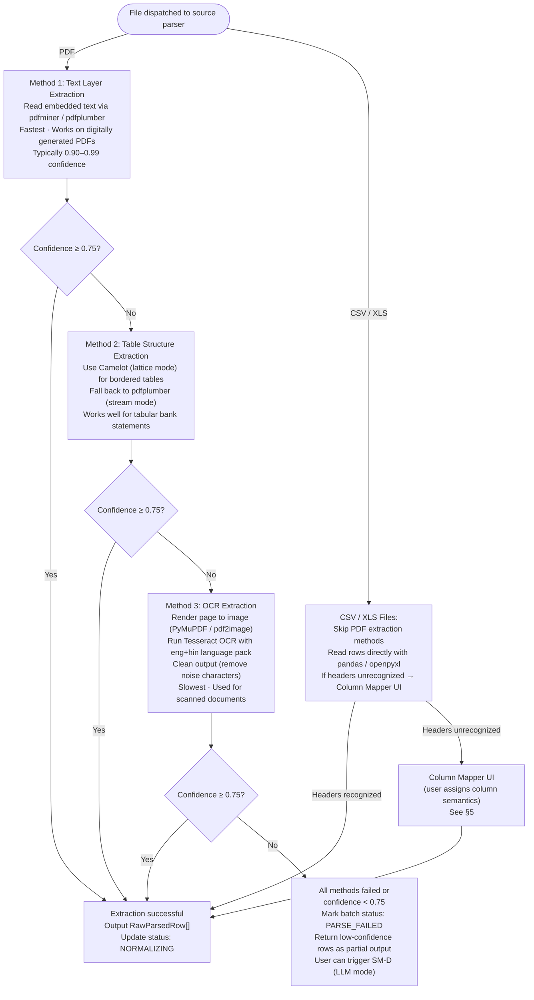
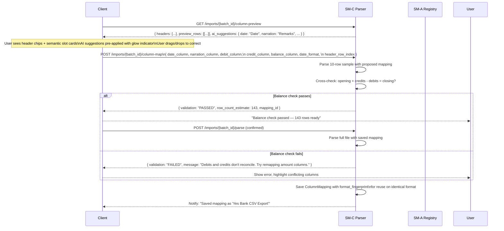
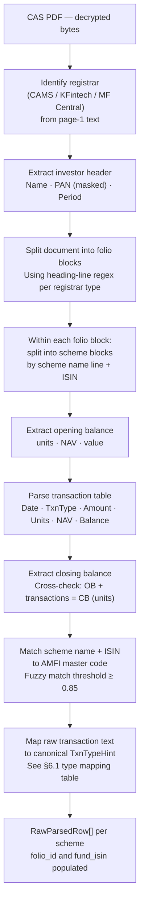
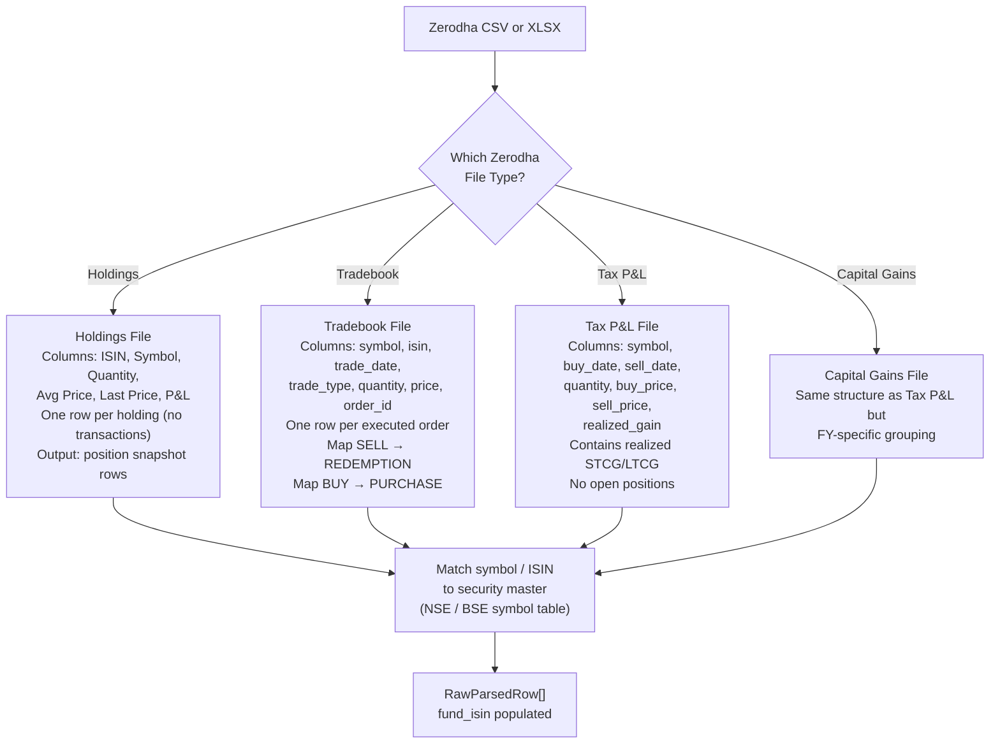
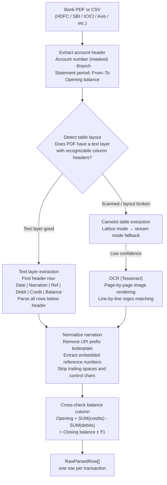

# SM-C — Parser Engine
## Ledger 3.0 | Sub-module Spec | Version 0.1 | March 15, 2026

---

## 1. Purpose & Scope

The Parser Engine is the document intelligence layer. It receives a validated, non-encrypted file (from SM-B) and is responsible for extracting all transaction rows as structured data. It does this through a **layered fallback chain** — from the fastest and most accurate method down to OCR. If all automatic methods are exhausted or produce low-confidence output, the file is handed to SM-D (LLM Processing Module).

### 1.1 Objectives

- Dispatch to the correct source-specific parser based on the `source_type` from SM-B
- For each source, apply a multi-layer extraction strategy: text layer → structured table extraction → OCR
- Produce a `RawParsedRow[]` output for each document — one row per financial transaction
- Handle the Generic/Unknown source type through a Column Mapper UI flow
- Track parse confidence per batch and per row
- Expose parse status via API for async polling

### 1.2 Out of Scope

- Schema normalization — owned by SM-E
- Account resolution — deferred to SM-E (which calls SM-A)
- LLM-based extraction — owned by SM-D (triggered when SM-C confidence is too low or all methods fail)

---

## 2. Data Models

### 2.1 RawParsedRow

The output of SM-C before normalization. Every parser produces rows matching this schema regardless of source format.

| Field | Type | Required | Description |
|---|---|---|---|
| `row_id` | UUID | yes | Assigned by parser for traceability |
| `batch_id` | UUID | yes | Parent ImportBatch |
| `source_type` | SourceType | yes | Which parser produced this row |
| `parser_version` | string | yes | Parser version identifier (e.g. `hdfc-pdf-v1.3`) |
| `extraction_method` | ExtractionMethod | yes | TEXT_LAYER / TABLE_EXTRACTION / OCR |
| `raw_date` | string | yes | Date as extracted (unparsed) |
| `raw_narration` | string | yes | Description as extracted |
| `raw_debit` | string | no | Debit amount as string (may contain commas, brackets) |
| `raw_credit` | string | no | Credit amount as string |
| `raw_balance` | string | no | Running balance as string |
| `raw_reference` | string | no | Reference/cheque number as extracted |
| `raw_quantity` | string | no | Units/shares (investment rows only) |
| `raw_unit_price` | string | no | NAV or price per unit (investment rows only) |
| `txn_type_hint` | TxnTypeHint | no | Parser-assigned type hint |
| `row_confidence` | float 0–1 | yes | Per-row extraction confidence |
| `page_number` | integer | no | Source PDF page number |
| `row_number` | integer | no | Line number within the parsed table |
| `folio_id` | string | no | CAS-specific: folio and scheme identifier |
| `fund_isin` | string | no | CAS/investment: ISIN of the fund or security |
| `extra_fields` | JSON | no | Source-specific additional data |

### 2.2 ColumnMapping

Stores user-confirmed column mappings for Generic CSV sources. Persisted and reused on re-upload of the same format.

| Field | Type | Description |
|---|---|---|
| `mapping_id` | UUID | PK |
| `user_id` | UUID | FK |
| `format_fingerprint` | string | Hash of header row — identifies format for reuse |
| `mapping_label` | string | User-assigned name, e.g. "Yes Bank CSV Export" |
| `date_column` | string | Column name mapped to date |
| `narration_column` | string | Column name mapped to narration |
| `debit_column` | string | nullable |
| `credit_column` | string | nullable |
| `amount_column` | string | nullable (single amount column with sign) |
| `balance_column` | string | nullable |
| `reference_column` | string | nullable |
| `date_format` | string | strptime format string, e.g. `%d/%m/%Y` |
| `amount_locale` | string | `IN` (commas as thousands) or `EU` |
| `header_row_index` | integer | 0-indexed row where headers appear |
| `data_start_row` | integer | 0-indexed row where data begins |
| `created_at` | timestamp | |
| `confirmed_at` | timestamp | Nullableuntil user confirms mapping |

---

## 3. Parser Registry

### 3.1 Registry Architecture

```mermaid
graph TD
    REGISTRY["ParserRegistry\n(central dispatch table)"]

    subgraph "PDF Parsers"
        P_CAS_CAMS["CAS CAMS Parser\nv1.0"]
        P_CAS_KFT["CAS KFintech Parser\nv1.0"]
        P_CAS_MFC["CAS MF Central Parser\nv1.0"]
        P_HDFC["HDFC Bank PDF Parser\nv1.2"]
        P_SBI["SBI Bank PDF Parser\nv1.1"]
        P_ICICI["ICICI Bank PDF Parser\nv1.0"]
        P_AXIS["Axis Bank PDF Parser\nv1.0"]
        P_KOTAK["Kotak Bank PDF Parser\nv1.0"]
        P_INDUS["IndusInd Bank PDF Parser\nv1.0"]
        P_IDFC["IDFC First Bank PDF Parser\nv1.0"]
    end

    subgraph "CSV / XLS Parsers"
        P_ZRD_H["Zerodha Holdings Parser\nv1.0"]
        P_ZRD_T["Zerodha Tradebook Parser\nv1.0"]
        P_ZRD_PL["Zerodha Tax P&L Parser\nv1.0"]
        P_ZRD_CG["Zerodha Capital Gains Parser\nv1.0"]
        P_HDFC_CSV["HDFC Bank CSV Parser\nv1.0"]
        P_SBI_CSV["SBI Bank CSV Parser\nv1.0"]
        P_GENERIC["Generic CSV / XLS Parser\n+ Column Mapper UI"]
    end

    INPUT["ImportBatch\n{ source_type, format }"]

    INPUT -->|"source_type lookup"| REGISTRY
    REGISTRY --> P_CAS_CAMS
    REGISTRY --> P_CAS_KFT
    REGISTRY --> P_CAS_MFC
    REGISTRY --> P_HDFC
    REGISTRY --> P_SBI
    REGISTRY --> P_ICICI
    REGISTRY --> P_AXIS
    REGISTRY --> P_KOTAK
    REGISTRY --> P_INDUS
    REGISTRY --> P_IDFC
    REGISTRY --> P_ZRD_H
    REGISTRY --> P_ZRD_T
    REGISTRY --> P_ZRD_PL
    REGISTRY --> P_ZRD_CG
    REGISTRY --> P_HDFC_CSV
    REGISTRY --> P_SBI_CSV
    REGISTRY --> P_GENERIC
```



### 3.2 Parser Contract (Interface)

Every parser must implement this interface:

**Inputs:**
- `batch_id` — to write rows against
- `file_bytes` — decrypted document content
- `source_type` — already detected
- `extraction_method_hints` — ordered list of methods to try

**Outputs:**
- `rows: RawParsedRow[]` — all extracted transaction rows
- `metadata: ParseMetadata` — statement period, account hint, parse confidence, method used, warnings
- `parse_status` — SUCCESS / PARTIAL / FAILED

**ParseMetadata Fields:**

| Field | Type | Description |
|---|---|---|
| `statement_from` | date | Earliest date in the document |
| `statement_to` | date | Latest date in the document |
| `account_hint` | string | Account number fragment, folio number, etc. |
| `total_rows_found` | integer | Total rows extracted from document |
| `rows_with_errors` | integer | Rows where extraction produced errors |
| `opening_balance` | decimal | If found in document |
| `closing_balance` | decimal | If found in document |
| `balance_cross_check_passed` | boolean | Does opening + credits - debits = closing? |
| `overall_confidence` | float 0–1 | Aggregate extraction quality signal |
| `warnings` | string[] | Non-fatal warnings (e.g. some rows skipped) |
| `extraction_method` | ExtractionMethod | Which method ultimately succeeded |

---

## 4. Extraction Fallback Chain

Every source-specific parser attempts extraction methods in this order, stopping at the first method that produces confidence ≥ **0.75**.



### 4.1 Extraction Method Confidence Signals

For each extraction method, confidence is computed from the following signals:

| Signal | Weight | Description |
|---|---|---|
| Balance cross-check passes | 0.40 | Opening + credits − debits = closing balance ± ₹1 |
| All rows have valid date | 0.20 | Parseable date in expected format |
| All rows have at least one of debit/credit | 0.20 | Monetary amount present |
| Row count > 0 | 0.10 | At least one row extracted |
| No row parse errors | 0.10 | No garbled or unreadable rows |

---

## 5. Column Mapper (Generic Source)

When source_type is `GENERIC_CSV` or `GENERIC_XLS`, or when a recognized CSV parser fails to match its expected headers, the Column Mapper workflow is invoked.

### 5.1 Column Mapper API

| Method | Path | Description |
|---|---|---|
| `GET` | `/imports/{batch_id}/column-preview` | Return first 10 rows and all detected column headers |
| `POST` | `/imports/{batch_id}/column-map` | Submit column mapping; triggers validation |
| `GET` | `/imports/column-mappings` | List saved column mappings for this user |
| `DELETE` | `/imports/column-mappings/{mapping_id}` | Delete a saved mapping |

### 5.2 Column Mapper Workflow



---

## 6. Source-Specific Parser Workflows

### 6.1 CAS Parser (CAMS & KFintech)



**CAS Transaction Type Mapping:**

| Raw CAS Text | TxnTypeHint |
|---|---|
| Purchase, SIP, NFO Allotment, Switch-In, STP-In | `PURCHASE` |
| Redemption, Switch-Out, STP-Out | `REDEMPTION` |
| Dividend Payout | `DIVIDEND_PAYOUT` |
| Dividend Reinvestment | `DIVIDEND_REINVEST` |
| Bonus Units | `BONUS` |
| Merger, Segregation, Corporate Action | `CORPORATE_ACTION` |

### 6.2 Zerodha Parser



### 6.3 Bank Statement Parser (Common Flow)



---

## 7. API Specification

### 7.1 Base Path

`/api/v1/parsers`

### 7.2 Endpoints

| Method | Path | Description |
|---|---|---|
| `POST` | `/imports/{batch_id}/parse` | Trigger parsing for a batch (usually called internally; exposed for API testing) |
| `GET` | `/imports/{batch_id}/parse-status` | Polling endpoint — returns current parse state + progress |
| `GET` | `/imports/{batch_id}/raw-rows` | Return RawParsedRow[] for a batch (for debugging and SM-J comparison) |
| `GET` | `/imports/{batch_id}/parse-metadata` | Return ParseMetadata — statement period, balance cross-check result, confidence |
| `GET` | `/imports/{batch_id}/column-preview` | Return header + preview rows for column mapper |
| `POST` | `/imports/{batch_id}/column-map` | Submit and validate column mapping |
| `GET` | `/imports/column-mappings` | List saved column mappings for the user |
| `DELETE` | `/imports/column-mappings/{mapping_id}` | Delete a saved mapping |
| `GET` | `/parsers/registry` | Return list of all registered parsers with version and supported source types |

### 7.3 Parse Status Response

`GET /imports/{batch_id}/parse-status`

```
{
  "batch_id": "uuid",
  "status": "PARSING",
  "progress": {
    "stage": "TEXT_EXTRACTION",
    "pages_processed": 8,
    "pages_total": 12,
    "rows_extracted_so_far": 94
  },
  "extraction_method_tried": ["TEXT_LAYER", "TABLE_EXTRACTION"],
  "extraction_method_current": "TABLE_EXTRACTION",
  "estimated_completion_seconds": 4
}
```

---

## 8. Business Rules & Constraints

| Rule | Description |
|---|---|
| BR-C-01 | Parsers are dispatched based on `source_type` only. The parser registry is a static lookup table — no dynamic dispatch logic. |
| BR-C-02 | Parser version is recorded on every RawParsedRow. If a parser is updated, re-processing a batch will use the newer version. |
| BR-C-03 | A row with no recoverable date is excluded from output and counted in `rows_with_errors`. |
| BR-C-04 | A row with no recoverable monetary amount (no debit, no credit, no signed amount) is excluded. |
| BR-C-05 | Balance cross-check failure is a warning, not a hard error. Rows are still passed to SM-E, but `balance_cross_check_passed` is set to false, reducing confidence. |
| BR-C-06 | CAS parsers must detect Switch-In / Switch-Out pairs on the same date with matching amounts and link them by setting identical `folio_id` + `pair_hint` in `extra_fields`. |
| BR-C-07 | For Zerodha Holdings files — no transaction rows are generated. Holdings are converted to position snapshots and routed separately (investment account update flow, not the standard dedup pipeline). |
| BR-C-08 | Column Mapper saved mappings are identified by `format_fingerprint` (hash of the header row). Two files with different header orderings are treated as different formats. |
| BR-C-09 | OCR output undergoes a confidence threshold — any OCR-read character with confidence < 0.6 is replaced with a `?` placeholder and the row is flagged for manual review. |

---

## 9. Error Catalog

| HTTP Status | Error Code | Scenario |
|---|---|---|
| 400 | `BATCH_NOT_IN_PARSEABLE_STATE` | Batch is not in DETECTED or PARSE_FAILED status |
| 404 | `BATCH_NOT_FOUND` | batch_id not found |
| 409 | `PARSE_ALREADY_RUNNING` | Duplicate parse trigger for the same batch |
| 422 | `NO_ROWS_EXTRACTED` | Parser ran but found no transaction rows |
| 422 | `COLUMN_MAP_VALIDATION_FAILED` | Balance cross-check failed for proposed column mapping |
| 422 | `MISSING_REQUIRED_COLUMNS` | Column mapper missing date or amount assignment |
| 503 | `OCR_SERVICE_UNAVAILABLE` | Tesseract/OCR service unreachable |

---

## 10. Integration Points

| Direction | Target | Description |
|---|---|---|
| Called by | SM-B | Triggered after upload completes (internalcall) |
| Calls | SM-D | When all extraction methods fail — hands batch to LLM |
| Output consumed by | SM-E | RawParsedRow[] is the input for normalization |
| Source data from | SM-B | File bytes via storage path (internal signed URL) |
| AMFI master lookup | External | Fuzzy-match scheme names for CAS ISIN resolution |
