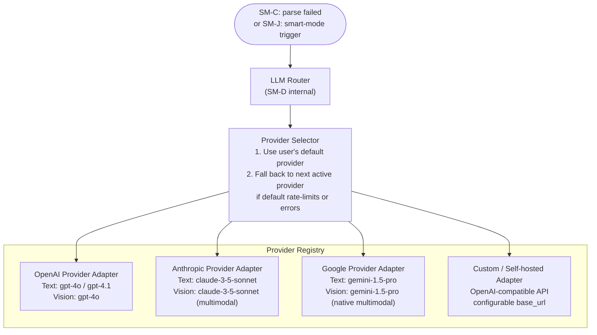
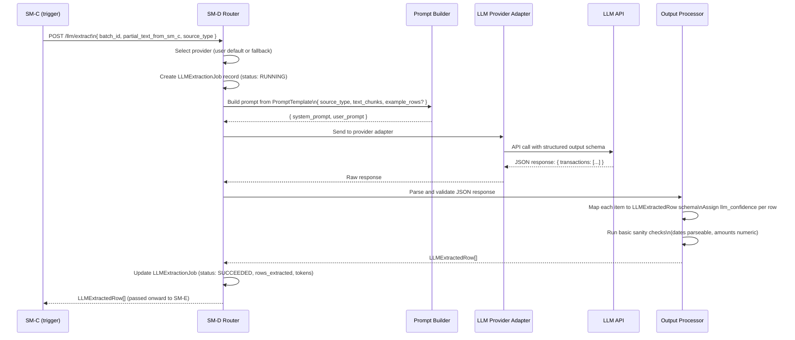
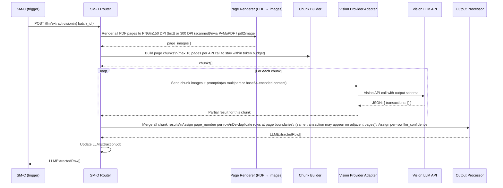
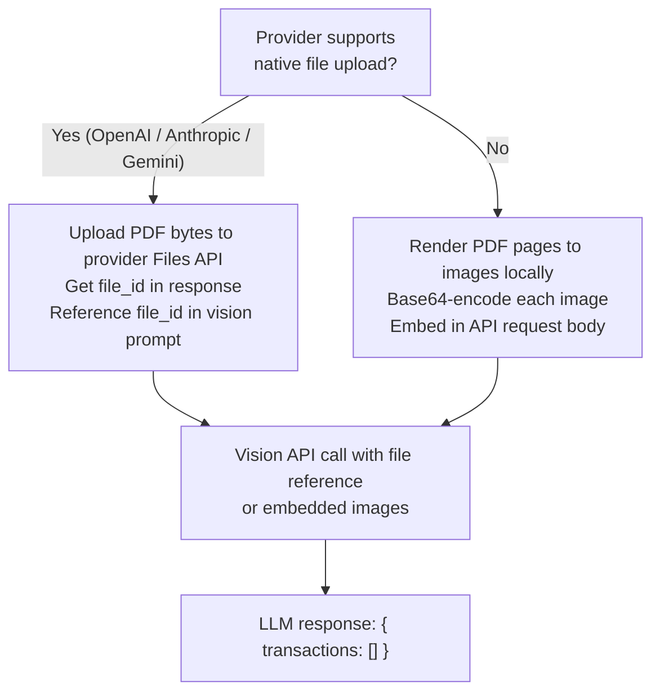
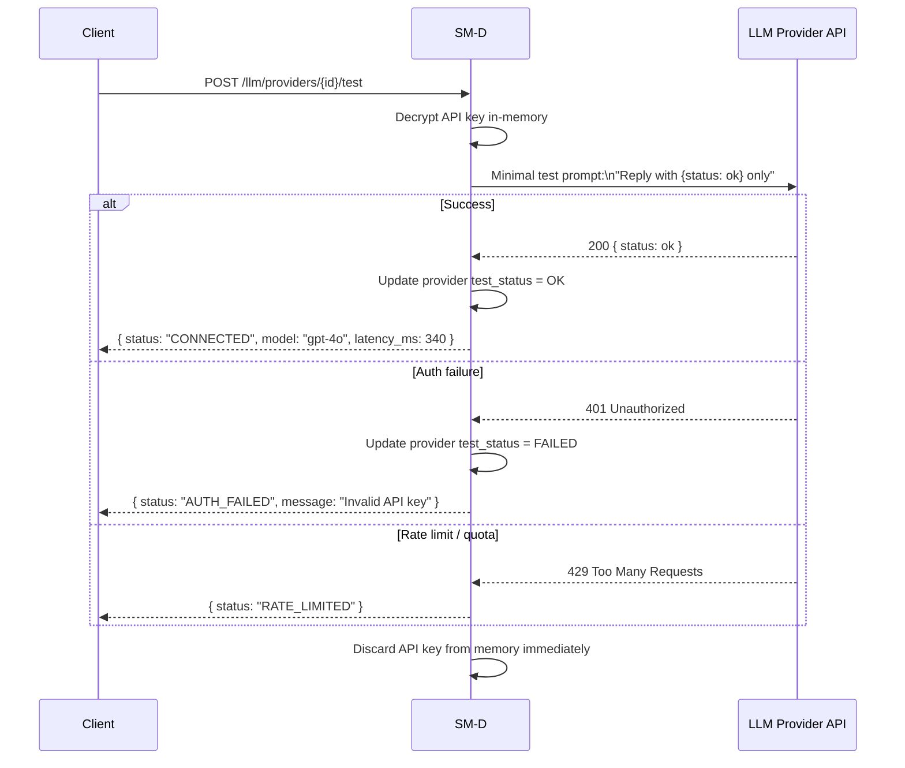
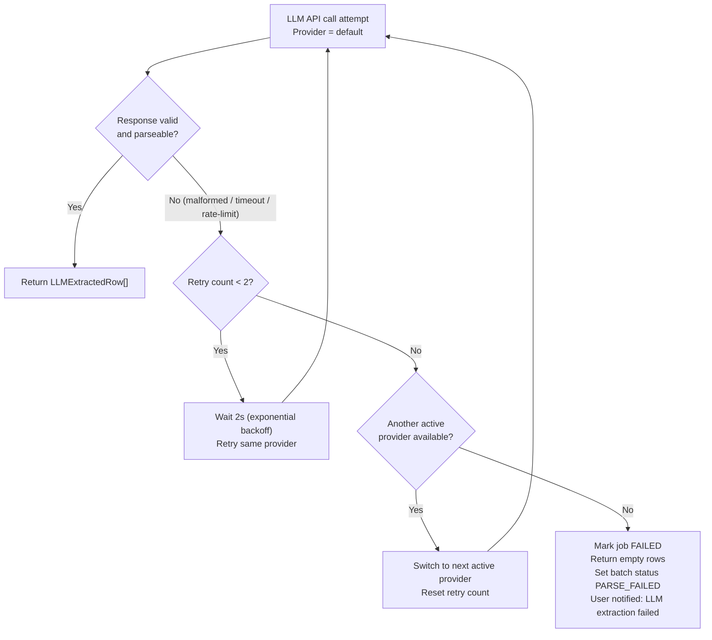

# SM-D — LLM Processing Module
## Ledger 3.0 | Sub-module Spec | Version 0.1 | March 15, 2026

---

## 1. Purpose & Scope

The LLM Processing Module is the **AI-powered extraction fallback** of the parse pipeline. It is invoked when SM-C (Parser Engine) exhausts its structured fallback chain and cannot produce high-confidence output. It is also the engine powering SM-J (Smart AI Processing Mode) when the user opts in for full-file AI analysis.

SM-D is a **provider-agnostic multi-model layer** — it abstracts OpenAI, Anthropic (Claude), Google Gemini, and any future providers behind a common interface. Provider selection, model routing, API key management, prompt versioning, and token tracking are all owned by this module.

### 1.1 Two Extraction Paths

SM-D operates two independent paths:

| Path | Trigger | Method | Use case |
|---|---|---|---|
| **Text Path** | SM-C text layer partially succeeded but confidence is low | Extract text, build structured prompt, call LLM completion | Digitally generated PDFs with complex layouts or unusual column arrangements |
| **Vision Path** | SM-C all methods failed (scanned PDF, handwritten, image-only PDF) | Render PDF pages to images, send images to LLM vision API | Scanned bank statements, printed-and-scanned documents |

Both paths produce the same `LLMExtractedRow[]` output format that SM-E can normalize.

### 1.2 Objectives

- Provide a multi-provider LLM registry with per-provider configuration and API key management
- Implement the Text Extraction path with configurable prompt templates per document type
- Implement the Vision Extraction path using vision-capable models (GPT-4o, Claude 3.5, Gemini 1.5 Pro)
- Emit structured JSON output that SM-E can normalize to `NormalizedTransaction[]`
- Track token usage and estimated cost per batch
- Support file handle upload (multipart) where the LLM provider accepts files natively

### 1.3 Out of Scope

- Schema normalization — owned by SM-E
- Categorization decisions — owned by SM-G
- Smart AI mode orchestration — owned by SM-J (which calls SM-D internally)

---

## 2. Data Models

### 2.1 LLMProvider

Configuration record for a registered LLM provider.

| Field | Type | Description |
|---|---|---|
| `provider_id` | UUID | PK |
| `user_id` | UUID | FK — each user manages their own keys |
| `provider_name` | ProviderName enum | OPENAI / ANTHROPIC / GOOGLE / CUSTOM |
| `api_key_encrypted` | string | AES-256 encrypted; decrypted in-memory at call time only |
| `api_key_hint` | string | Last 4 characters for display (e.g. `••••••••abc1`) |
| `base_url_override` | string | nullable — for custom/self-hosted endpoints |
| `default_text_model` | string | Model ID for text extraction (e.g. `gpt-4o`, `claude-3-5-sonnet-20241022`) |
| `default_vision_model` | string | Model ID for vision extraction |
| `is_active` | boolean | Whether this provider is used |
| `is_default` | boolean | Only one provider can be default |
| `test_status` | enum | UNTESTED / OK / FAILED |
| `test_last_run_at` | timestamp | |
| `created_at` | timestamp | |
| `updated_at` | timestamp | |

### 2.2 PromptTemplate

Versioned prompt templates per document type and extraction path.

| Field | Type | Description |
|---|---|---|
| `template_id` | UUID | PK |
| `source_type_scope` | string | SourceType or `*` for generic |
| `extraction_path` | enum | TEXT / VISION |
| `version` | string | Semantic version e.g. `1.2.0` |
| `is_current` | boolean | Only one template per scope+path can be current |
| `system_prompt` | text | System-level instructions to the LLM |
| `user_prompt_template` | text | Template with `{{variables}}` for batch context |
| `output_schema` | JSON | JSON Schema describing expected output structure |
| `max_tokens` | integer | Token budget for this template |
| `temperature` | float | LLM sampling temperature (0.0 for extraction tasks) |
| `created_at` | timestamp | |

### 2.3 LLMExtractionJob

One job per extraction attempt per batch.

| Field | Type | Description |
|---|---|---|
| `job_id` | UUID | PK |
| `batch_id` | UUID | FK → ImportBatch |
| `provider_id` | UUID | FK → LLMProvider |
| `model_used` | string | Actual model ID used |
| `extraction_path` | enum | TEXT / VISION |
| `prompt_template_id` | UUID | FK → PromptTemplate |
| `pages_sent` | integer | Number of pages (vision) or text chunks (text) |
| `input_tokens` | integer | Tokens consumed in prompt |
| `output_tokens` | integer | Tokens consumed in completion |
| `estimated_cost_usd` | decimal | Calculated from provider pricing table |
| `status` | enum | PENDING / RUNNING / SUCCEEDED / FAILED / RETRIED |
| `response_raw` | JSON | Raw LLM response (retained for debugging) |
| `rows_extracted` | integer | Number of rows parsed from LLM response |
| `overall_confidence` | float 0–1 | Self-assessed or heuristic confidence |
| `error_message` | string | nullable |
| `started_at` | timestamp | |
| `completed_at` | timestamp | |

### 2.4 LLMExtractedRow

Output of a successful LLM extraction job. Mirrors `RawParsedRow` but with LLM-specific fields.

| Field | Type | Required | Description |
|---|---|---|---|
| `row_id` | UUID | yes | Assigned by LLM module |
| `batch_id` | UUID | yes | Parent batch |
| `job_id` | UUID | yes | Source LLM job |
| `extraction_path` | enum | yes | TEXT / VISION |
| `raw_date` | string | yes | As returned by LLM |
| `raw_narration` | string | yes | |
| `raw_debit` | string | no | |
| `raw_credit` | string | no | |
| `raw_balance` | string | no | |
| `raw_reference` | string | no | |
| `raw_quantity` | string | no | For investment rows |
| `raw_unit_price` | string | no | |
| `txn_type_hint` | TxnTypeHint | no | LLM may infer this |
| `llm_confidence` | float 0–1 | yes | Per-row confidence from LLM |
| `page_number` | integer | no | Source page (vision path) |
| `llm_notes` | string | no | Any caveats or uncertainty from LLM |

---

## 3. Provider Architecture

### 3.1 Provider Registry and Routing



### 3.2 Provider Capability Matrix

| Provider | Text Path | Vision Path | File Handle Upload | Structured Output | Max Context |
|---|---|---|---|---|---|
| OpenAI (GPT-4o) | Yes | Yes | Yes (Files API) | Yes (JSON mode) | 128k tokens |
| Anthropic (Claude 3.5) | Yes | Yes | Yes (Files API beta) | Yes (tool_use) | 200k tokens |
| Google (Gemini 1.5 Pro) | Yes | Yes | Yes (Files API) | Yes (JSON schema) | 1M tokens |
| Custom (OpenAI-compat) | Yes | Depends on model | Depends | Depends | Configurable |

---

## 4. Text Extraction Path

### 4.1 Text Path Workflow



### 4.2 Text Prompt Structure

The prompt is assembled from three layers:

**Layer 1 — System prompt (static per source_type):**
Sets the LLM's role and the output contract. Example for bank statements:
- Role: You are a financial data extraction specialist
- Task: Extract all financial transactions from the provided text
- Rules: Date format normalization, amount sign convention, output schema
- Constraints: Return only actual transactions, exclude summary rows, totals, headers

**Layer 2 — Source context (dynamic, injected per batch):**
- Account type (bank savings / MF folio / stock broker)
- Statement period if known
- Currency
- Known column order (if partially detected by SM-C)

**Layer 3 — Document text (dynamic):**
- Full extracted text from SM-C (even if low confidence)
- OR: first 5 rows as examples if SM-C partially succeeded

**Output schema contract sent to LLM (as JSON Schema):**

```json schema
transactions: [{
  date: string,
  narration: string,
  debit: string | null,
  credit: string | null,
  balance: string | null,
  reference: string | null,
  confidence: number
}]
```

---

## 5. Vision Extraction Path

### 5.1 Vision Path Workflow



### 5.2 File Handle Upload (Provider Native)

For providers that support file uploads natively (OpenAI Files API, Anthropic Files API, Gemini Files API), SM-D uploads the PDF file directly rather than rendering to images. This reduces latency and preserves layout structure.



---

## 6. API Specification

### 6.1 Base Path

`/api/v1/llm`

### 6.2 Provider Management Endpoints

| Method | Path | Description |
|---|---|---|
| `GET` | `/llm/providers` | List all configured providers for the user |
| `POST` | `/llm/providers` | Register a new LLM provider with API key |
| `PUT` | `/llm/providers/{provider_id}` | Update provider config (model selection, active status) |
| `DELETE` | `/llm/providers/{provider_id}` | Remove a provider (cannot if it is the only active provider) |
| `POST` | `/llm/providers/{provider_id}/test` | Send a minimal test prompt to verify connectivity |
| `PUT` | `/llm/providers/{provider_id}/set-default` | Mark as the default provider |

### 6.3 Extraction Endpoints

| Method | Path | Description |
|---|---|---|
| `POST` | `/llm/extract` | Text path extraction for a batch |
| `POST` | `/llm/extract-vision` | Vision path extraction for a batch |
| `GET` | `/llm/jobs/{job_id}` | Get status and result of an extraction job |
| `GET` | `/imports/{batch_id}/llm-jobs` | List all LLM jobs for a batch |

### 6.4 Prompt Template Endpoints

| Method | Path | Description |
|---|---|---|
| `GET` | `/llm/prompts` | List all active prompt templates |
| `GET` | `/llm/prompts/{template_id}` | Get a specific template |
| `PUT` | `/llm/prompts/{template_id}/override` | User-level override for a prompt (advanced feature) |
| `DELETE` | `/llm/prompts/{template_id}/override` | Remove user override, revert to system template |

### 6.5 Usage Tracking Endpoint

| Method | Path | Description |
|---|---|---|
| `GET` | `/llm/usage` | Token usage and estimated cost summary by provider and period |
| `GET` | `/llm/usage/{provider_id}` | Per-provider usage breakdown |

### 6.6 Provider Test Flow



---

## 7. Retry and Fallback Strategy



---

## 8. Security Constraints

| Constraint | Detail |
|---|---|
| API key encryption at rest | AES-256 using a server-side key derived from a secrets manager; key is never stored in the application database |
| API key in-memory only | Decrypted into a local variable for the duration of one API call; Python `del` + gc after use |
| API key never logged | Logging middleware must scrub `api_key_encrypted` from all log lines; structured logging only allowed to log `api_key_hint` |
| API key never in API responses | `GET /llm/providers` returns `api_key_hint` only (last 4 chars); never the full key |
| User data isolation | LLM prompts are scoped to the authenticated user's batch content only; no cross-user data in any prompt |
| No persistent LLM context | Each API call is stateless — no session or conversation memory at the LLM level |
| Provider response stored securely | `response_raw` in LLMExtractionJob is stored encrypted; accessible only to the owning user |

---

## 9. Business Rules & Constraints

| Rule | Description |
|---|---|
| BR-D-01 | LLM extraction is never triggered automatically — only by SM-C (when all methods fail) or SM-J (explicit user action). |
| BR-D-02 | If no active LLM provider is configured, the extraction endpoint returns 424 (Failed Dependency) with a message directing the user to configure a provider. |
| BR-D-03 | The text path is always attempted before the vision path for the same batch. Vision path is only used if text path fails or batch was already identified as image-only. |
| BR-D-04 | Temperature is set to 0.0 for all extraction prompts — determinism is more important than creativity for financial data extraction. |
| BR-D-05 | LLM responses that cannot be parsed against the output schema are retried once with an additional schema reminder in the prompt. |
| BR-D-06 | Token usage is tracked per job and aggregated per user per month. No hard token limit is enforced (user bears the cost of their own API key). |
| BR-D-07 | Prompt templates are system-managed. Users may set overrides for the `user_prompt_template` field only — the `system_prompt` and `output_schema` are immutable. |
| BR-D-08 | File uploads to provider Files APIs are deleted from the provider's storage immediately after the job completes — no persistent storage on LLM provider side. |

---

## 10. Error Catalog

| HTTP Status | Error Code | Scenario |
|---|---|---|
| 400 | `BATCH_NOT_IN_PARSEABLE_STATE` | Batch not in PARSE_FAILED state for fallback trigger |
| 404 | `PROVIDER_NOT_FOUND` | provider_id not found or not owned by user |
| 422 | `NO_ACTIVE_PROVIDER` | No LLM provider configured or all are disabled |
| 422 | `VISION_MODEL_NOT_SUPPORTED` | Configured model does not support vision (image) input |
| 424 | `LLM_PROVIDER_AUTH_FAILED` | API key rejected by provider |
| 429 | `LLM_RATE_LIMITED` | All providers rate-limited — retry after cooldown |
| 500 | `LLM_RESPONSE_UNPARSEABLE` | LLM output did not match expected JSON schema after retries |
| 503 | `ALL_PROVIDERS_UNAVAILABLE` | All configured providers failed after retries |
