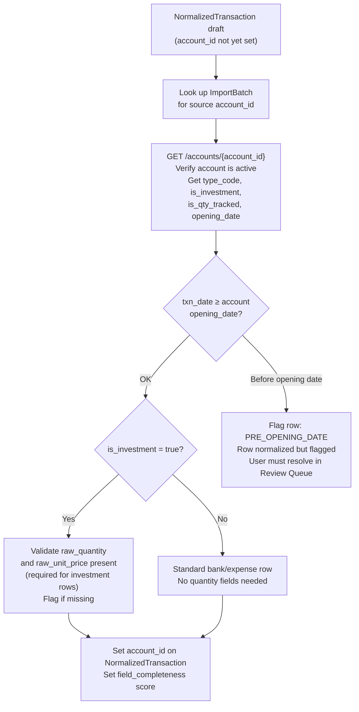
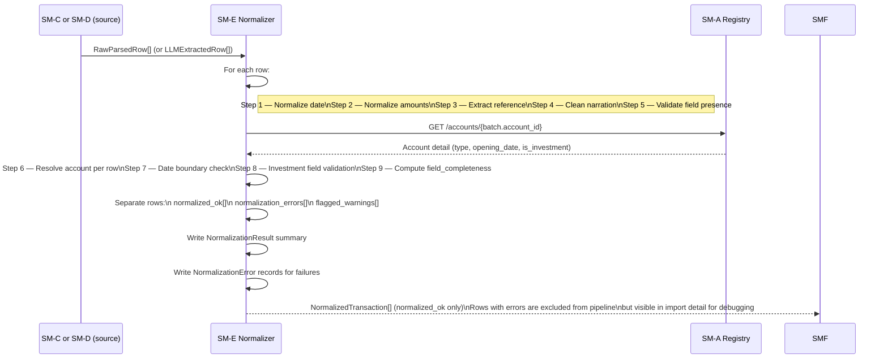
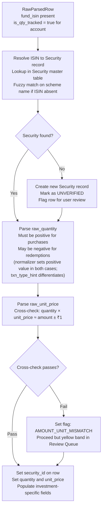

# SM-E — Schema Normalization Service
## Ledger 3.0 | Sub-module Spec | Version 0.1 | March 15, 2026

---

## 1. Purpose & Scope

The Schema Normalization Service converts the raw, source-specific output of SM-C (Parser Engine) or SM-D (LLM Processing Module) into the **canonical `NormalizedTransaction` schema**. Every downstream module — deduplication, categorization, scoring, and the accounting engine — works exclusively from normalized records.

Normalization is a pure transformation step: it adds no business logic beyond field cleaning, type conversion, sign convention enforcement, and completeness validation. It also resolves the destination account for each row by calling SM-A.

### 1.1 Objectives

- Accept `RawParsedRow[]` from SM-C or `LLMExtractedRow[]` from SM-D
- Parse and normalize date fields into ISO 8601 dates
- Parse and normalize monetary amounts into signed decimals with consistent sign convention
- Validate required fields and populate `field_completeness` score
- Resolve the destination account for each row by calling SM-A
- Emit `NormalizedTransaction[]` for consumption by SM-F (Deduplication)
- Flag any row that cannot be fully normalized for manual review

### 1.2 Out of Scope

- Deduplication — owned by SM-F
- Category assignment — owned by SM-G
- Journal entry creation — owned by the Accounting Engine

---

## 2. Data Models

### 2.1 NormalizationResult (per batch)

| Field | Type | Description |
|---|---|---|
| `batch_id` | UUID | FK → ImportBatch |
| `rows_received` | integer | Total RawParsedRow count |
| `rows_normalized` | integer | Successfully normalized |
| `rows_failed` | integer | Could not be normalized — see NormalizationError |
| `rows_flagged` | integer | Normalized but with warnings |
| `field_completeness_avg` | float 0–1 | Average across all normalized rows |
| `created_at` | timestamp | |

### 2.2 NormalizationError

| Field | Type | Description |
|---|---|---|
| `error_id` | UUID | PK |
| `batch_id` | UUID | FK |
| `row_id` | UUID | FK → RawParsedRow or LLMExtractedRow |
| `field` | string | Which field caused the failure |
| `reason` | NormalizationErrorReason | Enum — see §6 |
| `raw_value` | string | The original problematic value |
| `created_at` | timestamp | |

---

## 3. Normalization Rules

### 3.1 Date Normalization

| Input Pattern | Parsed As | Notes |
|---|---|---|
| `DD/MM/YYYY` | ISO date | Most Indian bank PDFs |
| `DD-MM-YYYY` | ISO date | Variant |
| `DD-Mon-YYYY` (e.g. `05-Jan-2024`) | ISO date | CAS statements |
| `DD MMM YYYY` (e.g. `12 Mar 2026`) | ISO date | Some PDF layouts |
| `YYYY-MM-DD` | ISO date | CSV exports |
| `MM/DD/YYYY` | Attempt; flag if ambiguous | Some third-party exports |
| Numeric timestamps | Convert to date | Rare Excel artifacts |
| Empty / null | Error: `MISSING_DATE` | Row excluded |
| Unparseable string | Error: `DATE_PARSE_FAILED` | Row excluded |

**Ambiguity rule:** If day ≤ 12, the date is ambiguous between DD/MM and MM/DD. The normalizer defaults to DD/MM (Indian convention) and sets a `DATE_AMBIGUOUS` flag on the row. The user may correct this in the Review Queue.

### 3.2 Amount Normalization

**Sign convention:**
- `debit_amount` — always positive decimal (money leaving the account)
- `credit_amount` — always positive decimal (money entering the account)
- `amount_signed` — negative for debits, positive for credits

**Input patterns handled:**

| Raw Input | Interpretation |
|---|---|
| `1,234.56` | Credit or debit depending on column |
| `(1,234.56)` or `-1,234.56` | Negative — debit in a signed-amount column |
| `1,234.56 Dr` | Debit |
| `1,234.56 Cr` | Credit |
| `1234.56` (no comma) | Standard decimal |
| `12,34,567.89` (Indian lakh format) | Parse using Indian locale |
| Empty / `–` / `nil` | null (not an error if the other column has a value) |
| Non-numeric string | Error: `AMOUNT_PARSE_FAILED` |

**Validation rules:**
- At least one of `debit_amount` or `credit_amount` must be non-null and > 0
- Both `debit_amount` and `credit_amount` cannot both be non-null for the same row
- `amount_signed` = `credit_amount` if credit, else `-(debit_amount)`

### 3.3 Running Balance Normalization

- Apply same parsing rules as amount fields
- If running balance is present, verify: `prior_balance + credit_amount - debit_amount ≈ running_balance` (tolerance: ±₹1)
- If verification fails, set `balance_inconsistent = true` flag on the row (warning, not exclusion)
- Running balance missing: set to null — not an error

### 3.4 Reference Number Extraction

Many bank narrations embed reference numbers inline. After the narration is copied to `narration_raw`, the normalizer extracts reference numbers using pattern matching:

| Pattern | Reference Type | Example |
|---|---|---|
| `UPI/[A-Z]{2}/\d{10,12}/` | UPI Reference | `UPI/CR/407812345678/SWIGGY` → ref `407812345678` |
| `NEFT/[A-Z0-9]{16,22}` | NEFT Reference | `NEFT/IN1234567890123456` |
| `IMPS/\d{12}` | IMPS Reference | `IMPS/406991234567` |
| `Chq No\s+\d+` | Cheque Number | `Chq No 123456` |
| `\d{6,8}` at end of narration | Generic reference | Fallback |

Extracted reference goes into `reference_number`. The narration is **not** stripped — the raw narration is preserved for dedup and categorization matching.

### 3.5 Narration Cleaning

After reference extraction, apply these cleaning steps to produce the `narration` (cleaned) field while preserving `narration_raw`:

| Step | Operation |
|---|---|
| Whitespace normalization | Collapse multiple spaces, trim leading/trailing |
| UPI boilerplate removal | Strip `UPI/DR/`, `UPI/CR/`, transaction IDs that are not descriptive |
| NEFT/RTGS prefix removal | Strip `NEFT/`, `RTGS/`, `IMPS/` prefixes |
| Control character removal | Strip `\t`, `\r`, `\n`, `\x00`–`\x1f` |
| Case normalization | UPPERCASE → Title Case for merchant names |
| Max length | Truncate to 500 characters if source exceeds |

### 3.6 Account Resolution

After row-level normalization, SM-E calls SM-A to resolve the account for each row:

### 3.7 Field Completeness Score

Computed per row as a weighted fraction of populated required/important fields:

| Field | Weight | Required? |
|---|---|---|
| `txn_date` | 0.25 | Yes |
| `narration` | 0.20 | Yes |
| `amount_signed` | 0.20 | Yes |
| `account_id` | 0.15 | Yes |
| `running_balance` | 0.10 | No (important for dedup) |
| `reference_number` | 0.05 | No |
| `value_date` | 0.03 | No |
| `quantity` (if investment) | 0.02 | Conditional |

`field_completeness = SUM(weight for each populated field) / SUM(all weights)`

---

## 4. Normalization Workflow

### 4.1 Full Normalization Sequence

### 4.2 Investment Row Normalization

Investment rows (from CAS or Zerodha) require special handling since they carry unit quantity data in addition to monetary amounts.

---

## 5. API Specification

### 5.1 Base Path

`/api/v1/normalize`

### 5.2 Endpoints

SM-E is primarily an internal pipeline stage. Its endpoints are exposed for testing and debugging.

| Method | Path | Description |
|---|---|---|
| `POST` | `/normalize/{batch_id}` | Trigger normalization for a batch (called internally by SM-B pipeline) |
| `GET` | `/normalize/{batch_id}/result` | Return NormalizationResult summary |
| `GET` | `/normalize/{batch_id}/errors` | Return all NormalizationError records for a batch |
| `GET` | `/normalize/{batch_id}/normalized-rows` | Return NormalizedTransaction[] for a batch (for test/debug) |
| `GET` | `/normalize/field-rules` | Return the normalization rules documentation (date formats, amount patterns, etc.) — useful for testing and UI hints |

---

## 6. Business Rules & Constraints

| Rule | Description |
|---|---|
| BR-E-01 | Rows that fail date normalization are excluded from the pipeline and recorded as NormalizationErrors. They do not proceed to SM-F. |
| BR-E-02 | Rows with no recoverable monetary amount are excluded. |
| BR-E-03 | Rows that pass normalization but have warnings (date ambiguity, balance inconsistency, pre-opening-date) proceed to SM-F with their flags set. They appear in the RED band in the Review Queue. |
| BR-E-04 | `narration_raw` is never modified — it is preserved exactly as extracted and used as input for deduplication hash. |
| BR-E-05 | `narration` (cleaned) is used for categorization rule matching. |
| BR-E-06 | Amount sign convention is enforced: `debit_amount` and `credit_amount` are always positive; `amount_signed` carries the sign. No consumer of NormalizedTransaction should reinterpret the sign. |
| BR-E-07 | For investment accounts, both `quantity` and `unit_price` must be present or both must be absent. A row with only one of them is flagged as `INCOMPLETE_INVESTMENT_FIELDS`. |
| BR-E-08 | All currency values are stored in INR minor units (paise) as integers internally, but exposed as decimal rupees in all API responses. |

---

## 7. Error Catalog (NormalizationErrorReason Enum)

| Code | Field | Description |
|---|---|---|
| `MISSING_DATE` | txn_date | Date field is empty or null |
| `DATE_PARSE_FAILED` | txn_date | Date string could not be parsed by any known format |
| `DATE_AMBIGUOUS` | txn_date | Day ≤ 12, DD/MM vs MM/DD ambiguous (warning, not exclusion) |
| `PRE_OPENING_DATE` | txn_date | Transaction date precedes account opening date |
| `MISSING_AMOUNT` | amount | Both debit and credit are null |
| `AMOUNT_PARSE_FAILED` | debit/credit | Amount string could not be parsed as a decimal |
| `BOTH_DEBIT_CREDIT_SET` | amount | Row has both a debit and a credit value (invalid) |
| `BALANCE_INCONSISTENT` | running_balance | Balance does not reconcile with prior balance + amounts (warning) |
| `ACCOUNT_NOT_FOUND` | account_id | SM-A lookup returned 404 |
| `ACCOUNT_INACTIVE` | account_id | Account is archived |
| `INCOMPLETE_INVESTMENT_FIELDS` | quantity/unit_price | Only one of quantity/unit_price present on investment row |
| `AMOUNT_UNIT_MISMATCH` | amount | quantity × unit_price does not equal amount (warning) |
| `ISIN_UNRESOLVED` | fund_isin | ISIN could not be matched in security master (warning) |
