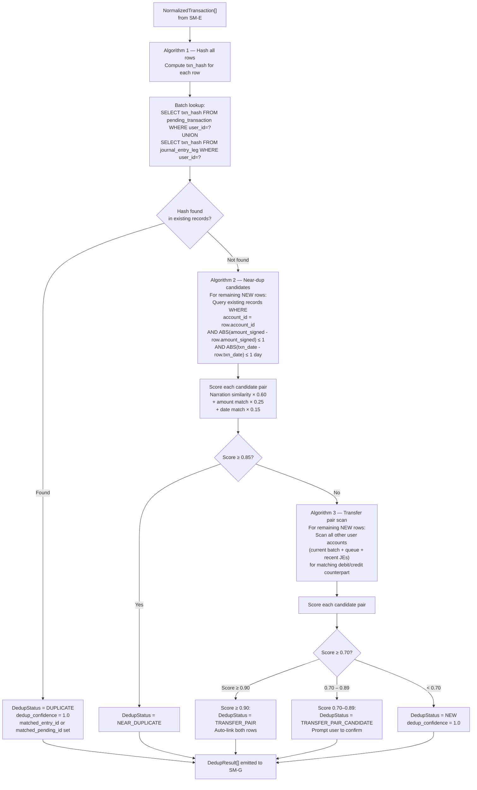
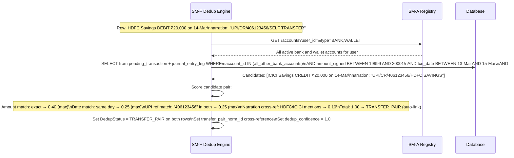
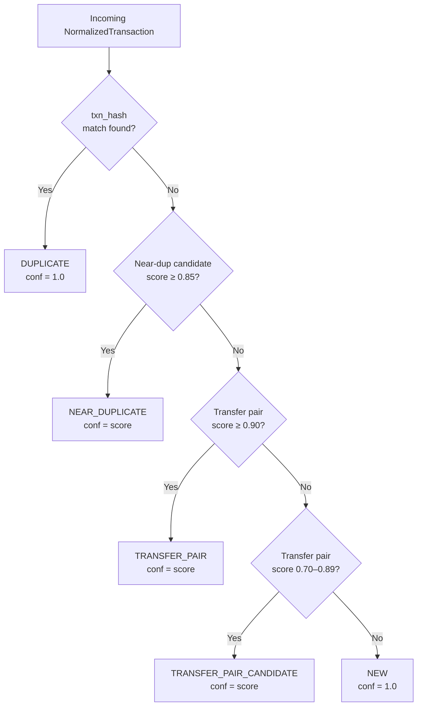

# SM-F — Deduplication Engine
## Ledger 3.0 | Sub-module Spec | Version 0.1 | March 15, 2026

---

## 1. Purpose & Scope

The Deduplication Engine ensures that a transaction already present in the ledger is never imported again, and that inter-account money movements are linked as transfers rather than treated as separate income and expense events. It is the **quality gate between raw parsed data and the user's review queue**.

### 1.1 Objectives

- Perform exact-match deduplication: if a row's hash matches a previously confirmed or pending transaction, mark it as `DUPLICATE`
- Perform near-duplicate detection: identify rows that are likely the same transaction but with minor variations (slightly different narration, 1-day date difference)
- Detect transfer pairs: identify debit-credit pairs across two accounts that represent the same inter-account money movement
- Assign a `DedupStatus` and `dedup_confidence` to every row
- Never silently discard: all duplicate rows are recorded and visible in the import detail view

### 1.2 Out of Scope

- Categorization — owned by SM-G
- Account resolution — completed by SM-E before SM-F receives rows
- Opening balance handling — separate flow in SM-B / SM-E

---

## 2. Data Models

### 2.1 DedupResult (per row output)

Extends `NormalizedTransaction` with dedup fields. SM-F does not create new rows — it attaches dedup metadata to each normalized row.

| Field | Type | Description |
|---|---|---|
| `norm_id` | UUID | FK → NormalizedTransaction |
| `batch_id` | UUID | FK → ImportBatch |
| `txn_hash` | string | Deterministic hash (see §3.1) used for exact-match lookup |
| `dedup_status` | DedupStatus | NEW / DUPLICATE / NEAR_DUPLICATE / TRANSFER_PAIR / TRANSFER_PAIR_CANDIDATE |
| `dedup_confidence` | float 0–1 | Confidence that the dedup_status assignment is correct |
| `matched_entry_id` | UUID | JournalEntry this row duplicates (if DUPLICATE) |
| `matched_pending_id` | UUID | PendingTransaction this row duplicates (if pending-pending dup) |
| `transfer_pair_norm_id` | UUID | Counterpart NormalizedTransaction (if TRANSFER_PAIR or CANDIDATE) |
| `transfer_pair_account_id` | UUID | Account that holds the counterpart transaction |
| `near_dup_similarity` | float 0–1 | Narration similarity (if NEAR_DUPLICATE) |
| `near_dup_amount_diff` | decimal | Amount difference from matched row (if NEAR_DUPLICATE) |
| `near_dup_date_diff_days` | integer | Date difference in days from matched candidate |

### 2.2 DedupStats (per batch summary)

| Field | Type | Description |
|---|---|---|
| `batch_id` | UUID | FK |
| `total_rows` | integer | Rows received from SM-E |
| `new_count` | integer | Status = NEW |
| `duplicate_count` | integer | Status = DUPLICATE |
| `near_duplicate_count` | integer | Status = NEAR_DUPLICATE |
| `transfer_pair_count` | integer | Status = TRANSFER_PAIR (both sides found) |
| `transfer_candidate_count` | integer | Status = TRANSFER_PAIR_CANDIDATE (one side only) |
| `created_at` | timestamp | |

---

## 3. Deduplication Algorithms

### 3.1 Algorithm 1 — Exact Hash Match

A deterministic hash is computed for every incoming row. If the same hash exists in either `pending_transaction` or `journal_entry_leg` (confirmed entries), the row is a `DUPLICATE`.

**Hash input fields:**

| Field | Notes |
|---|---|
| `account_id` | Scoped to the destination account |
| `txn_date` | ISO date string (YYYY-MM-DD) |
| `narration_raw` | Raw narration, not cleaned — preserves original uniqueness |
| `amount_signed` | Signed decimal rounded to 2 decimal places |
| `running_balance` | Included if present; `""` if null (prevents false positives from statements that omit balance) |

**Hash algorithm:** `SHA-256(account_id + "|" + txn_date + "|" + narration_raw + "|" + amount_signed + "|" + running_balance_or_empty)`

The same statement re-imported will always produce identical hashes for its rows, guaranteeing idempotent re-import behavior.

**Lookup scope:** Both the `pending_transaction` table (still in review queue) and approved `journal_entry_leg` records for this user.

### 3.2 Algorithm 2 — Near-Duplicate Detection

Near-duplicate detection catches variations that break exact-hash matching: slightly different narration formatting, 1-day date differences from value date vs. transaction date, or minor rounding differences.

**Candidate selection criteria** (all must match to be a candidate):

| Signal | Threshold |
|---|---|
| Same account | Exact |
| Amount difference | ≤ ₹1 (absolute) |
| Date difference | ≤ 1 day |

**Scoring criteria** (applied to candidates):

| Signal | Weight | Max Contribution |
|---|---|---|
| Narration similarity (fuzzy token sort, 0–1) | 0.60 | 0.60 |
| Amount exact match | 0.25 | 0.25 |
| Date exact match (vs. 1-day difference) | 0.15 | 0.15 |

**Thresholds:**
- Total score ≥ 0.85 → `NEAR_DUPLICATE` (dedup_confidence = score)
- Total score 0.65–0.84 → flagged for user review (dedup_status = NEW, flag added)
- Total score < 0.65 → treated as a new transaction

**Narration similarity algorithm:** Levenshtein ratio after token-sort normalization (case folding, punctuation stripping, token alphabetic sort). This handles narrations like `UPI-SWIGGY ORDER 12345` vs `SWIGGY/UPI/12345 ORDER`.

### 3.3 Algorithm 3 — Transfer Pair Detection

A transfer pair is a debit in one account that corresponds to a credit in another account of the same user, representing a movement of money between accounts (not an income or expense event).

**Detection criteria:**

| Signal | Rule | Weight |
|---|---|---|
| Amount match | Absolute values equal ± ₹1 | 0.40 |
| Direction match | One is debit, other is credit | Required |
| Different accounts | Must be two different accounts owned by the same user | Required |
| Date proximity | ≤ 1 day apart | 0.25 |
| UPI/NEFT reference match | Same reference number in narration (if present) | 0.25 |
| Narration cross-reference | One narration contains the other account's name or identifier | 0.10 |

**Score thresholds:**
- ≥ 0.90 → `TRANSFER_PAIR` — auto-linked; both rows appear as blue in Review Queue
- 0.70–0.89 → `TRANSFER_PAIR_CANDIDATE` — linked with "Confirm this transfer?" prompt
- < 0.70 → not linked; each row treated independently

**Scope of scan:** When a new batch is processed, SM-F scans for transfer pair candidates against:
1. All other `NormalizedTransaction` rows in the current batch (same batch, two accounts)
2. All `PendingTransaction` records currently in the review queue for this user
3. All `JournalEntry` records within ±3 days of the candidate date that have not yet been paired

---

## 4. Deduplication Workflow

### 4.1 Full Dedup Sequence per Batch



### 4.2 Transfer Pair Detection — Detail Sequence



### 4.3 DedupStatus Decision Tree



---

## 5. API Specification

### 5.1 Base Path

`/api/v1/dedup`

### 5.2 Endpoints

SM-F is primarily an internal pipeline step. Its endpoints are exposed for testing, debugging, and the user-facing Review Queue UI.

| Method | Path | Description |
|---|---|---|
| `POST` | `/dedup/check/{batch_id}` | Trigger dedup for a batch (called internally by SM-B pipeline) |
| `GET` | `/dedup/stats/{batch_id}` | Get DedupStats summary for a batch |
| `GET` | `/dedup/results/{batch_id}` | Return full DedupResult[] for a batch |
| `GET` | `/dedup/transfer-pairs/{batch_id}` | Return only TRANSFER_PAIR and CANDIDATE rows |
| `POST` | `/dedup/confirm-transfer` | User confirms a TRANSFER_PAIR_CANDIDATE (raises to TRANSFER_PAIR) |
| `POST` | `/dedup/break-link` | User breaks a TRANSFER_PAIR (both rows revert to NEW, requiring individual categorization) |
| `POST` | `/dedup/mark-duplicate` | User manually marks a NEW row as a duplicate of an existing entry |
| `POST` | `/dedup/unmark-duplicate` | User reverses a duplicate marking |

### 5.3 Transfer Pair Confirm/Break API

```
POST /api/v1/dedup/confirm-transfer
Body: { norm_id_a: "uuid", norm_id_b: "uuid" }
Response: { status: "TRANSFER_PAIR", dedup_confidence: 1.0 }

POST /api/v1/dedup/break-link
Body: { norm_id: "uuid" }  (breaks the pair for this row and its counterpart)
Response: { status: "NEW", message: "Both rows returned to independent categorization" }
```

---

## 6. Business Rules & Constraints

| Rule | Description |
|---|---|
| BR-F-01 | Duplicate rows are **never discarded** — they are recorded with DedupStatus=DUPLICATE and visible in the import detail view. The user can always see what was found and what was skipped. |
| BR-F-02 | The deduplication hash is computed from `narration_raw` (not the cleaned version) to prevent hash drift when the cleaning logic changes. |
| BR-F-03 | Transfer pair detection scans across all bank, wallet, and credit card accounts (`type_code = ASSET` with `sub_type IN BANK, CASH`) for the same user. Investment accounts are excluded from transfer pair detection. |
| BR-F-04 | If a user manually breaks a confirmed TRANSFER_PAIR, both rows are re-routed to SM-G for independent categorization. |
| BR-F-05 | A DUPLICATE row does not proceed to SM-G (no categorization needed). A NEAR_DUPLICATE row does proceed to SM-G but is flagged for manual review. |
| BR-F-06 | Transfer pairs (when approved) generate a single inter-account transfer JournalEntry — no income or expense account is involved. |
| BR-F-07 | Deduplication is scoped to the authenticated user. Cross-user hash matching is never performed. |
| BR-F-08 | The hash lookup is a database-level indexed query on `(user_id, txn_hash)`. This index is critical for performance and must be enforced as a unique constraint. |

---

## 7. Error Catalog

| HTTP Status | Error Code | Scenario |
|---|---|---|
| 400 | `BATCH_NOT_DEDUPLICATED` | Trying to read dedup results before dedup has run |
| 404 | `ROW_NOT_FOUND` | norm_id not found |
| 409 | `ALREADY_CONFIRMED_TRANSFER` | confirm-transfer called on a row already TRANSFER_PAIR |
| 409 | `NOT_A_TRANSFER_PAIR` | break-link called on a row not in TRANSFER_PAIR status |
| 422 | `PAIR_DIFFERENT_USER` | norm_id_a and norm_id_b belong to different users |
| 422 | `PAIR_SAME_ACCOUNT` | Both sides of proposed transfer are in the same account |

---

## 8. Integration Points

| Direction | Target | Detail |
|---|---|---|
| Receives from | SM-E | NormalizedTransaction[] after normalization |
| Calls | SM-A | `GET /accounts` to fetch all bank/wallet accounts for transfer pair scan |
| Calls | DB (direct) | Hash lookup and near-dup candidate queries — SM-F has read access to both `pending_transaction` and `journal_entry_leg` for the current user |
| Outputs to | SM-G | DedupResult[] — only rows with DedupStatus = NEW, NEAR_DUPLICATE, or TRANSFER_PAIR(_CANDIDATE) |
| Outputs to | SM-I | DedupResult metadata is embedded in TransactionProposal |
| User interaction | SM-I API | User confirms/breaks transfer pairs via SM-I which calls SM-F endpoints |
