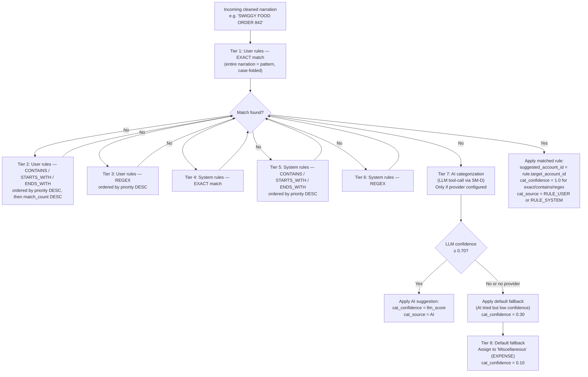
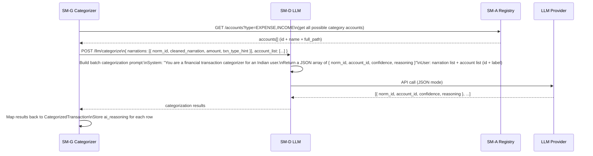
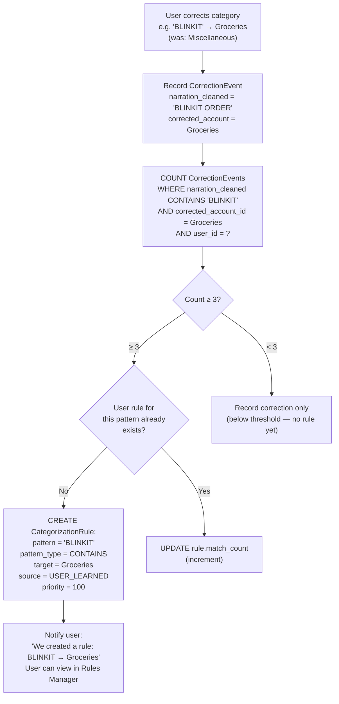

# SM-G — Categorization Engine
## Ledger 3.0 | Sub-module Spec | Version 0.1 | March 15, 2026

---

## 1. Purpose & Scope

The Categorization Engine determines which account from the user's Chart of Accounts should be assigned to each incoming transaction as its **category** (the non-source leg of the journal entry). This is the primary AI touchpoint in the standard pipeline — it uses a rule cascade that escalates from fast string matching to AI inference only when simpler methods fail.

### 1.1 Objectives

- Apply a deterministic, ordered rule cascade to assign a category account to each transaction
- Use AI (LLM tool-call) as the final-resort categorization method when no rules match
- Learn from user corrections: auto-promote patterns to user rules after repeated corrections
- Allow users to create, edit, disable, and delete their own rules
- Give all system rules a fixed base that users can override but not delete
- Return `suggested_account_id` and `cat_confidence` per transaction

### 1.2 Out of Scope

- Account creation — owned by SM-A
- Confidence score composition — handled by SM-H (cat_confidence is one input)
- Journal entry creation — owned by the Accounting Engine
- Transfer pairs — categorization is not applied to TRANSFER_PAIR rows (they have a fixed template JE)

---

## 2. Data Models

### 2.1 CategorizationRule

| Field | Type | Description |
|---|---|---|
| `rule_id` | UUID | PK |
| `user_id` | UUID | FK; null for system rules |
| `rule_name` | string | Auto-generated or user-set label e.g. "SWIGGY → Dining Out" |
| `pattern_type` | enum | CONTAINS / STARTS_WITH / ENDS_WITH / EXACT / REGEX |
| `pattern` | string | The string pattern to match against `narration` (cleaned) |
| `is_case_sensitive` | boolean | Default false |
| `target_account_id` | UUID | FK → Account — the category to assign |
| `source` | enum | SYSTEM / USER_MANUAL / USER_LEARNED |
| `priority` | integer | Higher value = evaluated first within same tier; default 100 |
| `match_count` | integer | Cumulative count of transactions matched by this rule |
| `is_enabled` | boolean | Rules can be disabled without deletion |
| `applies_to_account_types` | string[] | Optional: restrict to specific account sub_types (e.g. BANK only) |
| `created_at` | timestamp | |
| `updated_at` | timestamp | |

### 2.2 CategorizedTransaction

Output of SM-G. Extends `DedupResult` with categorization fields.

| Field | Type | Description |
|---|---|---|
| `norm_id` | UUID | FK → NormalizedTransaction |
| `suggested_account_id` | UUID | FK → Account |
| `cat_confidence` | float 0–1 | Confidence in the assigned category |
| `cat_source` | enum | RULE_USER / RULE_SYSTEM / AI / DEFAULT |
| `matched_rule_id` | UUID | FK → CategorizationRule (null if AI or default) |
| `ai_job_id` | UUID | FK → LLMExtractionJob (null if not AI-categorized) |
| `ai_reasoning` | string | Brief explanation from LLM (if AI-categorized) |

### 2.3 CorrectionEvent

Records user corrections to categorization — feeds the rule learning mechanic.

| Field | Type | Description |
|---|---|---|
| `correction_id` | UUID | PK |
| `user_id` | UUID | FK |
| `norm_id` | UUID | FK → NormalizedTransaction |
| `original_account_id` | UUID | What SM-G originally suggested |
| `corrected_account_id` | UUID | What the user changed it to |
| `narration_cleaned` | string | The cleaned narration at time of correction |
| `auto_rule_created` | boolean | Whether this correction triggered a new rule |
| `created_at` | timestamp | |

---

## 3. Rule Cascade

### 3.1 Cascade Order

Rules are evaluated in strict order. The first match wins.

### 3.2 Rule Evaluation Detail

For CONTAINS pattern matching, the evaluation is:
`narration_lower CONTAINS pattern_lower` (if `is_case_sensitive = false`)

For REGEX:
- Pattern is pre-compiled at rule creation time, not at evaluation time
- `re.search(pattern, narration, re.IGNORECASE)` (unless `is_case_sensitive = true`)
- Invalid regex at creation time → 400 error, rule not saved

**Tie-breaking within a tier:**
1. Higher `priority` number wins
2. If equal priority: higher `match_count` (more proven rule) wins
3. If still tied: more recently created rule wins (`created_at DESC`)

---

## 4. System Rule Library

System rules are shipped with Ledger and cover the most common Indian financial narration patterns. Approximately 170 rules at launch.

### 4.1 Sample System Rules

| Pattern | Type | Target Account | Notes |
|---|---|---|---|
| `SWIGGY` | CONTAINS | Expense > Food & Dining | Food delivery |
| `ZOMATO` | CONTAINS | Expense > Food & Dining | Food delivery |
| `BIGBASKET` | CONTAINS | Expense > Groceries | Online grocery |
| `UBER` | CONTAINS | Expense > Transport | Cab |
| `OLA` | CONTAINS | Expense > Transport | Cab |
| `PETROL` | CONTAINS | Expense > Transport | Fuel |
| `INDIAN OIL` | CONTAINS | Expense > Transport | Fuel |
| `NETFLIX` | CONTAINS | Expense > Entertainment | OTT |
| `SPOTIFY` | CONTAINS | Expense > Entertainment | Music |
| `LIC` | CONTAINS | Expense > Insurance | Insurance |
| `HDFC LIFE` | CONTAINS | Expense > Insurance | Insurance |
| `SALARY` | CONTAINS | Income > Salary | Payroll |
| `ATM/CASH WDL` | CONTAINS | Asset > Cash in Hand | ATM withdrawal |
| `NACH DR.*SIP` | REGEX | Asset > Mutual Funds | SIP deduction |
| `NACH DR.*EMI` | REGEX | Liability > Loans | EMI deduction |
| `UPI/DR.*NACH` | CONTAINS | Liability > Loans | NACH mandate |
| `NEFT.*SALARY` | REGEX | Income > Salary | NEFT salary credit |
| `INTEREST CREDIT` | CONTAINS | Income > Interest | FD / savings interest |
| `INT PD ON` | STARTS_WITH | Income > Interest | Savings interest format |

### 4.2 System Rule Management

- System rules can be **disabled** by the user but never deleted
- A user rule with the same pattern takes priority regardless of priority number setting
- System rule updates (new patterns added in app updates) are propagated on deployment
- Users see system rules under a "Built-in rules" tab — read-only except for the enable/disable toggle

---

## 5. AI Categorization

### 5.1 AI Tool-Call Architecture

When no rule matches, SM-G forms a tool-call request to SM-D (LLM module) with a structured categorization query.

**Batch size for AI calls:** Up to 50 narrations per LLM call to balance token efficiency and latency.

**AI prompt constraints:**
- Model must choose only from the provided `account_list` — it cannot hallucinate new account names
- Account list provided as `{ id, full_path }` pairs — model responds with `account_id` only (no free-text name generation)
- If the model returns an account_id not in the provided list, the result is rejected and the default fallback is used

---

## 6. Rule Learning

### 6.1 Auto-Promotion Logic

When a user corrects the category of a transaction in the Review Queue or Transaction List, a `CorrectionEvent` is recorded. When 3 correction events share the same cleaned narration pattern and target the same account, a user rule is auto-promoted.

### 6.2 Retroactive Rule Application

When a new user rule is created (manually or via learning), the user may choose to apply it retroactively:

- **Scope**: All existing PendingTransactions and confirmed JournalEntries where the narration matches the new rule's pattern
- **For PendingTransactions**: Update `suggested_account_id` in-place (not yet confirmed)
- **For confirmed JournalEntries**: Do NOT auto-correct. Present as a suggestion: "This rule would re-categorize 47 historical transactions. Apply changes?"
- **If user accepts**: SM-I triggers a batch correction edit on those entries (reversal + correction via Accounting Engine)
- Count of affected rows shown before the user confirms

---

## 7. API Specification

### 7.1 Base Path

`/api/v1`

### 7.2 Categorization Trigger

| Method | Path | Description |
|---|---|---|
| `POST` | `/categorize/{batch_id}` | Run categorization on all NEW/NEAR_DUPLICATE rows in a batch (internal pipeline call) |
| `GET` | `/categorize/{batch_id}/results` | Return CategorizedTransaction[] for a batch |

### 7.3 Rules Management

| Method | Path | Description |
|---|---|---|
| `GET` | `/rules` | List all rules (user + system); supports `?source=USER` filter |
| `GET` | `/rules/{rule_id}` | Get single rule detail |
| `POST` | `/rules` | Create a user rule |
| `PUT` | `/rules/{rule_id}` | Update a user rule (pattern, target, priority, enabled) |
| `DELETE` | `/rules/{rule_id}` | Delete a user rule (USER_MANUAL / USER_LEARNED only) |
| `PUT` | `/rules/{rule_id}/disable` | Disable a rule without deleting |
| `PUT` | `/rules/{rule_id}/enable` | Re-enable a disabled rule |
| `GET` | `/rules/system` | List system rules (read-only) |
| `PUT` | `/rules/{rule_id}/system-override` | Enable/disable a system rule for this user |
| `POST` | `/rules/test` | Test a pattern against a narration string — returns match result |
| `POST` | `/rules/retroactive-preview` | Preview count of transactions a rule would re-categorize |
| `POST` | `/rules/retroactive-apply` | Apply retroactive re-categorization |

### 7.4 Corrections

| Method | Path | Description |
|---|---|---|
| `POST` | `/corrections` | Record a single category correction (called from Review Queue or Transaction List) |
| `GET` | `/corrections` | List all corrections for the user |
| `GET` | `/corrections/learning-progress` | Show patterns approaching the 3-correction threshold |

---

## 8. Business Rules & Constraints

| Rule | Description |
|---|---|
| BR-G-01 | System rules cannot be deleted. They can only be disabled on a per-user basis. |
| BR-G-02 | User rules always take precedence over system rules at the same pattern type — even if the system rule has a higher `priority` number. |
| BR-G-03 | REGEX rules are pre-validated at creation time. Invalid regex returns 400 and the rule is not saved. |
| BR-G-04 | AI categorization is skipped (default fallback applied immediately) if no active LLM provider is configured. |
| BR-G-05 | TRANSFER_PAIR rows are excluded from categorization — they already have a fixed transfer JE template. |
| BR-G-06 | DUPLICATE rows are excluded from categorization — they are not entering the ledger. |
| BR-G-07 | The `match_count` field is updated atomically when a rule matches — even during batch categorization runs. |
| BR-G-08 | Rule auto-promotion threshold is 3 corrections with matching narration pattern and same target account. Partial matches (same narration, different targets) do not promote. |
| BR-G-09 | `target_account_id` must point to an active, non-system leaf account |
| BR-G-10 | AI categorization is batched — up to 50 narrations per LLM call. Large batches are chunked automatically. |

---

## 9. Error Catalog

| HTTP Status | Error Code | Scenario |
|---|---|---|
| 400 | `INVALID_REGEX` | Pattern type REGEX with syntactically invalid regex |
| 400 | `TARGET_NOT_LEAF` | target_account_id has children — must be a leaf account |
| 400 | `TARGET_ACCOUNT_INACTIVE` | target_account_id is archived |
| 403 | `SYSTEM_RULE_IMMUTABLE` | Attempt to update or delete a system rule |
| 404 | `RULE_NOT_FOUND` | rule_id not found or belongs to another user |
| 409 | `DUPLICATE_RULE` | A user rule with identical pattern_type + pattern + target already exists |
| 422 | `RETROACTIVE_TOO_LARGE` | Retroactive apply would affect > 1,000 entries; requires explicit confirmation flag |
