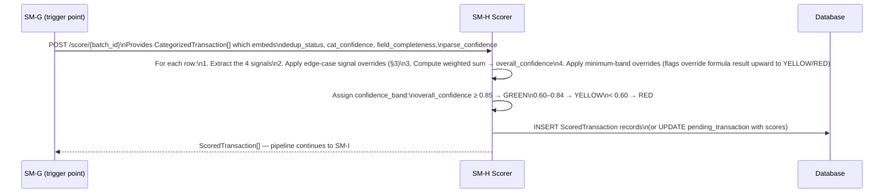
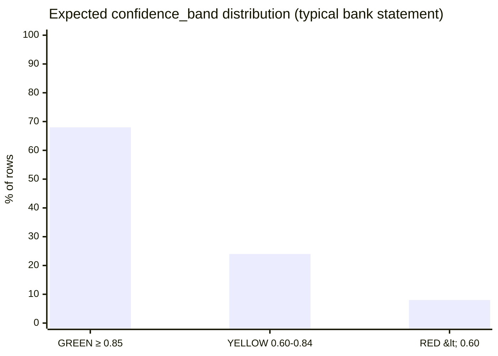
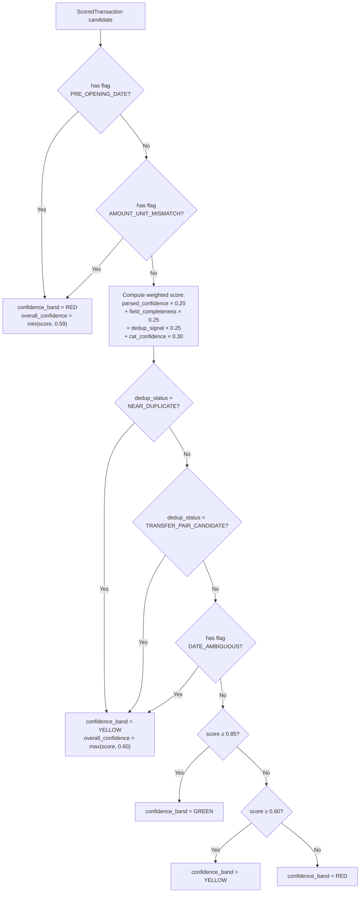

# SM-H — Confidence Scoring Service
## Ledger 3.0 | Sub-module Spec | Version 0.1 | March 15, 2026

---

## 1. Purpose & Scope

The Confidence Scoring Service computes a single **`overall_confidence`** score (0–1) for each transaction arriving at the Review Queue. This score is a composite of four independent signals gathered from upstream pipeline stages. It determines the visual priority banding (GREEN / YELLOW / RED) that drives the Review Queue UX and the bulk-approval rules.

### 1.1 Objectives

- Aggregate the four confidence signals (parse, field completeness, dedup, category) into one composite score
- Apply defined band thresholds to assign GREEN, YELLOW, or RED band per transaction
- Determine which transactions are safe for one-click bulk approval (GREEN) and which require individual attention (RED)
- Store scores on `PendingTransaction` records for consumption by SM-I
- Support threshold configuration (without code changes)

### 1.2 Out of Scope

- Computing the individual signals — each upstream module (SM-C, SM-E, SM-F, SM-G) produces its own signal
- Displaying scores — owned by SM-I (Transaction Proposal Service)
- User overrides of scoring thresholds — admin-level only setting

---

## 2. Scoring Model

### 2.1 The Four Signals

| Signal | Source Module | Field | Range |
|---|---|---|---|
| `parse_confidence` | SM-C or SM-D | `ImportBatch.parse_confidence` (applied per-row from batch; per-row value if SM-D emits it) | 0 – 1 |
| `field_completeness` | SM-E | `NormalizedTransaction.field_completeness` | 0 – 1 |
| `dedup_confidence` | SM-F | `DedupResult.dedup_confidence` | 0 – 1 |
| `cat_confidence` | SM-G | `CategorizedTransaction.cat_confidence` | 0 – 1 |

### 2.2 Composite Score Formula

$$\text{overall\_confidence} = w_1 \cdot \text{parse\_confidence} + w_2 \cdot \text{field\_completeness} + w_3 \cdot \text{dedup\_confidence} + w_4 \cdot \text{cat\_confidence}$$

**Default weights:**

| Signal | Variable | Default Weight |
|---|---|---|
| parse_confidence | $w_1$ | 0.20 |
| field_completeness | $w_2$ | 0.25 |
| dedup_confidence | $w_3$ | 0.25 |
| cat_confidence | $w_4$ | 0.30 |

**Sum of weights:** $w_1 + w_2 + w_3 + w_4 = 1.00$

**Rationale for weights:**
- `cat_confidence` has the highest weight because an incorrect categorization is the most consequential error visible to the user
- `field_completeness` and `dedup_confidence` are equal — both affect data accuracy
- `parse_confidence` is lowest because by the time a row reaches SM-H, the parser already succeeded (major failures excluded earlier)

Weights are stored in a configuration table and can be adjusted by administrators without code changes.

### 2.3 Band Thresholds

| Band | overall_confidence | Meaning | Review Queue Row Color | Bulk-Approvable? |
|---|---|---|---|---|
| GREEN | ≥ 0.85 | High confidence — safe for 1-click bulk approval | Green | Yes |
| YELLOW | 0.60 – 0.84 | Moderate confidence — warrants a quick glance | Yellow/Amber | No (requires individual confirm) |
| RED | < 0.60 | Low confidence — must be individually reviewed | Red | No |

**Special bands (overrides):**

| Condition | Forced Band | Reason |
|---|---|---|
| `dedup_status = TRANSFER_PAIR_CANDIDATE` | YELLOW (minimum) | User must confirm the pairing |
| `dedup_status = NEAR_DUPLICATE` | YELLOW (minimum) | User should verify it's not a true duplicate |
| `has_flag: PRE_OPENING_DATE` | RED | Transaction date before account history begins |
| `has_flag: DATE_AMBIGUOUS` | YELLOW (minimum) | Day/month order ambiguous |
| `has_flag: AMOUNT_UNIT_MISMATCH` | RED | Investment units × price ≠ amount |
| `has_flag: MISSING_DATE` | RED | Never reaches SM-H (excluded by SM-E); listed for completeness |

---

## 3. Signal Detail and Edge Cases

### 3.1 parse_confidence Edge Cases

| Scenario | Value Applied |
|---|---|
| SM-C succeeded with text layer | Batch-level parse_confidence (typically 0.90–0.99) |
| SM-C used OCR fallback | Per-row confidence from OCR (may vary 0.60–0.90) |
| SM-D (LLM) used for extraction | Per-row `llm_confidence` from `LLMExtractedRow` |
| parse_confidence not set (rare) | Default: 0.50 |

### 3.2 dedup_confidence Signal Mapping

The `dedup_confidence` from SM-F does not map directly — it measures confidence that the dedup_status is correct, not whether the row is "good". SM-H transforms it:

| DedupStatus | dedup_confidence from SM-F | Signal used in formula |
|---|---|---|
| NEW | 1.0 | 1.0 — no dedup concern |
| DUPLICATE | 1.0 | Row excluded — never reaches SM-H |
| NEAR_DUPLICATE | 0.85–1.0 | 0.60 (capped down — high risk, forces YELLOW) |
| TRANSFER_PAIR | 0.90–1.0 | 0.90 — pairing is confident, minor review needed |
| TRANSFER_PAIR_CANDIDATE | 0.70–0.89 | 0.60 (reflects pairing uncertainty) |

### 3.3 cat_confidence Range Mapping by Source

| cat_source | Expected cat_confidence range |
|---|---|
| RULE_USER (exact) | 1.0 |
| RULE_USER (contains) | 1.0 |
| RULE_USER (regex) | 0.95 |
| RULE_SYSTEM (exact) | 0.95 |
| RULE_SYSTEM (contains) | 0.90 |
| RULE_SYSTEM (regex) | 0.85 |
| AI | LLM-assigned, 0.50–0.99 |
| DEFAULT (Miscellaneous) | 0.10 |

---

## 4. Scoring Workflow

### 4.1 Scoring Sequence



### 4.2 Score Distribution Visualization



Typical distribution for a clean, recognized-source bank statement import: ~68% green (bulk-approvable), ~24% yellow (quick glance), ~8% red (manual attention). Scanned or LLM-extracted documents will shift this distribution toward yellow and red.

### 4.3 Overall Confidence Decision Tree



---

## 5. API Specification

### 5.1 Base Path

`/api/v1/score`

### 5.2 Endpoints

| Method | Path | Description |
|---|---|---|
| `POST` | `/score/{batch_id}` | Compute scores for all transactions in a batch (internal pipeline call) |
| `GET` | `/score/{batch_id}/results` | Return ScoredTransaction[] for a batch |
| `GET` | `/score/{batch_id}/summary` | Band distribution summary: { green: N, yellow: N, red: N } |
| `GET` | `/score/thresholds` | Return current threshold and weight configuration |
| `PUT` | `/score/thresholds` | Update thresholds (admin-only endpoint) |

### 5.3 Score Summary Response

`GET /api/v1/score/{batch_id}/summary`

```
{
  "batch_id": "uuid",
  "total_rows_scored": 98,
  "green": { "count": 67, "percent": 68.4 },
  "yellow": { "count": 23, "percent": 23.5 },
  "red": { "count": 8, "percent": 8.2 },
  "transfer_pairs": 3,
  "near_duplicates": 2,
  "computed_at": "2026-03-15T14:32:00Z"
}
```

---

## 6. Business Rules & Constraints

| Rule | Description |
|---|---|
| BR-H-01 | Flag-based overrides always win over formula-computed bands. A RED flag forces RED even if the formula score would be GREEN. |
| BR-H-02 | Minimum-band overrides (NEAR_DUPLICATE, TRANSFER_PAIR_CANDIDATE, DATE_AMBIGUOUS) can only raise the band, never lower it. If formula gives RED, those flags do not override to YELLOW. |
| BR-H-03 | GREEN band rows are eligible for bulk-approval only if no flags are present on the row. A row with overall_confidence 0.90 but any flag is forced to YELLOW for bulk-approval purposes. |
| BR-H-04 | Weight configuration changes apply to all future scoring runs but do not retroactively re-score already-scored batches. Re-processing a batch re-scores with the current weights. |
| BR-H-05 | Threshold configuration (0.85 / 0.60 boundaries) is global across all users. There are no per-user threshold overrides in v1. |

---

## 7. Error Catalog

| HTTP Status | Error Code | Scenario |
|---|---|---|
| 400 | `BATCH_NOT_CATEGORIZED` | Scoring triggered before SM-G has completed |
| 400 | `INVALID_WEIGHTS` | Weight update request where sum ≠ 1.0 |
| 403 | `THRESHOLD_UPDATE_ADMIN_ONLY` | Non-admin user tries to PUT /score/thresholds |
| 404 | `BATCH_NOT_FOUND` | batch_id not found |
