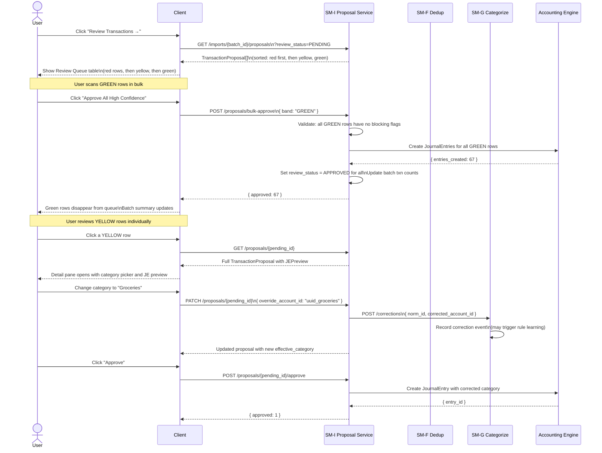
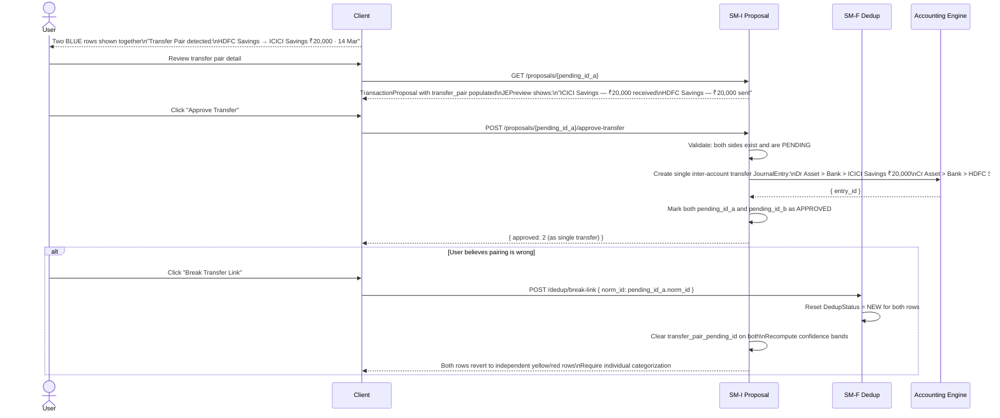
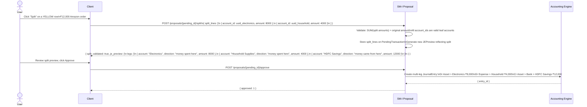
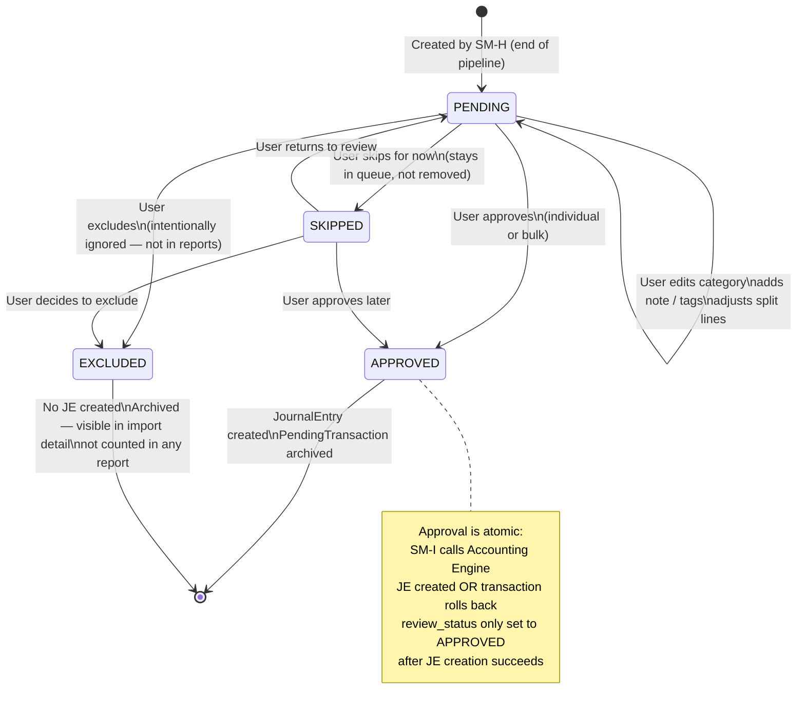

# SM-I — Transaction Proposal Service
## Ledger 3.0 | Sub-module Spec | Version 0.1 | March 15, 2026

---

## 1. Purpose & Scope

The Transaction Proposal Service is the **human-facing review interface** of the pipeline. It presents scored, categorized transaction proposals to the user, supports individual and bulk review actions, and triggers journal entry creation through the Accounting Engine when transactions are approved.

This is the only module the end user directly interacts with in the pipeline — all upstream modules feed into the data SM-I serves.

### 1.1 Objectives

- Serve the Review Queue: a sorted, filterable list of all pending transaction proposals
- Present each proposal with its suggested journal entry preview (debit/credit legs in plain language)
- Support individual actions: approve, exclude, edit category, add note, split
- Support bulk actions: approve-all-green, approve-selected, set-category-for-selected
- Support transfer pair actions: confirm-transfer, break-link
- Trigger Accounting Engine to create `JournalEntry` records on approval
- Update ImportBatch status as proposals are resolved

### 1.2 Out of Scope

- Score computation — handled by SM-H
- Categorization logic — handled by SM-G
- Deduplication — handled by SM-F
- Accounting Engine internals (journal entry balancing, running balance updates) — separate engine
- Full Transaction List (confirmed entries) — owned by the Transaction List sub-module (SM-3 in the product spec)

---

## 2. Data Models

### 2.1 PendingTransaction

The central record for proposals. Created by SM-H at the end of the scoring stage.

| Field | Type | Description |
|---|---|---|
| `pending_id` | UUID | PK |
| `batch_id` | UUID | FK → ImportBatch |
| `user_id` | UUID | FK — indexed |
| `norm_id` | UUID | FK → NormalizedTransaction (source data) |
| `txn_hash` | string | Copied from DedupResult for fast lookup |
| `txn_date` | date | |
| `value_date` | date | nullable |
| `narration` | string | Cleaned narration |
| `narration_raw` | string | Original |
| `account_id` | UUID | FK → source account |
| `debit_amount` | decimal | nullable |
| `credit_amount` | decimal | nullable |
| `amount_signed` | decimal | |
| `running_balance` | decimal | nullable |
| `reference_number` | string | nullable |
| `quantity` | decimal | nullable (investment rows) |
| `unit_price` | decimal | nullable |
| `suggested_account_id` | UUID | FK → category account (from SM-G) |
| `cat_confidence` | float | |
| `cat_source` | enum | |
| `matched_rule_id` | UUID | nullable |
| `dedup_status` | DedupStatus | |
| `dedup_confidence` | float | |
| `transfer_pair_pending_id` | UUID | nullable — linked pair |
| `overall_confidence` | float | Composite score from SM-H |
| `confidence_band` | enum | GREEN / YELLOW / RED |
| `flags` | Flag[] | JSON array of flag types |
| `review_status` | ReviewStatus | PENDING / APPROVED / EXCLUDED / SKIPPED |
| `user_note` | string | nullable — user-added note |
| `user_tags` | string[] | User-applied tags |
| `split_lines` | SplitLine[] | JSON — if user split the transaction |
| `override_account_id` | UUID | nullable — if user changed the suggested category |
| `approved_at` | timestamp | nullable |
| `excluded_at` | timestamp | nullable |
| `created_at` | timestamp | |
| `updated_at` | timestamp | |

### 2.2 SplitLine

Embedded in `PendingTransaction.split_lines` when a transaction is split across multiple categories.

| Field | Type | Description |
|---|---|---|
| `split_id` | UUID | |
| `account_id` | UUID | FK → category account |
| `amount` | decimal | Portion assigned to this category |
| `note` | string | nullable |
| `line_order` | integer | Display order |

### 2.3 TransactionProposal (API response object)

The enriched view SM-I returns to the client. Not a stored entity — assembled on read.

| Field | Type | Description |
|---|---|---|
| `pending_id` | UUID | |
| `batch_id` | UUID | |
| `txn_date` | date | |
| `narration` | string | |
| `account` | AccountSummary | Source account: { id, name, full_path } |
| `amount_signed` | decimal | |
| `debit_amount` | decimal | nullable |
| `credit_amount` | decimal | nullable |
| `suggested_category` | AccountSummary | From SM-G: { id, name, full_path } |
| `override_category` | AccountSummary | nullable — if user has already edited |
| `effective_category` | AccountSummary | `override_category ?? suggested_category` |
| `cat_confidence` | float | |
| `cat_source` | enum | |
| `dedup_status` | DedupStatus | |
| `transfer_pair` | TransferPairSummary | nullable — { counterpart_pending_id, counterpart_account, amount } |
| `overall_confidence` | float | |
| `confidence_band` | enum | |
| `flags` | Flag[] | |
| `review_status` | ReviewStatus | |
| `je_preview` | JEPreview | Suggested journal entry legs (plain language) |
| `split_lines` | SplitLine[] | Empty if not split |
| `user_note` | string | nullable |
| `user_tags` | string[] | |

### 2.4 JEPreview

Shown to the user before approval. Plain language (no accounting jargon).

| Field | Type | Description |
|---|---|---|
| `legs` | JEPreviewLeg[] | |
| `is_balanced` | boolean | Should always be true for system-generated previews |

**JEPreviewLeg:**
| Field | Type | Description |
|---|---|---|
| `account_name` | string | Full path e.g. "Food & Dining › Dining Out" |
| `direction` | string | "money spent here" (debit) or "money came from here" (credit) |
| `amount` | decimal | Positive always |
| `quantity` | decimal | nullable (investment rows) |
| `unit_price` | decimal | nullable |

---

## 3. Review Queue Sorting and Filtering

### 3.1 Default Sort Order

```
1. RED band rows first (require most attention)
2. YELLOW band rows
3. GREEN band rows (safe for bulk-approve)

Within each band:
  - Transfer pair candidates first
  - Then near-duplicates
  - Then by txn_date descending
```

### 3.2 Filter Parameters

`GET /api/v1/imports/{batch_id}/proposals`

| Filter Param | Values | Description |
|---|---|---|
| `band` | GREEN / YELLOW / RED | Filter by confidence band |
| `review_status` | PENDING / SKIPPED / APPROVED / EXCLUDED | Default: PENDING |
| `dedup_status` | NEW / NEAR_DUPLICATE / TRANSFER_PAIR / TRANSFER_PAIR_CANDIDATE | |
| `account_id` | UUID | Filter to specific source account |
| `from_date` / `to_date` | ISO date | Filter by transaction date |
| `min_amount` / `max_amount` | decimal | Amount range filter |
| `has_flag` | Flag type | Filter to rows with a specific flag |
| `batch_id` | UUID | All pending across multiple batches (omit for cross-batch queue) |
| `page` / `limit` | integer | Pagination |

---

## 4. Workflows

### 4.1 Review Queue — Full Flow



### 4.2 Transfer Pair Approval Flow



### 4.3 Split Transaction Flow



### 4.4 PendingTransaction ReviewStatus State Machine



---

## 5. API Specification

### 5.1 Base Path

`/api/v1`

### 5.2 Proposal Query Endpoints

| Method | Path | Description |
|---|---|---|
| `GET` | `/imports/{batch_id}/proposals` | List proposals for a batch (primary Review Queue endpoint) |
| `GET` | `/proposals` | Cross-batch queue: all PENDING proposals for the user (badge count source) |
| `GET` | `/proposals/count` | Lightweight: return count of PENDING proposals (for nav badge) |
| `GET` | `/proposals/{pending_id}` | Full proposal detail with JEPreview |
| `GET` | `/proposals/{pending_id}/je-preview` | JEPreview only — updates dynamically as user changes category |

### 5.3 Action Endpoints

| Method | Path | Body | Description |
|---|---|---|---|
| `PATCH` | `/proposals/{pending_id}` | `{ override_account_id?, user_note?, user_tags?, split_lines? }` | Edit proposal (does not approve) |
| `POST` | `/proposals/{pending_id}/approve` | — | Approve single proposal |
| `POST` | `/proposals/{pending_id}/exclude` | `{ reason? }` | Exclude individual proposal |
| `POST` | `/proposals/{pending_id}/skip` | — | Skip (defer) individual proposal |
| `POST` | `/proposals/{pending_id}/approve-transfer` | — | Approve transfer pair (both sides) |
| `POST` | `/proposals/{pending_id}/split` | `{ split_lines: [...] }` | Set split lines (validates sum = total amount) |

### 5.4 Bulk Action Endpoints

| Method | Path | Body | Description |
|---|---|---|---|
| `POST` | `/proposals/bulk-approve` | `{ pending_ids?: [], band?: "GREEN", batch_id? }` | Approve a list or all-GREEN in a batch |
| `POST` | `/proposals/bulk-exclude` | `{ pending_ids: [] }` | Exclude a list |
| `POST` | `/proposals/bulk-set-category` | `{ pending_ids: [], account_id }` | Set same category on multiple proposals |

### 5.5 JEPreview Generation

The JEPreview is **generated on demand** based on the current state of the proposal. It is not stored — it is computed from the effective_category, split_lines, dedup_status, and amount. The JE legs are expressed in plain language:

- For credits: "money received here" → income or source account (credit side)
- For debits: "money spent here" → expense or destination account (debit side)
- "money came from here" → source bank account (credit leg for expense entries)
- "money transferred to/from here" → for pure inter-account transfers

---

## 6. Business Rules & Constraints

| Rule | Description |
|---|---|
| BR-I-01 | Only GREEN proposals (with no flags) are eligible for bulk-approval. YELLOW and RED proposals always require individual confirmation. |
| BR-I-02 | Approval is atomic: the Accounting Engine creates the JournalEntry in a single DB transaction. If JE creation fails, `review_status` stays PENDING. |
| BR-I-03 | A proposal cannot be approved without an `effective_category` — either `suggested_account_id` or `override_account_id` must be non-null. |
| BR-I-04 | Split lines must sum exactly to `amount_signed`. A split that does not sum correctly returns 422 — no partial splits are saved. |
| BR-I-05 | TRANSFER_PAIR proposals must be approved together via `approve-transfer`. Approving one side independently is not allowed. |
| BR-I-06 | EXCLUDED proposals are frozen — they cannot be re-approved without changing status to PENDING first (`POST /proposals/{id}/reopen`). |
| BR-I-07 | The `je_preview` endpoint recalculates in real-time on every category or split change and does not require a separate refresh call. |
| BR-I-08 | The proposal count returned by `GET /proposals/count` excludes SKIPPED rows (returns only PENDING count). Nav badge shows confirmed unresolved items only. |

---

## 7. Error Catalog

| HTTP Status | Error Code | Scenario |
|---|---|---|
| 400 | `SPLIT_AMOUNT_MISMATCH` | Split lines do not sum to original amount |
| 400 | `MISSING_CATEGORY` | Approve attempted with no effective_category set |
| 404 | `PROPOSAL_NOT_FOUND` | pending_id not found or belongs to different user |
| 409 | `ALREADY_APPROVED` | Approve called on a proposal in APPROVED state |
| 409 | `ALREADY_EXCLUDED` | Action on an EXCLUDED proposal without reopening first |
| 409 | `TRANSFER_PAIR_INCOMPLETE` | Approve attempted on one side of a transfer pair individually |
| 409 | `BULK_APPROVE_HAS_RED` | Bulk approve attempted on selection containing RED rows |
| 422 | `SPLIT_INVALID_ACCOUNT` | A split line references an archived or non-existent account |
| 422 | `CATEGORY_NOT_LEAF` | override_account_id has children — must be a leaf account |
| 500 | `JE_CREATION_FAILED` | Accounting Engine returned an error during JE creation |
