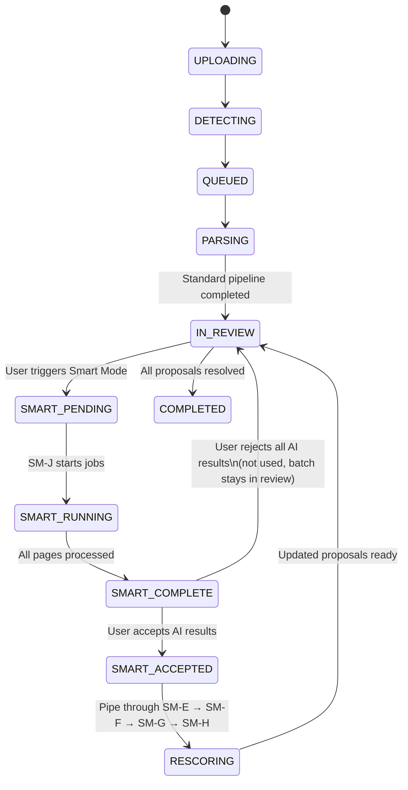
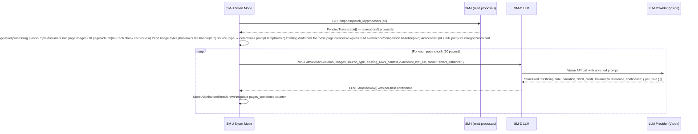
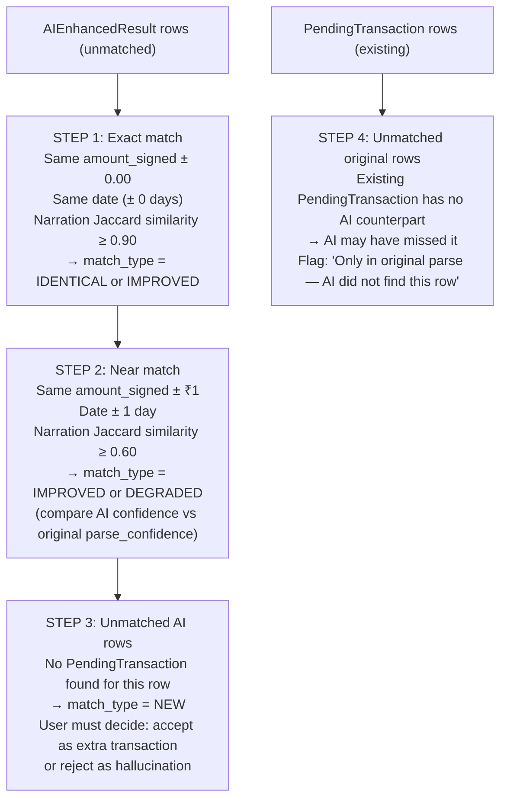
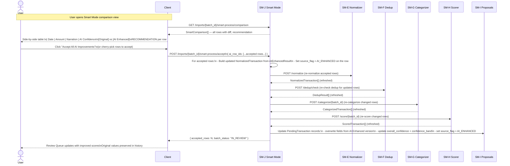
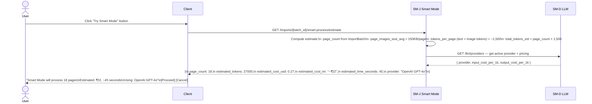
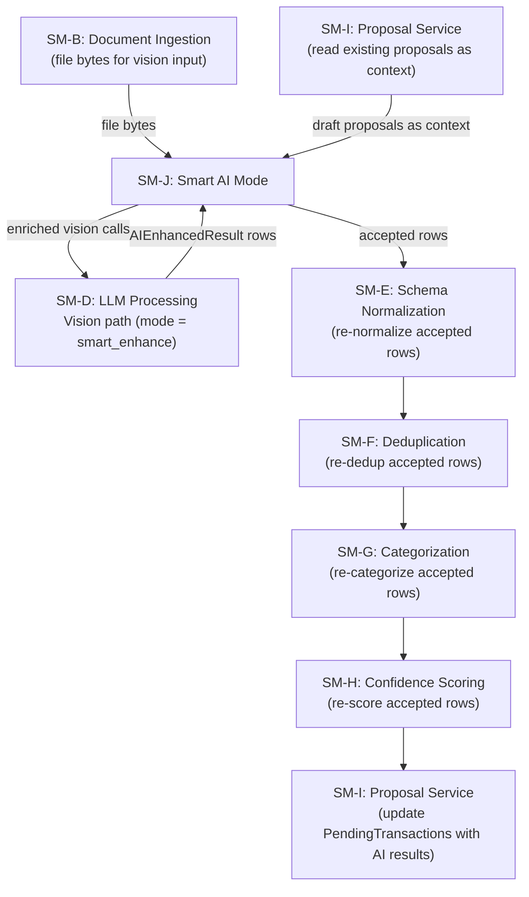

# SM-J — Smart AI Processing Mode
## Ledger 3.0 | Sub-module Spec | Version 0.1 | March 15, 2026

---

## 1. Purpose & Scope

Smart AI Processing Mode is the **optional, user-triggered enhancement layer** that re-runs the entire extraction pipeline using LLM assistance on every row, then presents a side-by-side comparison of the original parse result and the AI-enhanced result. The user chooses to accept, reject, or partially accept the AI version.

Smart mode is designed for situations where the standard pipeline (SM-C text/OCR extraction → SM-D fallback) produced low-confidence results, the document was scanned or handwritten, or the user wants to verify AI's interpretation before committing.

It is **not automatic** — the user explicitly activates it for a specific import batch.

### 1.1 Objectives

- Accept the original PDF/CSV bytes plus the current proposal set as context
- Call SM-D vision extraction path on every page of the document with an enriched prompt
- Produce an `AIEnhancedResult` per row — mirroring the structure of `NormalizedTransaction` + scores
- Allow the user to compare original and AI results side-by-side
- Support selective acceptance: accept some AI rows, reject others, accept field-level overrides
- Re-run SM-E → SM-F → SM-G → SM-H on accepted AI rows to refresh proposals
- Maintain a clear audit trail of which fields came from AI vs. standard parse

### 1.2 Out of Scope

- Standard LLM fallback for parsing (that is SM-D's job during the normal pipeline)
- Bulk AI categorization (SM-G handles that in the standard pipeline)
- Retroactive Smart Mode on already-approved transactions (v1 only: active for IN_REVIEW batches)

---

## 2. When Smart Mode is Available

Smart mode activates only when a batch is in the `IN_REVIEW` status and has not yet been fully approved.



---

## 3. Data Models

### 3.1 SmartProcessingJob

One job per batch activation of Smart Mode.

| Field | Type | Description |
|---|---|---|
| `smart_job_id` | UUID | PK |
| `batch_id` | UUID | FK → ImportBatch |
| `user_id` | UUID | FK |
| `status` | enum | QUEUED / RUNNING / COMPLETE / FAILED |
| `triggered_at` | timestamp | |
| `completed_at` | timestamp | nullable |
| `page_count` | integer | Total pages processed |
| `pages_completed` | integer | Running count for progress polling |
| `total_tokens_used` | integer | Tokens consumed across all pages |
| `estimated_cost_usd` | decimal | nullable — calculated if provider reports token pricing |
| `provider_id` | UUID | FK → LLMProvider used |
| `error_detail` | string | nullable — last error if FAILED |

### 3.2 AIEnhancedResult

One row per transaction the LLM extracted from the document. Some rows may be entirely new (missed by standard parse), some may differ from standard parse, and some may be identical.

| Field | Type | Description |
|---|---|---|
| `ai_row_id` | UUID | PK |
| `smart_job_id` | UUID | FK |
| `batch_id` | UUID | FK → ImportBatch |
| `page_number` | integer | Page in the original document |
| `txn_date` | date | nullable |
| `value_date` | date | nullable |
| `narration` | string | |
| `debit_amount` | decimal | nullable |
| `credit_amount` | decimal | nullable |
| `amount_signed` | decimal | |
| `running_balance` | decimal | nullable |
| `reference_number` | string | nullable |
| `currency` | string | ISO 4217 |
| `quantity` | decimal | nullable (investment) |
| `unit_price` | decimal | nullable (investment) |
| `ai_confidence_per_field` | JSON | `{ "txn_date": 0.95, "amount_signed": 0.99, "narration": 0.88, ... }` |
| `ai_overall_confidence` | float | Aggregate field confidence |
| `match_type` | enum | IDENTICAL / IMPROVED / DEGRADED / NEW / AI_ONLY (standard parse missed this row) |
| `matched_pending_id` | UUID | nullable — FK → PendingTransaction (if this AI row corresponds to an existing proposal) |
| `accepted` | boolean | null=pending, true=accepted, false=rejected |
| `accepted_at` | timestamp | nullable |
| `diff_fields` | string[] | Which fields differ from the original parse result |

### 3.3 SmartComparison (API Response View)

Assembled on read from AIEnhancedResult + PendingTransaction.

| Field | Type | Description |
|---|---|---|
| `ai_row_id` | UUID | |
| `match_type` | enum | |
| `original` | ProposalSnapshot | nullable — the existing PendingTransaction fields |
| `ai_enhanced` | AIEnhancedResult | The AI version |
| `diff_fields` | FieldDiff[] | List of `{ field, original_value, ai_value, ai_confidence }` |
| `recommendation` | enum | ACCEPT_AI / KEEP_ORIGINAL / REVIEW_MANUALLY |
| `accepted` | boolean | null = user has not yet decided |

---

## 4. Context Assembly

### 4.1 Prompt Construction Strategy

Smart mode sends each page of the document as a separate vision call to SM-D. The prompt is enriched with context from the existing draft proposals to help the LLM resolve ambiguities.



### 4.2 Enriched Prompt Structure

The system prompt for Smart mode (stored as a versioned `PromptTemplate` in SM-D's template library):

```
System:
You are an expert financial document analysis assistant for an Indian personal finance application.
You are reviewing a bank/investment statement page that has already been partially parsed by
automated tools. Your task is to extract ALL transactions with maximum accuracy.

Where the automated parse may have failed:
- Scanned/photographed pages
- Tables with merged cells or unusual formatting
- Two-column transaction layouts
- Transactions split across page breaks

Context (previously parsed transactions nearby for reference):
[INJECTED: existing_rows_context — plain text table of date/narration/amount/balance]

Extract every transaction you can see. For each transaction, provide confidence scores per field.
Return JSON array: [{ date, narration, debit_amount, credit_amount, running_balance, ... }]
Do not invent transactions. If a field is not visible, set it to null.
```

---

## 5. Result Comparison and Diff Computation

### 5.1 Row Matching Logic

After all AIEnhancedResult rows are collected, SM-J runs a matching pass to link AI rows to existing PendingTransactions:



### 5.2 Recommendation Engine

For each matched pair, SM-J computes a recommendation:

| Condition | Recommendation |
|---|---|
| AI field confidence > original confidence AND no degraded fields | `ACCEPT_AI` |
| Original parse confidence > 0.95 and AI match is IDENTICAL | `KEEP_ORIGINAL` (no change needed) |
| Any AI field confidence < 0.60 in a key field (date, amount) | `REVIEW_MANUALLY` |
| match_type = NEW | `REVIEW_MANUALLY` (could be hallucination) |
| AI narration differs significantly (Jaccard < 0.70) but amounts match | `REVIEW_MANUALLY` |

---

## 6. Acceptance Flow

### 6.1 Full Accept/Reject Flow



### 6.2 Partial Field-Level Accept

For IMPROVED rows where only some fields are better:

`PATCH /imports/{batch_id}/smart-process/comparison/{ai_row_id}/field-accept`

Body: `{ fields: ["narration", "reference_number"] }` — accepts only these fields from the AI result, keeping all other fields from the original parse.

---

## 7. Cost Estimation Before Activation

Before the user triggers Smart Mode, SM-J provides an upfront cost estimate.



---

## 8. API Specification

### 8.1 Base Path

`/api/v1/imports/{batch_id}/smart-process`

### 8.2 Endpoints

| Method | Path | Description |
|---|---|---|
| `GET` | `/estimate` | Return cost and time estimate before activating |
| `POST` | `/` | Trigger Smart Mode for the batch. Responds immediately; processing is async |
| `GET` | `/status` | Poll job status: QUEUED / RUNNING / COMPLETE / FAILED; includes pages_completed/page_count |
| `GET` | `/comparison` | Full SmartComparison[] once status = COMPLETE. Supports same filters as SM-I proposals |
| `POST` | `/accept` | Accept a list of AI rows (full-row accept). Triggers re-pipeline |
| `POST` | `/accept-all-recommended` | Accept all rows where recommendation = ACCEPT_AI |
| `POST` | `/reject` | Reject a list of AI rows (keep original). No re-pipeline needed |
| `PATCH` | `/comparison/{ai_row_id}/field-accept` | Accept specific fields from an AI row |
| `DELETE` | `/` | Discard Smart Mode results entirely — batch reverts to original proposals |

### 8.3 Status Poll Response

`GET /api/v1/imports/{batch_id}/smart-process/status`

```
{
  "smart_job_id": "uuid",
  "status": "RUNNING",
  "page_count": 18,
  "pages_completed": 11,
  "percent_complete": 61,
  "estimated_seconds_remaining": 17,
  "total_tokens_used": 16500
}
```

### 8.4 Comparison Response (partial example)

`GET /api/v1/imports/{batch_id}/smart-process/comparison`

```
[
  {
    "ai_row_id": "uuid",
    "match_type": "IMPROVED",
    "recommendation": "ACCEPT_AI",
    "diff_fields": [
      { "field": "narration", "original_value": "UPI/DR/8427/Pay", "ai_value": "UPI payment to Swiggy Order #8427", "ai_confidence": 0.94 },
      { "field": "reference_number", "original_value": null, "ai_value": "UPI8427219102KK", "ai_confidence": 0.91 }
    ],
    "original": {
      "txn_date": "2026-03-14",
      "amount_signed": -450.00,
      "narration": "UPI/DR/8427/Pay",
      "overall_confidence": 0.71
    },
    "ai_enhanced": {
      "txn_date": "2026-03-14",
      "amount_signed": -450.00,
      "narration": "UPI payment to Swiggy Order #8427",
      "reference_number": "UPI8427219102KK",
      "ai_overall_confidence": 0.93
    },
    "accepted": null
  },
  ...
]
```

---

## 9. Business Rules & Constraints

| Rule | Description |
|---|---|
| BR-J-01 | Smart Mode requires an active, configured LLM provider with vision capability. If no vision-capable provider exists, the Smart Mode button is disabled with "Configure an AI provider to enable this feature." |
| BR-J-02 | Smart Mode can only be triggered on batches in `IN_REVIEW` status. It cannot run on already-approved (COMPLETED) batches. |
| BR-J-03 | Only one SmartProcessingJob can be active per batch at a time. If a job is already RUNNING, triggering again returns the existing job status. |
| BR-J-04 | NEW rows returned by AI (match_type = NEW) are never auto-accepted. They always require explicit user review (recommendation = REVIEW_MANUALLY). |
| BR-J-05 | Accepted AI rows re-run the full downstream pipeline (SM-E → SM-F → SM-G → SM-H). They are NOT reprocessed by SM-C or SM-B — only the normalized field values are updated. |
| BR-J-06 | Original parse values are preserved in `AIEnhancedResult.original` at the time of comparison and are never overwritten. The audit trail always shows both versions. |
| BR-J-07 | Cost and token tracking is recorded even if the user rejects all AI results. Tokens consumed are non-refundable from the user's LLM API key. |
| BR-J-08 | If a SmartProcessingJob fails mid-way (network error, provider timeout), the completed pages are preserved. The user can retry from the failed page rather than restarting from page 1. |
| BR-J-09 | Deleting a Smart Mode job (`DELETE /smart-process`) removes all AIEnhancedResult rows and reverts the ImportBatch status to IN_REVIEW. It does NOT refund tokens already used. |

---

## 10. Error Catalog

| HTTP Status | Error Code | Scenario |
|---|---|---|
| 400 | `BATCH_NOT_IN_REVIEW` | Smart Mode triggered on a batch that is not in IN_REVIEW status |
| 400 | `NO_VISION_PROVIDER` | No LLM provider with vision capability configured |
| 409 | `JOB_ALREADY_RUNNING` | A SmartProcessingJob is already active for this batch |
| 409 | `COMPARISON_NOT_READY` | Comparison endpoint called before status = COMPLETE |
| 422 | `ACCEPT_ROW_NOT_FOUND` | ai_row_id in accept request not found for this batch |
| 422 | `FIELD_ACCEPT_INVALID` | Field-level accept references a field that is not in `diff_fields` |
| 503 | `PROVIDER_UNAVAILABLE` | LLM provider returned a non-retryable error during processing |

---

## 11. Integration Points Summary


