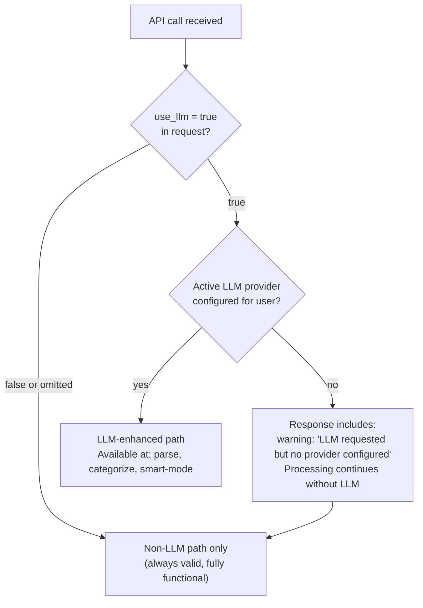
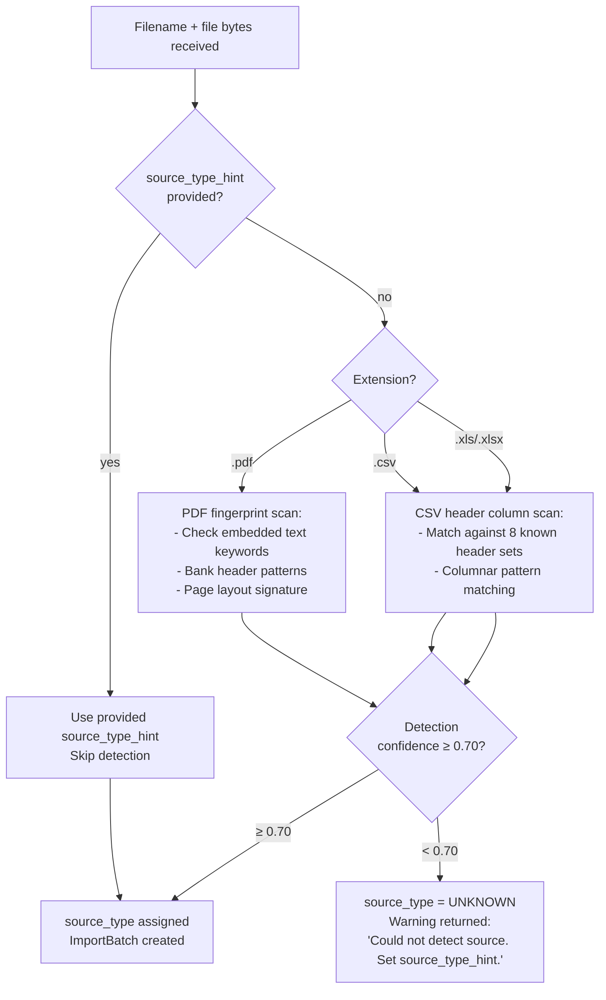
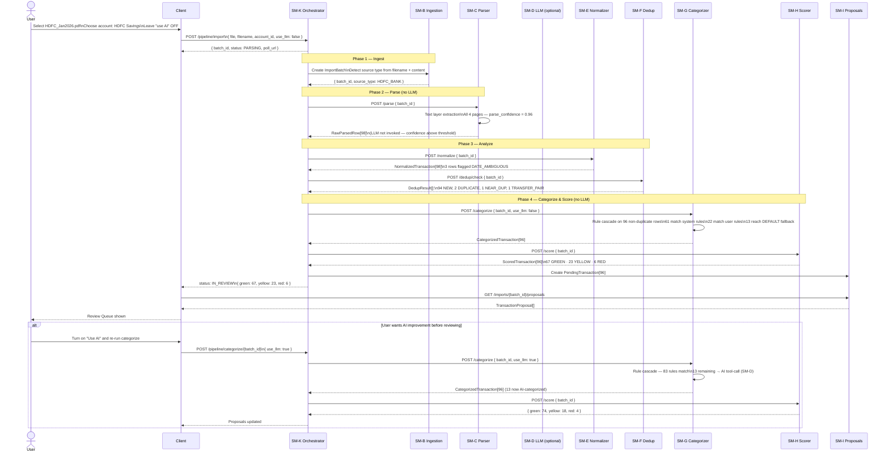
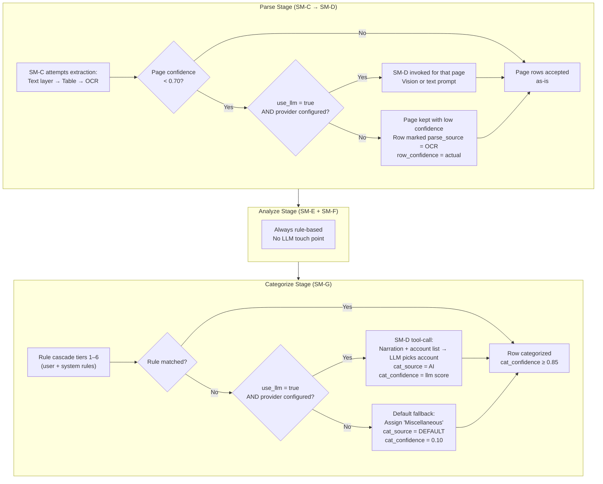
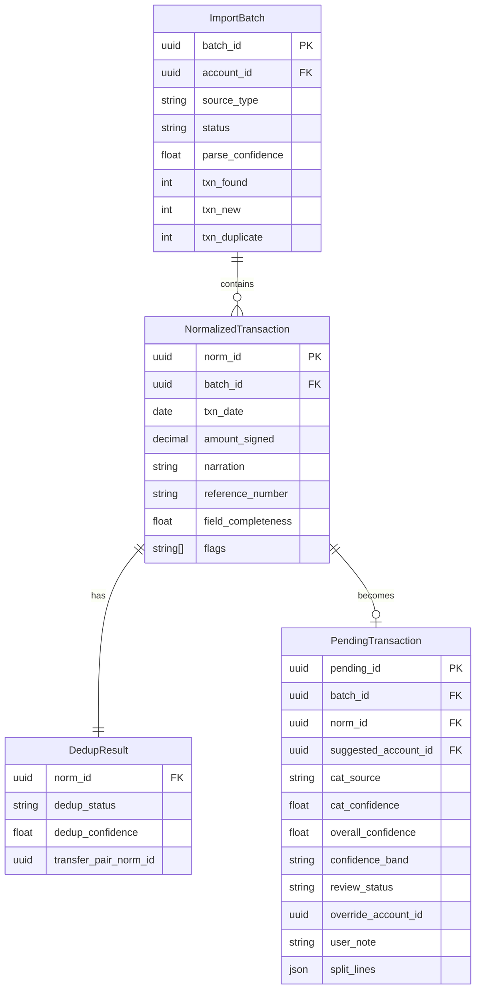

# SM-K — Pipeline Orchestration API
## Ledger 3.0 | Sub-module Spec | Version 0.1 | March 15, 2026

---

## 1. Purpose & Scope

The Pipeline Orchestration API provides a **unified, client-facing entry point** for the Transaction Manager pipeline. Rather than calling SM-B through SM-I individually (which is the internal wiring), clients can call one step or one combined endpoint and receive ready-to-review proposals.

**LLM is optional everywhere.** The pipeline runs fully without any LLM configured. LLM touches are additive — they improve confidence where they can, but every stage has a non-LLM path that produces a valid result.

### 1.1 The Four Callable Steps

| Step | Endpoint | What it does | LLM involved? |
|---|---|---|---|
| Parse | `POST /pipeline/parse` | Upload file → detect source → extract rows | Optional (fallback for low-confidence pages) |
| Analyze | `POST /pipeline/analyze/{batch_id}` | Normalize + deduplicate parsed rows | No |
| Categorize & Score | `POST /pipeline/categorize/{batch_id}` | Assign categories + compute confidence bands | Optional (AI categorization when no rule matches) |
| Full Import | `POST /pipeline/import` | All steps in one call; returns proposals | Optional at each stage |

Clients can call steps individually (for streaming UX, progress display, or partial re-runs) or call the full import in one shot.

---

## 2. LLM Optionality Design

LLM is gated by a per-call `use_llm` flag and the presence of a configured provider.



### 2.1 LLM touch points per stage

| Stage | Without LLM | With LLM (`use_llm: true`) |
|---|---|---|
| **Parse** (SM-C / SM-D) | Text layer → Camelot table extraction → Tesseract OCR. If OCR confidence < 0.70, rows marked `parse_confidence = low` but still returned. | SM-D vision extraction invoked for any page where SM-C confidence < 0.70. LLM fills gaps OCR missed. |
| **Analyze** (SM-E / SM-F) | No LLM needed. Normalization is rules-based. Dedup is hash + fuzzy. | No LLM path — LLM adds no value here. `use_llm` flag is silently ignored for this step. |
| **Categorize & Score** (SM-G / SM-H) | Rule cascade (user rules → system rules → DEFAULT "Miscellaneous"). Rows without a rule match get `cat_source = DEFAULT`, `cat_confidence = 0.10`. | After rule cascade fails, LLM tool-call invoked with narration + account list. Returns a chosen account ID + reasoning. |
| **Smart Mode** (SM-J) | Not applicable — Smart Mode is inherently LLM-only and is a separate opt-in call. | Full vision pass on entire document. |

---

## 3. Step 1: Parse

### 3.1 `POST /api/v1/pipeline/parse`

Upload a file and trigger extraction. The parser is inferred from the filename extension and content fingerprint — clients do not need to specify the parser.

**Request** — `multipart/form-data`

| Field | Type | Required | Description |
|---|---|---|---|
| `file` | binary | yes* | The statement file (PDF, CSV, XLS, XLSX). Mutually exclusive with `content_base64`. |
| `content_base64` | string | yes* | Base64-encoded file bytes. Alternative to multipart upload (for mobile clients). |
| `filename` | string | yes | Original filename including extension (e.g. `HDFC_Jan2026.pdf`). Used for source type inference even when `content_base64` is used. |
| `account_id` | UUID | yes | The account this statement belongs to (FK → SM-A). Determines sign convention for debits/credits. |
| `password` | string | no | PDF password. **Never stored.** Decryption is performed in-request and the password is discarded immediately after. |
| `source_type_hint` | string | no | Optionally override the inferred SourceType (e.g. `HDFC_BANK`, `ZERODHA_TRADEBOOK`). Use when auto-detection is ambiguous. |
| `use_llm` | boolean | no | Default `false`. If `true` and a provider is configured, SM-D is invoked for low-confidence pages. |
| `statement_from` | date | no | Override detected statement start date (ISO 8601). |
| `statement_to` | date | no | Override detected statement end date. |

*One of `file` or `content_base64` is required.

**Source Type Inference Rules (applied in order):**



**Response — `202 Accepted`**

```json
{
  "batch_id": "uuid",
  "status": "PARSING",
  "source_type": "HDFC_BANK",
  "source_type_inferred": true,
  "filename": "HDFC_Jan2026.pdf",
  "account_id": "uuid",
  "format": "PDF",
  "page_count": 4,
  "parse_method": "TEXT_LAYER",
  "use_llm": false,
  "poll_url": "/api/v1/pipeline/parse/status/uuid",
  "warnings": []
}
```

Parsing runs asynchronously. Poll `GET /api/v1/pipeline/parse/status/{batch_id}` for result.

**Parse Status Response (poll)** — `GET /api/v1/pipeline/parse/status/{batch_id}`

```json
{
  "batch_id": "uuid",
  "status": "PARSE_COMPLETE",
  "rows_extracted": 98,
  "parse_confidence": 0.96,
  "parse_method_used": "TEXT_LAYER",
  "llm_pages_used": 0,
  "statement_from": "2026-01-01",
  "statement_to": "2026-01-31",
  "raw_rows_url": "/api/v1/pipeline/parse/{batch_id}/rows",
  "next_step": "POST /api/v1/pipeline/analyze/uuid"
}
```

**Parse Result Rows** — `GET /api/v1/pipeline/parse/{batch_id}/rows`

Returns the raw extracted rows before normalization. Useful for debugging or manual inspection.

| Field | Type | Description |
|---|---|---|
| `row_id` | UUID | |
| `batch_id` | UUID | |
| `row_number` | integer | Sequential row number within the batch |
| `page_number` | integer | Source page (PDF) or sheet (XLS) |
| `raw_date` | string | As-found date string |
| `raw_narration` | string | As-found description |
| `raw_debit` | string | As-found debit column value |
| `raw_credit` | string | As-found credit column value |
| `raw_balance` | string | As-found balance column value |
| `amount_signed` | decimal | Computed by parser (negative = debit) |
| `parse_source` | enum | TEXT_LAYER / TABLE_EXTRACTION / OCR / LLM_TEXT / LLM_VISION |
| `row_confidence` | float | Per-row confidence (0–1) |
| `parse_warnings` | string[] | e.g. `["date_ambiguous", "balance_not_found"]` |

---

## 4. Step 2: Analyze

### 4.1 `POST /api/v1/pipeline/analyze/{batch_id}`

Normalizes raw rows (SM-E) and runs deduplication (SM-F). No LLM involvement.

**Request body** — `application/json`

| Field | Type | Required | Description |
|---|---|---|---|
| `balance_tolerance` | decimal | no | Max running balance drift before flagging (default `1.00` — i.e. ±₹1) |
| `date_ambiguity_resolution` | enum | no | `DD_MM_FIRST` (default) or `MM_DD_FIRST` — how to interpret ambiguous dates like `03/04/2026` |
| `dedup_scope` | enum | no | `PENDING_ONLY` (default) / `INCLUDE_CONFIRMED` — whether to check against already-approved journal entries too |

**No request body required** — all fields are optional. `POST /api/v1/pipeline/analyze/{batch_id}` with empty body is valid.

**Response — `200 OK`**

```json
{
  "batch_id": "uuid",
  "status": "ANALYZED",
  "rows_normalized": 98,
  "normalization_errors": 2,
  "dedup_summary": {
    "new": 94,
    "duplicate": 2,
    "near_duplicate": 1,
    "transfer_pair": 1,
    "transfer_pair_candidate": 0
  },
  "flags_raised": {
    "date_ambiguous": 3,
    "pre_opening_date": 0,
    "balance_drift": 1
  },
  "next_step": "POST /api/v1/pipeline/categorize/uuid"
}
```

**Normalization errors** (rows SM-E could not process) are returned as part of the batch detail — they are not hard failures. The batch moves forward; problematic rows are flagged with `review_status = RED`.

---

## 5. Step 3: Categorize & Score

### 5.1 `POST /api/v1/pipeline/categorize/{batch_id}`

Runs the categorization rule cascade (SM-G) and computes confidence bands (SM-H). Returns the full set of `PendingTransaction` records ready for review.

**Request body** — `application/json`

| Field | Type | Required | Description |
|---|---|---|---|
| `use_llm` | boolean | no | Default `false`. If `true` and a provider is configured, AI tool-call (SM-G tier 7) is invoked for rows that have no matching rule. |
| `default_category_id` | UUID | no | Override the system default fallback account (normally the "Miscellaneous" expense account). Applied to rows that reach tier 8 of the rule cascade. |

**Response — `200 OK`**

```json
{
  "batch_id": "uuid",
  "status": "IN_REVIEW",
  "proposals_created": 96,
  "categorization_summary": {
    "rule_user": 22,
    "rule_system": 61,
    "ai": 8,
    "default_fallback": 5
  },
  "confidence_summary": {
    "green": 67,
    "yellow": 23,
    "red": 6
  },
  "llm_used": true,
  "llm_tokens_used": 1240,
  "review_url": "/api/v1/imports/uuid/proposals"
}
```

`llm_used` reflects whether LLM was actually invoked (it may be `false` even when `use_llm: true` if all rows matched rules before reaching tier 7).

---

## 6. Full Pipeline in One Call

### 6.1 `POST /api/v1/pipeline/import`

Runs all steps — parse, analyze, categorize, score — in sequence and returns the complete set of proposals. This is the primary endpoint for simple integrations.

**Request** — `multipart/form-data`

| Field | Type | Required | Description |
|---|---|---|---|
| `file` | binary | yes* | Statement file |
| `content_base64` | string | yes* | Base64 alternative |
| `filename` | string | yes | Filename with extension |
| `account_id` | UUID | yes | Target account |
| `password` | string | no | PDF password (never stored) |
| `source_type_hint` | string | no | Override source detection |
| `statement_from` | date | no | Override detected period start |
| `statement_to` | date | no | Override detected period end |
| `use_llm` | boolean | no | Default `false`. Applies to both parse stage (low-confidence pages) and categorize stage (unmatched narrations). |
| `date_ambiguity_resolution` | enum | no | `DD_MM_FIRST` (default) / `MM_DD_FIRST` |
| `dedup_scope` | enum | no | `PENDING_ONLY` (default) / `INCLUDE_CONFIRMED` |
| `default_category_id` | UUID | no | Fallback category account for unmatched transactions |

**Response — `202 Accepted`** (immediately, processing is async)

```json
{
  "batch_id": "uuid",
  "status": "PARSING",
  "poll_url": "/api/v1/pipeline/import/status/uuid"
}
```

**Poll** — `GET /api/v1/pipeline/import/status/{batch_id}`

```json
{
  "batch_id": "uuid",
  "status": "IN_REVIEW",
  "stage_completed": "SCORE",
  "stages": {
    "parse":      { "status": "DONE", "rows": 98,   "parse_confidence": 0.96 },
    "analyze":    { "status": "DONE", "normalized": 98, "duplicates": 2 },
    "categorize": { "status": "DONE", "categorized": 96, "llm_used": false },
    "score":      { "status": "DONE", "green": 67, "yellow": 23, "red": 6 }
  },
  "proposals_url": "/api/v1/imports/uuid/proposals",
  "warnings": [
    { "code": "DATE_AMBIGUOUS", "count": 3, "message": "3 rows have ambiguous day/month order. Assumed DD/MM." },
    { "code": "BALANCE_DRIFT", "count": 1, "message": "Running balance mismatch of ₹0.50 on row 47. Within tolerance." }
  ]
}
```

Once `status = IN_REVIEW`, the client navigates to `proposals_url` to begin reviewing.

---

## 7. Full Import Sequence



---

## 8. LLM Optional — Decision Points Detailed



---

## 9. API Reference Summary

### 9.1 Step-by-step

| Method | Path | Auth | Description |
|---|---|---|---|
| `POST` | `/api/v1/pipeline/parse` | JWT | Upload file, trigger extraction |
| `GET` | `/api/v1/pipeline/parse/status/{batch_id}` | JWT | Poll parse status |
| `GET` | `/api/v1/pipeline/parse/{batch_id}/rows` | JWT | Retrieve raw extracted rows |
| `POST` | `/api/v1/pipeline/analyze/{batch_id}` | JWT | Run normalization + dedup |
| `GET` | `/api/v1/pipeline/analyze/{batch_id}/results` | JWT | Get NormalizedTransaction + DedupResult per row |
| `POST` | `/api/v1/pipeline/categorize/{batch_id}` | JWT | Run categorization + scoring |
| `GET` | `/api/v1/pipeline/categorize/{batch_id}/results` | JWT | Get CategorizedTransaction + ScoredTransaction per row |

### 9.2 Full pipeline

| Method | Path | Auth | Description |
|---|---|---|---|
| `POST` | `/api/v1/pipeline/import` | JWT | All-in-one import |
| `GET` | `/api/v1/pipeline/import/status/{batch_id}` | JWT | Poll full import status with per-stage breakdown |

### 9.3 Re-run a stage

Any stage can be re-run on an existing batch (e.g. to retry categorization with LLM after a provider is configured):

| Method | Path | Description |
|---|---|---|
| `POST` | `/api/v1/pipeline/analyze/{batch_id}` | Re-normalize + re-dedup (resets downstream stages) |
| `POST` | `/api/v1/pipeline/categorize/{batch_id}` | Re-categorize + re-score (does not re-parse or re-normalize) |

Re-running a stage resets all downstream `PendingTransaction` records. If any proposals from the batch have already been **approved**, those are preserved — only PENDING proposals are reset.

---

## 10. Persistable Entities Produced

At the end of the full pipeline, the following entities exist in the database and are the source of truth for the review queue:



`PendingTransaction` is the final persistable output passed to the Review Queue (SM-I). On approval it triggers `JournalEntry` creation in the Accounting Engine and is then archived.

---

## 11. Business Rules

| Rule | Description |
|---|---|
| BR-K-01 | `use_llm: false` (or omitted) must produce a fully valid pipeline output. LLM is a quality enhancement, not a functional dependency. |
| BR-K-02 | If `use_llm: true` is requested but no provider is configured, processing continues without LLM. A `warnings` entry is added to the response — it is never a hard error. |
| BR-K-03 | The `password` field is never written to any database, log, or audit trail. It is used in-memory for the duration of the parse request only. |
| BR-K-04 | `account_id` must exist and be active in SM-A before any pipeline call is accepted. The orchestrator validates this before creating an ImportBatch. |
| BR-K-05 | Re-running any stage (analyze, categorize) on a batch that has already-approved proposals preserves those approvals. Only PENDING proposals are rebuilt. |
| BR-K-06 | The `source_type` of a batch is immutable after parse is complete. If source detection was wrong, the batch must be cancelled and re-uploaded with `source_type_hint`. |
| BR-K-07 | The full pipeline (`POST /pipeline/import`) is equivalent to calling parse → analyze → categorize in sequence. The same business rules apply to each stage regardless of whether it is called individually or as part of the combined endpoint. |

---

## 12. Error Catalog

| HTTP Status | Error Code | Scenario |
|---|---|---|
| 400 | `NO_FILE_PROVIDED` | Neither `file` nor `content_base64` supplied |
| 400 | `FILENAME_REQUIRED` | `content_base64` provided without `filename` |
| 400 | `UNSUPPORTED_FORMAT` | File extension is not PDF, CSV, XLS, or XLSX |
| 400 | `BATCH_NOT_PARSED` | `/analyze` called before parse is complete |
| 400 | `BATCH_NOT_ANALYZED` | `/categorize` called before analyze is complete |
| 400 | `INCORRECT_PASSWORD` | PDF decryption failed with supplied password |
| 404 | `ACCOUNT_NOT_FOUND` | `account_id` does not exist or is archived |
| 404 | `BATCH_NOT_FOUND` | `batch_id` not found for this user |
| 409 | `BATCH_ALREADY_COMPLETED` | Full pipeline called on a batch with status COMPLETED |
| 409 | `PARSE_ALREADY_RUNNING` | Parse triggered on a batch already in PARSING state |
| 422 | `SOURCE_TYPE_UNKNOWN` | Auto-detection failed and `source_type_hint` not provided |
| 422 | `NO_ROWS_EXTRACTED` | Zero rows returned after parsing — likely wrong account_id or wrong password |
