# Transaction Manager — ERD, Architecture & Design
## Ledger 3.0 — Module 2 | Version 0.1 | March 15, 2026

---

## 1. Document Purpose

This document is the technical design reference for the Transaction Manager (Module 2 of Ledger 3.0). It covers the complete entity-relationship model, system architecture, component interactions, data-flow sequences, state machines, and key design decisions. It is the engineering counterpart to `transaction-manager-spec.md` (product/UX design) and `pdf-parser.md` (parser implementation detail).

---

## 2. Entity Relationship Diagram

### 2.1 Entity Overview

Every financial event passes through two lifecycle stages before becoming permanent:

| Stage | Entity | Description |
|---|---|---|
| Pre-approval | `PendingTransaction` | Raw parsed transaction in the Review Queue. Can be adjusted, split, linked, excluded, or approved. |
| Post-approval | `JournalEntry` + `JournalEntryLeg` | Immutable double-entry accounting record. Cannot be deleted — only reversed. |

Supporting entities: `Account` (Chart of Accounts tree), `ImportBatch` (groups transactions by source file), `RecurringRule` (schedule templates), `CategorizationRule` (narration → account dictionary), `InvestmentLot` (FIFO purchase lots), `Security` (stocks, MFs, ETFs), `PriceHistory` (market prices), and `ReconciliationRecord` (balance verification checkpoints).

### 2.2 Complete ERD

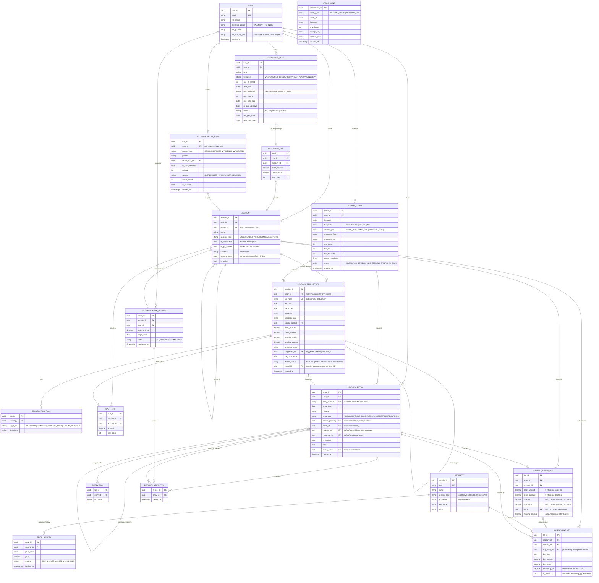

---

## 3. System Architecture

### 3.1 Architectural Overview

The Transaction Manager follows a layered architecture:

- **Client Layer** — React (web) and React Native (mobile) apps. PDF password decryption is performed entirely client-side; only decrypted bytes reach the server.
- **API Gateway** — Authenticates requests, enforces rate limits, routes to services.
- **Backend Services** — Purpose-specific services: importing, reviewing, accounting, categorisation, deduplication, investment tracking, and reconciliation.
- **Parser Registry** — Source-specific parser modules dispatched by a central Source Detector.
- **External Integrations** — AMFI (MF NAVs), NSE/BSE (equity prices), LLM providers.
- **Data Layer** — PostgreSQL (source of truth), Redis (balance cache), file storage (original PDFs + attachments), task queue (background parse jobs).

### 3.2 Component Architecture

```mermaid
graph TD
    subgraph "Client Layer"
        WEB["Web App — React + TypeScript"]
        MOBILE["Mobile App — React Native"]
        CLIENT_DECRYPT["Client-Side PDF Decryption\npdf-lib / pdfjs-dist\nPassword NEVER sent to server"]
    end

    subgraph "API Gateway"
        GW["REST API Gateway\nJWT Auth · Rate Limiting · CORS"]
    end

    subgraph "Core Backend Services"
        SVC_IMPORT["Import Service\nOrchestrates upload → parse → dedup → queue"]
        SVC_REVIEW["Review Service\nQueue management · approval trigger"]
        SVC_ACCOUNTING["Accounting Engine\nJE creation · balance updates · invariants"]
        SVC_CATEGORY["Categorisation Engine\nRule cascade · AI inference · rule learning"]
        SVC_DEDUP["Deduplication Engine\nHash check · near-duplicate · transfer pair"]
        SVC_RECURRING["Recurring Engine\nDaily scheduler · occurrence generation"]
        SVC_INVEST["Investment Engine\nFIFO lots · XIRR · price updates"]
        SVC_RECON["Reconciliation Service\nPeriod management · clearing · locking"]
    end

    subgraph "Parser Registry"
        DETECT["Source Detector\nPage-1 fingerprinting · CSV header analysis"]
        P_CAS["CAS Parser\nCAMS · KFintech · MF Central"]
        P_ZRD["Zerodha Parser\nHoldings · Tradebook · Tax P&L · Capital Gains"]
        P_HDFC["HDFC Bank Parser"]
        P_SBI["SBI Bank Parser"]
        P_ICICI["ICICI Bank Parser"]
        P_OTHER["Axis · Kotak · IndusInd · IDFC Parsers"]
        P_GENERIC["Generic CSV / XLS Parser\n+ Column Mapper UI"]
    end

    subgraph "External Integrations"
        EXT_AMFI["AMFI API — Free\nMutual Fund NAVs (daily)"]
        EXT_MARKET["Market Data\nNSE / BSE equity prices"]
        EXT_LLM["LLM Provider\nOpenAI · Anthropic · Gemini\nUser BYOK key"]
    end

    subgraph "Data Layer"
        DB[("PostgreSQL\nPrimary Database")]
        REDIS[("Redis\nBalance Cache · Session Store")]
        S3["File Storage\nOriginal PDFs + Attachments\nUser-scoped paths + signed URLs"]
        QUEUE["Task Queue\nBackground parse jobs for large files"]
    end

    WEB --> CLIENT_DECRYPT
    MOBILE --> CLIENT_DECRYPT
    CLIENT_DECRYPT -->|"Decrypted bytes only"| GW
    WEB --> GW
    MOBILE --> GW

    GW --> SVC_IMPORT
    GW --> SVC_REVIEW
    GW --> SVC_ACCOUNTING
    GW --> SVC_CATEGORY
    GW --> SVC_RECURRING
    GW --> SVC_INVEST
    GW --> SVC_RECON

    SVC_IMPORT --> DETECT
    DETECT --> P_CAS
    DETECT --> P_ZRD
    DETECT --> P_HDFC
    DETECT --> P_SBI
    DETECT --> P_ICICI
    DETECT --> P_OTHER
    DETECT --> P_GENERIC

    SVC_IMPORT --> SVC_DEDUP
    SVC_IMPORT --> SVC_CATEGORY
    SVC_REVIEW --> SVC_ACCOUNTING
    SVC_RECURRING --> SVC_ACCOUNTING

    SVC_INVEST --> EXT_AMFI
    SVC_INVEST --> EXT_MARKET
    SVC_CATEGORY --> EXT_LLM

    SVC_IMPORT --> DB
    SVC_REVIEW --> DB
    SVC_ACCOUNTING --> DB
    SVC_ACCOUNTING --> REDIS
    SVC_CATEGORY --> DB
    SVC_DEDUP --> DB
    SVC_RECURRING --> DB
    SVC_INVEST --> DB
    SVC_RECON --> DB

    SVC_IMPORT --> S3
    SVC_IMPORT --> QUEUE
    QUEUE --> P_CAS
    QUEUE --> P_ZRD
    QUEUE --> P_HDFC
```

### 3.3 Backend Service Responsibilities

| Service | Core Responsibility | Key Operations |
|---|---|---|
| **Import Service** | Orchestrate file upload → parse → dedup → queue | Upload validate, dispatch parser, create `ImportBatch` + `PendingTransaction` records |
| **Review Service** | Manage the Review Queue | Fetch queue with filters/sort, update review status, trigger bulk approval |
| **Accounting Engine** | Core double-entry engine — sole writer to `journal_entry` | Create JE + legs (atomic), enforce invariants, run reversals, update running balances |
| **Categorisation Engine** | Determine which account a transaction belongs to | Rule-cascade match, LLM tool-call inference, auto-promote rules after repetitive corrections |
| **Deduplication Engine** | Prevent duplicate transactions from entering the ledger | Hash exact-match, near-duplicate fuzzy match, transfer-pair detection across accounts |
| **Recurring Engine** | Generate pending transactions from active recurring rules | Daily scheduler, produce `PendingTransaction` from rule template, place in purple queue section |
| **Investment Engine** | FIFO lot management, XIRR, price fetching | Create lot on BUY, consume lots on SELL, compute capital gains + classification (STCG/LTCG), fetch prices |
| **Reconciliation Service** | Bank reconciliation periods | Create period, mark transactions cleared, compute running difference, lock cleared transactions on completion |

---

## 4. PDF Parser Pipeline

### 4.1 The 8-Stage Pipeline

All documents flow through a common 8-stage pipeline regardless of source. Source-specific parsers handle Stage 5 only.

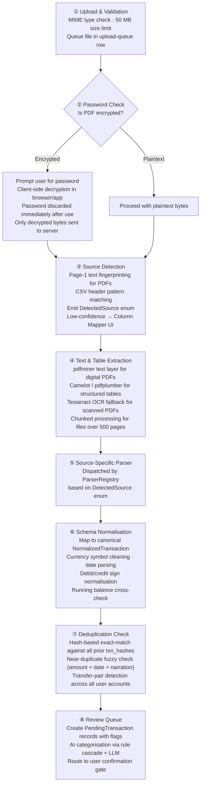

### 4.2 Parser Registry

| Source Type | Enum | Formats | Detection Signal |
|---|---|---|---|
| CAMS CAS | `CAS_CAMS` | PDF (password-protected) | "Computer Age Management Services" in page 1 |
| KFintech CAS | `CAS_KFINTECH` | PDF (password-protected) | "KFintech" or "Karvy" in page 1 |
| MF Central CAS | `CAS_MFCENTRAL` | PDF | "MF Central" in page 1 |
| Zerodha Holdings | `ZERODHA_HOLDINGS` | XLSX / CSV | Header: `ISIN,Stock Symbol,...` |
| Zerodha Tradebook | `ZERODHA_TRADEBOOK` | XLSX / CSV | Header: `symbol,isin,trade_date,trade_type,...` |
| Zerodha Tax P&L | `ZERODHA_TAX_PL` | XLSX / CSV | Sheet name "Tax P&L" or column "Capital Gains" |
| HDFC Bank | `HDFC_PDF` | PDF, CSV | "HDFC Bank" + "Statement of Account" |
| SBI Bank | `SBI_PDF` | PDF, CSV | "State Bank of India" or SBI CSV header |
| ICICI Bank | `ICICI_PDF` | PDF | "ICICI Bank" account statement markers |
| Axis Bank | `AXIS_PDF` | PDF | "Axis Bank" statement header |
| Kotak Bank | `KOTAK_PDF` | PDF | "Kotak Mahindra Bank" |
| IndusInd Bank | `INDUSIND_PDF` | PDF | "IndusInd Bank" |
| IDFC First Bank | `IDFC_PDF` | PDF | "IDFC FIRST Bank" |
| Generic fallback | `GENERIC_CSV` | CSV / XLS / XLSX | Triggered when no other parser matches |

### 4.3 Canonical NormalizedTransaction Schema

Every parser outputs records matching this schema before Stage 6:

| Field | Type | Notes |
|---|---|---|
| `source_type` | string | `DetectedSource` enum value |
| `source_account_hint` | string | Account number, folio number, or identifier extracted from the document |
| `date` | Date | Transaction date |
| `value_date` | Date \| null | Settlement date if available |
| `narration` | string | Cleaned, normalised description |
| `narration_raw` | string | Verbatim as extracted from document |
| `debit_amount` | decimal \| null | Positive — money leaving this account |
| `credit_amount` | decimal \| null | Positive — money entering this account |
| `running_balance` | decimal \| null | Account balance after this transaction |
| `reference_number` | string \| null | UPI ref, NEFT ref, cheque number |
| `quantity` | decimal \| null | Units or shares (investment transactions only) |
| `unit_price` | decimal \| null | NAV or price per unit (investment transactions only) |
| `txn_type_hint` | string \| null | Parser hint: `PURCHASE`, `REDEMPTION`, `DIVIDEND_PAYOUT`, etc. |

---

## 5. Sub-module Interaction Map

The nine sub-modules share the same database and accounting engine. This diagram shows primary data flows.

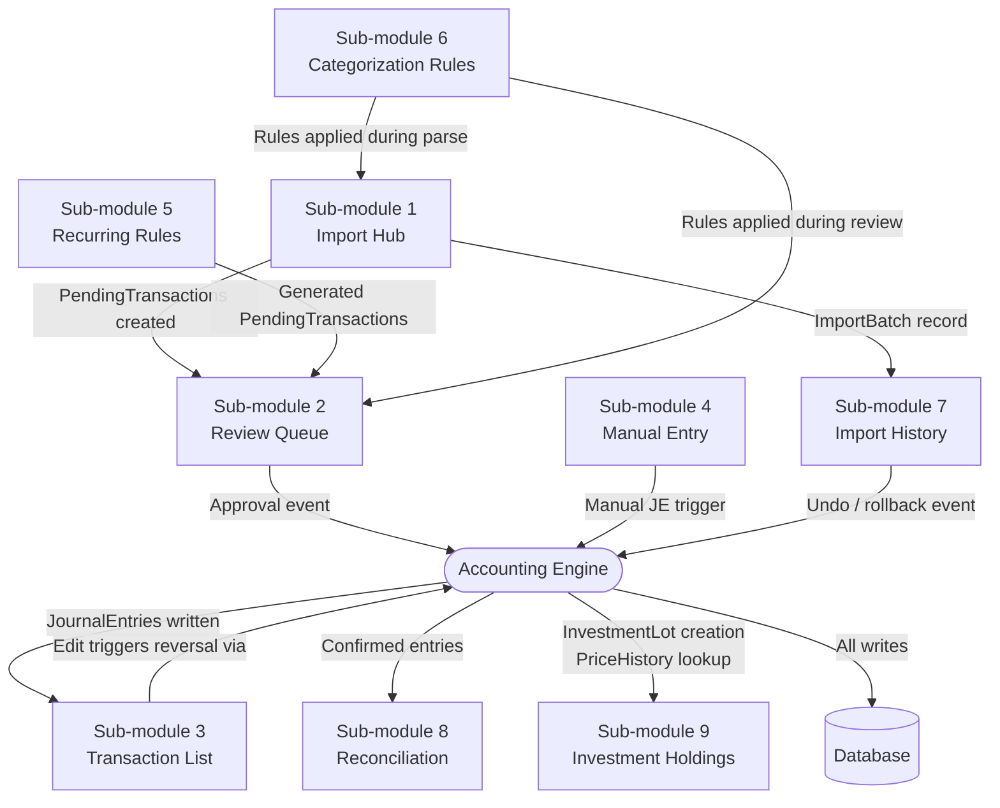

---

## 6. Transaction Lifecycle

### 6.1 PendingTransaction State Machine

A `PendingTransaction` is created when a document is parsed (SM1) or the Recurring Engine fires (SM5). It exists only until approved or permanently excluded.

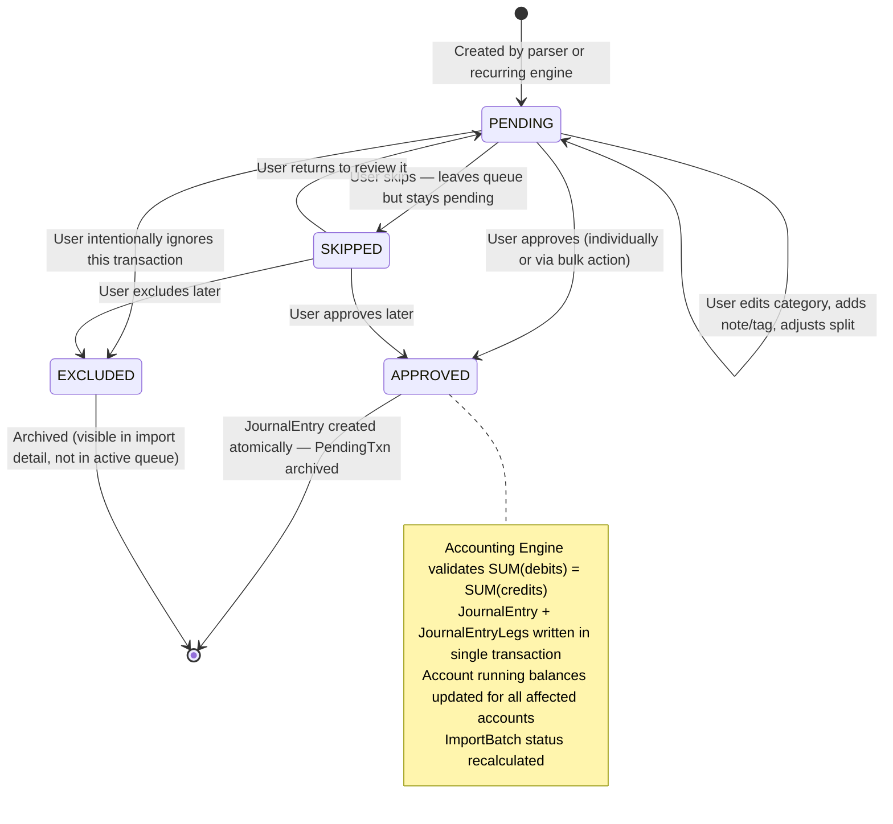

### 6.2 ImportBatch State Machine

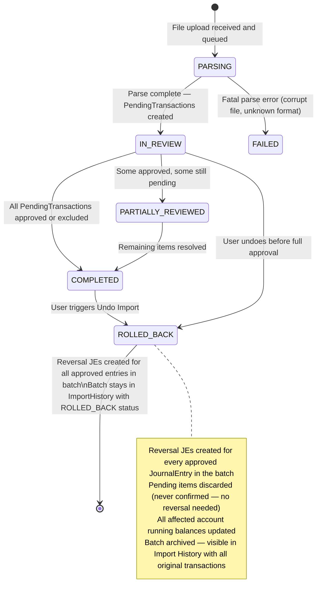

### 6.3 RecurringRule State Machine

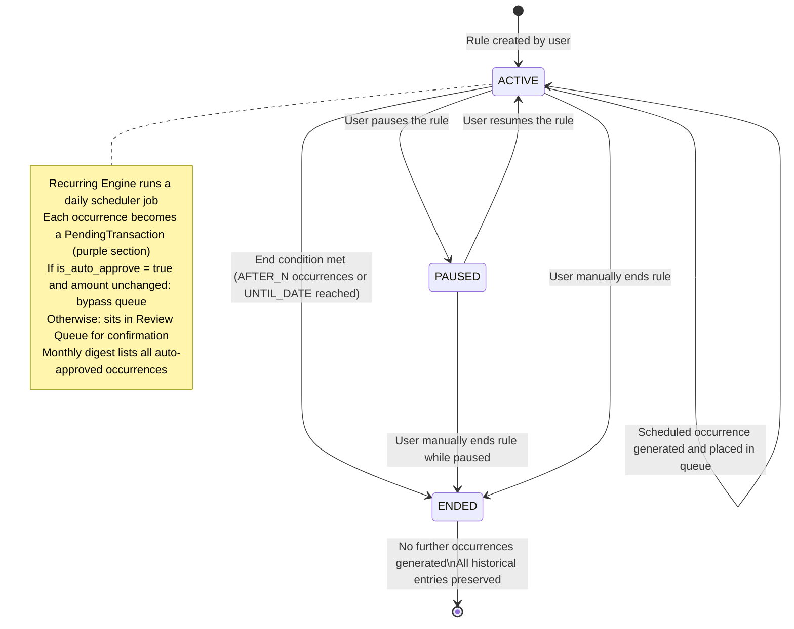

---

## 7. Data Flow Diagrams

### 7.1 Import-to-Ledger Sequence

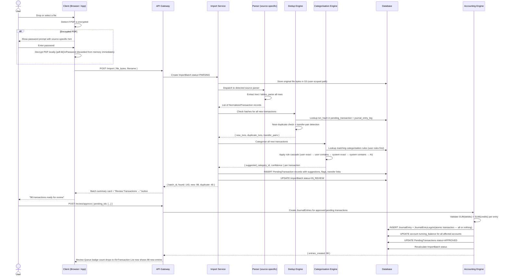

### 7.2 Correction Flow (Edit a Confirmed Transaction)

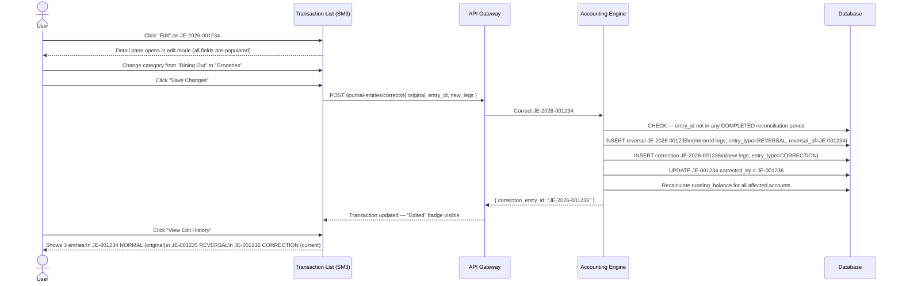

### 7.3 Transfer Pair Detection Flow

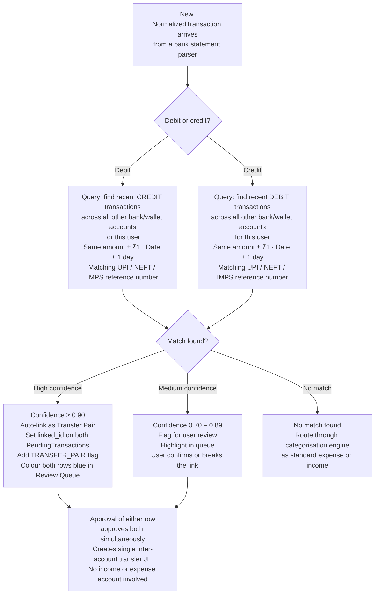

### 7.4 Categorisation Cascade

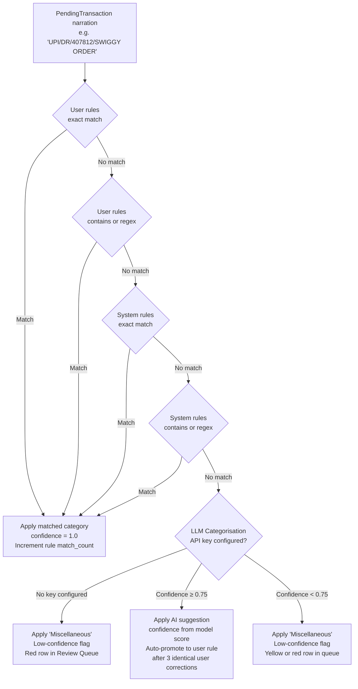

---

## 8. Accounting Engine Design

### 8.1 Core Invariants

The Accounting Engine enforces four invariants. They cannot be bypassed by any service or API call.

| Invariant | Rule | Enforcement |
|---|---|---|
| **Balancing Rule** | `SUM(debit_amounts) = SUM(credit_amounts)` for every `JournalEntry` | Hard reject — database transaction rolled back; the UI disables Save until the entry balances |
| **Immutability** | Confirmed `JournalEntry` rows cannot be updated or deleted | Only `INSERT` is permitted on `journal_entry` and `journal_entry_leg`; corrections create new reversal + correction entries |
| **Period Boundary** | Entry date ≥ account's `opening_date` | Soft block with override confirmation prompt |
| **Locked Period** | Entries in a `COMPLETED` reconciliation period cannot be edited without unlocking | System checks `reconciliation_record.status`; warns before allowing edit |

### 8.2 Journal Entry Generation Patterns

| Transaction Class | Debit Account(s) | Credit Account(s) | Notes |
|---|---|---|---|
| Bank expense (import) | Expense account (suggested category) | Asset › Bank | Standard single-leg import |
| Salary credit (multi-leg) | Asset › Bank (net) · Asset › EPF · Expense › TDS | Income › Salary (gross) | AI suggests split from user's salary structure |
| Bank income / refund | Asset › Bank | Income account | Interest, refunds, rental |
| Inter-account transfer | Asset › Destination Bank | Asset › Source Bank | No income/expense leg |
| Opening balance | Asset account | Equity › Opening Balance Equity | entry_type = `OPENING_BAL` · system-generated |
| MF purchase / SIP | Asset › MF Fund (cost value) | Asset › Bank | Plus quantity + unit_price on debit leg |
| MF redemption | Asset › Bank · Income or Expense › Capital Gains | Asset › MF Fund (book cost of lots consumed) | FIFO lot consumption; STCG / LTCG split |
| Dividend payout | Asset › Bank | Income › Dividends | |
| Stock buy | Asset › Equity Account (cost) | Asset › Bank | New `InvestmentLot` created |
| Stock sell | Asset › Bank · Income or Expense › Capital Gains | Asset › Equity (book cost) | FIFO lot(s) consumed |
| Loan EMI | Liability › Loan (principal) · Expense › Interest | Asset › Bank | AI computes principal/interest split from loan schedule |
| Reversal | Mirror of original (debits ↔ credits swapped) | Mirror of original | entry_type = `REVERSAL` |
| Correction | New user-specified legs | New user-specified legs | entry_type = `CORRECTION` |
| Recurring | Per rule's template legs | Per rule's template legs | entry_type = `RECURRING` |

### 8.3 Reversal and Correction Chain

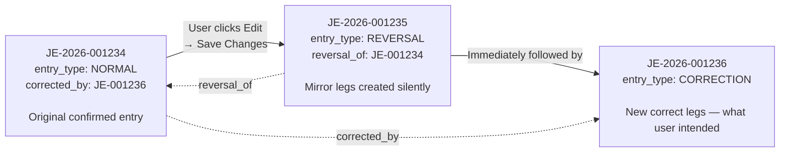

The user sees only JE-001234 with an **Edited** badge in the Transaction List. The reversal and correction entries appear under "View Edit History."

---

## 9. Investment Account Design

### 9.1 FIFO Lot Model

Every BUY confirmation creates an `InvestmentLot`. Every SELL consumes lots in FIFO order, decrementing `remaining_qty` until the sell quantity is satisfied.

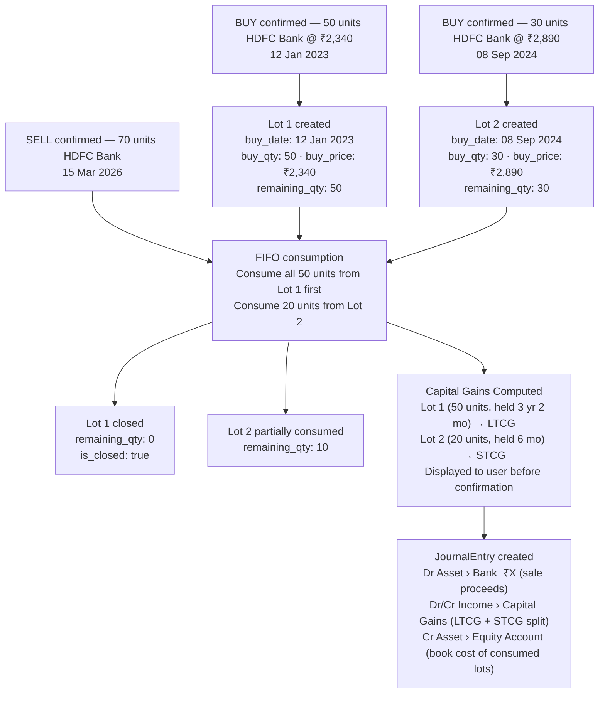

### 9.2 XIRR Calculation

XIRR is the discount rate $r$ that satisfies:

$$\sum_{i=1}^{n} \frac{C_i}{\left(1+r\right)^{(d_i - d_0)/365}} = 0$$

Where $C_i$ is the cash flow on date $d_i$ (negative for purchases, positive for redemptions and the current notional market value), and $d_0$ is the date of the first cash flow. Each `journal_entry_leg` with `quantity != null` on an investment account contributes a dated cash flow. The current market value from `price_history` contributes a notional positive cash flow dated today. XIRR is computed per security for the individual row and across all investment accounts for the portfolio summary.

---

## 10. Security Architecture

### 10.1 PDF Password Handling

PDF passwords are processed entirely client-side using `pdf-lib` (web) or `react-native-pdf-lib` (mobile). The password is used to decrypt the PDF bytes in the browser or native app process. Immediately after decryption, the password string is removed from memory. Only the decrypted document content is uploaded to the server. The server never receives, processes, stores, or logs the password at any point.

### 10.2 LLM API Key Security

The user's LLM API key is stored encrypted at rest using AES-256. The encryption key is derived from a server-side secret that is not stored in the database. The plaintext key is decrypted in memory only at the moment of an LLM API call and for the duration of that call only. It is never included in application logs, error reports, debug output, or API responses. The user can rotate or delete their key at any time from Settings.

### 10.3 Data Access Scoping

All backend service queries include a `user_id` filter derived from the authenticated JWT. No API endpoint can return data belonging to a different user. The LLM tool-calling architecture enforces this at the tool function level — `user_id` is a non-overridable parameter injected server-side, never derived from the LLM's output.

### 10.4 Immutability as an Audit Control

The immutable ledger is also a security control. An attacker with write access to the database cannot silently alter historical financial records without leaving a trace: every correction requires a reversal entry, and every entry carries a `created_at` timestamp that cannot be backdated. The combination makes retroactive manipulation detectable.

### 10.5 File Storage

Original uploaded files are stored in user-scoped storage paths (`/users/{user_id}/imports/{batch_id}/{filename}`). Access is via time-limited signed URLs generated at request time. Path scoping combined with signed URL authentication prevents cross-user access through URL guessing or enumeration.

---

## 11. Database Design Notes

### 11.1 Primary Indexes

| Table | Index | Rationale |
|---|---|---|
| `pending_transaction` | `(user_id, review_status)` | Primary Review Queue fetch |
| `pending_transaction` | `txn_hash` unique | Deduplication hash lookup |
| `pending_transaction` | `(batch_id, review_status)` | Batch-level queue filtering |
| `journal_entry` | `(user_id, entry_date DESC)` | Transaction List default sort |
| `journal_entry` | `entry_number` unique | JE number lookup |
| `journal_entry_leg` | `account_id` | Account-level ledger queries |
| `journal_entry_leg` | `(account_id, entry_date DESC)` | Passbook view ordered by date |
| `investment_lot` | `(account_id, security_id, is_closed)` | Open lot lookup for FIFO |
| `price_history` | `(security_id, price_date DESC)` | Latest price lookup |
| `categorization_rule` | `(user_id, is_enabled, priority DESC)` | Rule cascade evaluation order |
| `reconciliation_record` | `(account_id, status)` | Active reconciliation check |

### 11.2 Partitioning

`journal_entry` and `journal_entry_leg` are the largest tables over the long term. Partition `journal_entry` by `user_id` using hash partitioning to distribute load. Alternatively, partition by `entry_date` year for date-range report optimisation where full cross-year queries are rare.

### 11.3 Integrity Constraints

| Constraint | Implementation |
|---|---|
| JE must balance | Application-level validation in Accounting Engine + DB trigger as safety net: asserts `SUM(debit_amount) = SUM(credit_amount)` per `entry_id` before commit |
| JE minimum 2 legs | Enforced at application layer; DB-level count check on insert |
| Lot quantity non-negative | `CHECK (remaining_qty >= 0)` on `investment_lot` |
| Dedup hash unique per user | Unique index on `(user_id, txn_hash)` — constraint enforced at DB level, not just application |
| Account type hierarchy | Enum constraint on `account_type`; parent account must exist and be of the same or parent-compatible type |

### 11.4 Soft Deletes and Archiving

No rows are hard-deleted from any financial table. `import_batch`, `pending_transaction`, `journal_entry`, and `investment_lot` use a soft-delete pattern (`is_archived`, `archived_at`). All standard API queries filter `WHERE is_archived = false`. The Import History sub-module explicitly queries archived records to provide the complete audit trail.

---

## 12. Key Design Decisions

| Decision | Choice Made | Rationale |
|---|---|---|
| **Client-side PDF decryption** | Password handling entirely in browser or native app | User trust: no PAN-derived password ever transmitted to a server. Regulatory: avoids any server-side handling of authentication credentials |
| **Mandatory review gate** | All import transactions require human confirmation before becoming JEs | Prevents silent AI miscategorisation errors and corrupted parser output from entering the permanent ledger undetected |
| **Immutable ledger with reversal** | No `UPDATE` or `DELETE` on `journal_entry`; corrections via reversal + re-entry | Full audit trail, compliance with double-entry accounting principles, tamper-evidence, and protection against silent data corruption |
| **Two-stage transaction model** | `PendingTransaction` → `JournalEntry` separation | Separates the parsing "intent" from the ledger "fact". Allows safe rejection, editing, splitting, and annulment before any accounting commitment is made |
| **BYOK LLM** | User supplies their own API key; system stores it encrypted, never in plaintext | Financial data is never sent to an LLM service without explicit user setup. No SaaS LLM vendor dependency for core features |
| **FIFO by default, user override on SELL** | Default lot matching is oldest-first; user can pick specific lots before confirming | Aligns with Indian tax authority default guidance on cost basis; user override supports tax-optimisation strategies (loss harvesting, LTCG planning) |
| **Rule learning from corrections** | After 3 identical user re-categorisations for the same narration pattern, a user rule is auto-promoted | Reduces repetitive manual work without requiring users to explicitly manage rules they may not know exist |
| **Recurring = confirm by default** | Recurring transactions land in the Review Queue; auto-approve is opt-in per rule | Prevents silent incorrect amounts when recurring values change (rent increase, SIP change, rate-linked EMI fluctuation) |
| **Import undo as batch, not per-transaction** | Undo reverses all JEs in a batch atomically | Maintains ledger and deduplication hash consistency — a partial undo would leave the system in an inconsistent state where some transactions appear to exist and some do not |
| **Hash-based deduplication** | `hash(account_id + date + narration + amount + running_balance)` | Deterministic and reproducible: the same statement re-imported always produces the same hashes and is guaranteed to skip. No need to store the original file content for dedup purposes |
| **Transfer pair detection before categorisation** | Dedup Engine runs transfer-pair detection before the Categorisation Engine assigns a category | Prevents inter-account transfers from being incorrectly categorised as income or expenses — the most common source of spending report inflation in personal finance tools |
